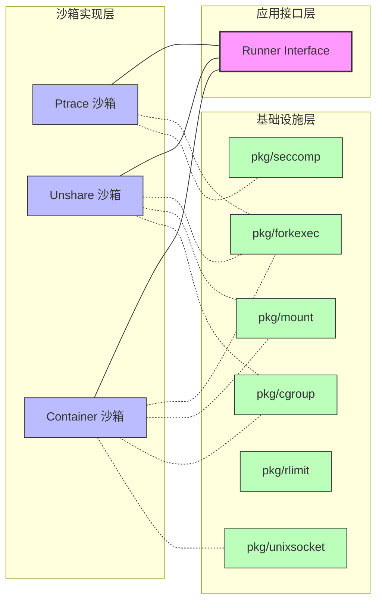

# GoJudgeSandbox

GoJudgeSandbox 是一个高性能、安全的程序执行沙箱系统。


## 核心模块测试

```mermaid
gantt
    title 各操作耗时对比 (微秒)
    dateFormat X
    axisFormat %s

    section 基本操作
    标准 Fork           :0, 17
    简单 Fork           :0, 120

    section 单一命名空间
    PID                :0, 118
    用户               :0, 126
    UTS                :0, 122
    Cgroup             :0, 121
    IPC                :0, 157
    挂载               :0, 112
    网络               :0, 296

    section 组合操作
    快速挂载+Pivot     :0, 227
    完全命名空间隔离   :0, 378
    完全隔离+Pivot     :0, 505
```



## 系统架构图



## 容器池实现方式

1. **基于 Seccomp + Ptrace 的沙箱**
   - **工作原理**：
     - 使用 BPF seccomp 过滤系统调用
     - 通过 ptrace 跟踪和控制文件系统访问
     - 使用 setrlimit 限制资源使用
   - **优点**：
     - 实现简单，不需要特权
     - 精确的系统调用控制
     - 灵活的文件访问控制
   - **缺点**：
     - 每个系统调用都需要上下文切换
     - 约20%的性能开销
     - 资源统计可能不够精确

2. **基于 Unshare + Cgroup 的沙箱**
   - **工作原理**：
     - 使用 clone/unshare 创建隔离的命名空间
     - 通过 bind mount 和 pivot_root 隔离文件系统
     - 使用 cgroup 控制和统计资源使用
   - **优点**：
     - 无系统调用跟踪开销
     - 更准确的资源使用统计
     - 完整的环境隔离
   - **缺点**：
     - 需要 root 权限
     - 容器创建有约20ms开销
     - 实现相对复杂

3. **Container 池化封装**
   ```mermaid
   sequenceDiagram
       participant S as Sandbox
       participant C as Container
       participant P as Program
       
       rect rgb(200, 200, 255)
           Note over S: 容器初始化阶段
           S->>C: create container
           C->>C: container init
           C->>C: init filesystem
           C->>C: close_on_exec all fds
       end
       
       rect rgb(200, 255, 200)
           Note over S: 程序执行阶段
           S->>C: execve(args, env, files)
           C->>C: look up program path
           C->>P: fork & setup env
           P->>P: drop caps & no new privs
           P-->>C: init finished
           C-->>S: send pid via ucred
           
           S->>S: create cgroup
           S->>C: send ack
           C->>P: send ack
           P->>P: execve
           
           par Goroutines
               S->>S: sandbox read
               and
               C->>C: init read
           end
       end
       
       alt normal exit
           P-->>C: waitpid exit
           C->>C: kill all & collect zombies
           C-->>S: send result
           S->>S: destroy cgroup
       else abort (timeout/oom)
           S->>C: send kill
           C->>P: kill(-1, SIGKILL)
           P-->>C: waitpid exit
           C->>C: kill all & collect zombies
           C-->>S: send result
           S->>S: destroy cgroup
       end
   ```

## 致谢

感谢 criyle 的 [go-sandbox](https://github.com/criyle/go-sandbox) !