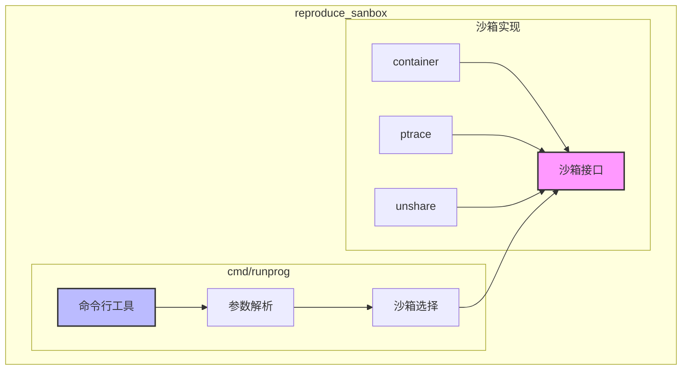
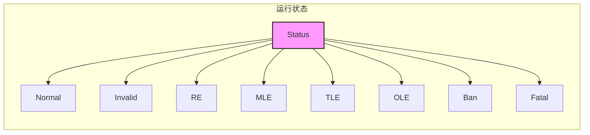
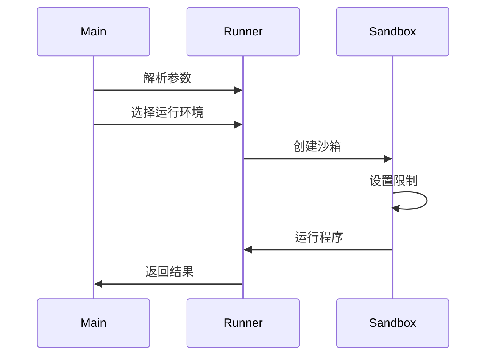

# CMD 包架构设计

## 1. 定位和作用

`cmd/runprog` 是一个用于测试和验证沙箱功能的命令行工具，它不是核心功能的一部分，而是帮助我们开发和测试的辅助工具。



### 1.1 主要功能
- 提供统一的命令行参数
- 选择不同的沙箱实现
- 设置运行限制（时间、内存等）
- 输出运行结果

### 1.2 依赖关系
```
cmd/runprog
├── 依赖 container 包
├── 依赖 ptrace 包
├── 依赖 unshare 包
└── 依赖 runner 接口
```

## 2. 目录结构

```
cmd/
└── runprog/                # 程序运行器
    ├── config/            # 配置文件
    ├── array_flags.go     # 命令行数组标志
    ├── fileutil.go        # 文件工具
    ├── main.go            # 主程序入口
    ├── main_darwin.go     # MacOS 实现
    └── main_linux.go      # Linux 实现
```

## 3. 运行参数

| 参数 | 说明 | 默认值 |
|------|------|--------|
| -tl | 时间限制（秒） | 1 |
| -rtl | 实际时间限制（秒） | 0 |
| -ml | 内存限制（MB） | 256 |
| --allow-proc | 允许访问 /proc | false |
| --unsafe | 不安全模式 | false |
| --show-details | 显示详细信息 | false |
| --cgroup | 使用 cgroup | false |
| --cred | 使用凭证 | false |

## 4. 状态定义



## 5. 执行流程



## 6. 核心组件

### 6.1 主程序
```go
func main() {
    // 解析命令行参数
    flag.Uint64Var(&timeLimit, "tl", 1, "时间限制")
    flag.Uint64Var(&memoryLimit, "ml", 256, "内存限制")
    // ...

    // 选择运行环境
    var r runner.Runner
    switch pType {
    case "container":
        r = container环境
    case "ptrace":
        r = ptrace环境
    case "unshare":
        r = unshare环境
    }

    // 运行程序
    result := r.Run(context)
}
```

### 6.2 状态映射
```go
func getStatus(s runner.Status) int {
    switch s {
    case runner.StatusNormal:
        return StatusNormal
    case runner.StatusTimeLimitExceeded:
        return StatusTLE
    case runner.StatusMemoryLimitExceeded:
        return StatusMLE
    // ...
    }
}
```

## 7. 使用示例

```bash
# 基本使用
runprog -tl 1 -ml 256 ./program

# 带输入输出
runprog -i input.txt -o output.txt ./program

# 容器模式
runprog --type container ./program

# 详细信息
runprog --show-details ./program
