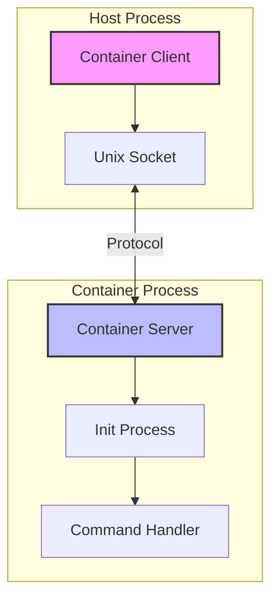
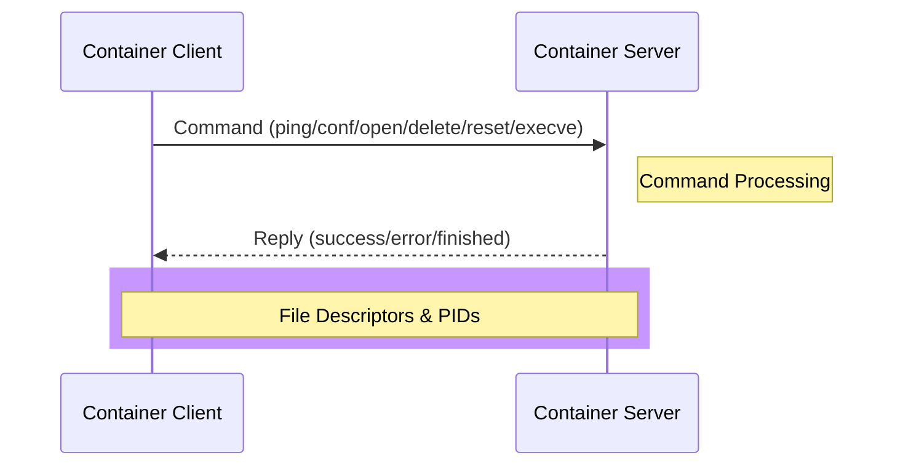
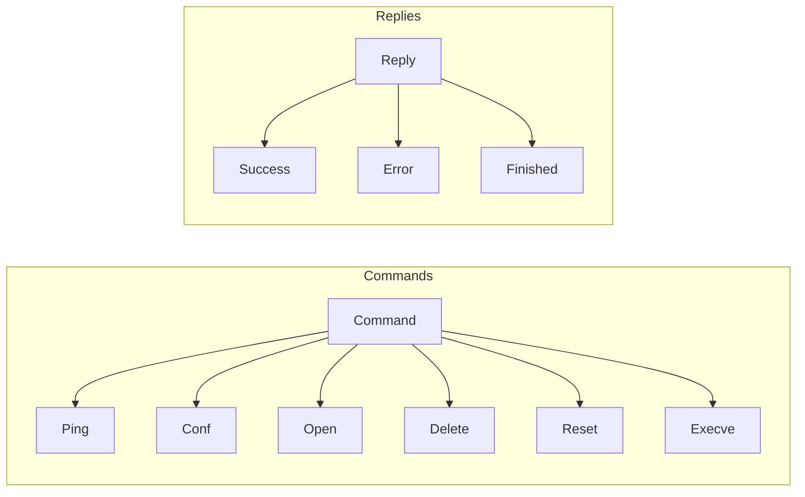
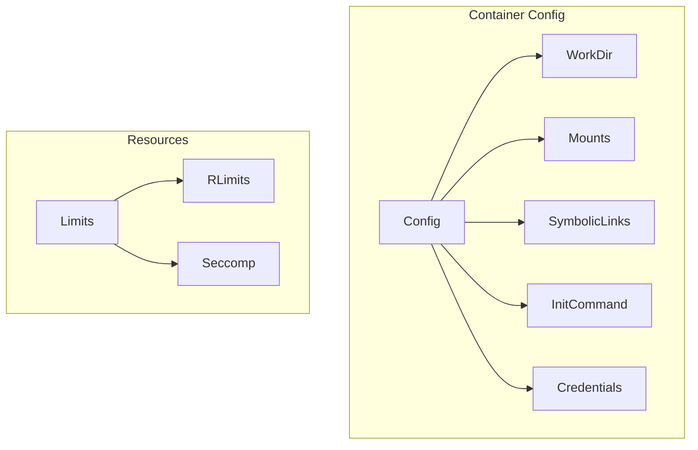
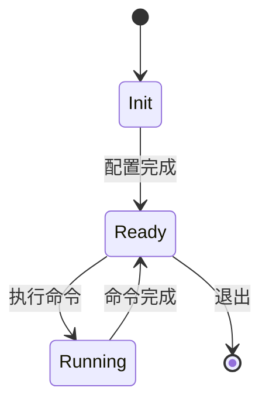
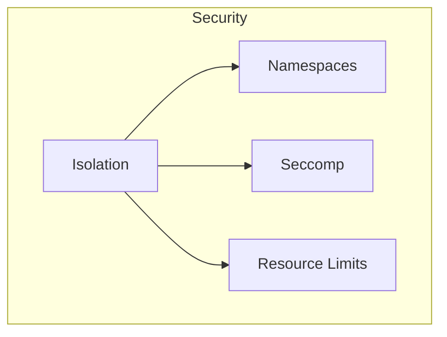

# Container 模块架构设计

## 1. 核心架构



## 2. 通信流程



## 3. 命令处理



## 4. 容器配置



## 5. 进程状态



## 6. 核心组件说明

### 6.1 Container Server
```go
type containerServer struct {
    socket *socket           // Unix socket 通信
    containerConfig         // 容器配置
    defaultEnv []string     // 默认环境变量
    
    // 通信通道
    recvCh chan recvCmd     // 接收命令
    sendCh chan sendReply   // 发送响应
    
    // 进程管理
    waitPid chan int
    waitPidResult chan waitPidResult
}
```

### 6.2 Command 结构
```go
type cmd struct {
    DeleteCmd *deleteCmd    // 删除操作
    ExecCmd   *execCmd      // 执行程序
    ConfCmd   *confCmd      // 设置配置
    OpenCmd   []OpenCmd     // 打开文件
    Cmd       cmdType       // 命令类型
}
```

### 6.3 Reply 结构
```go
type reply struct {
    Error     *errorReply   // 错误信息
    ExecReply *execReply    // 执行结果
}
```

## 7. 安全特性


