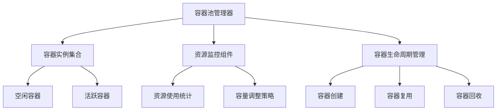
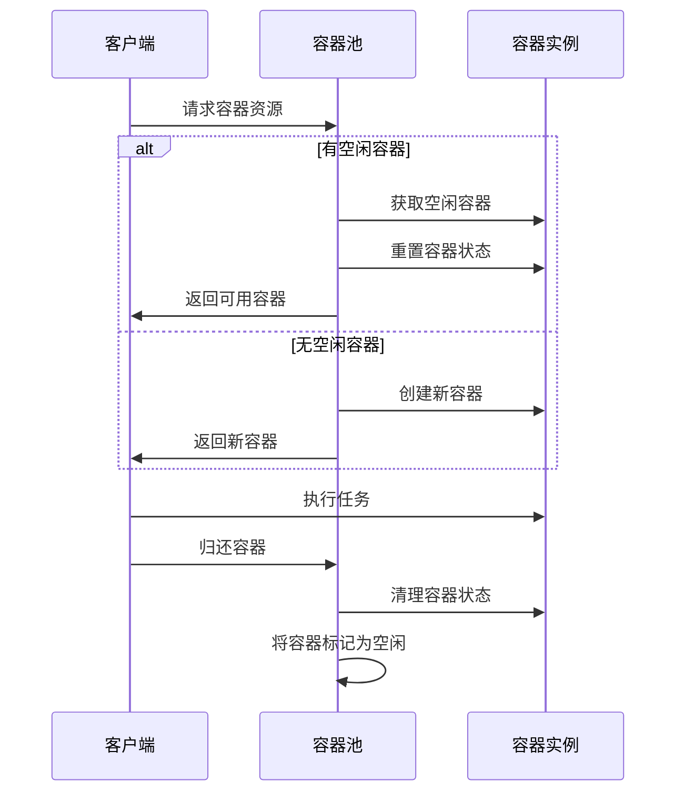
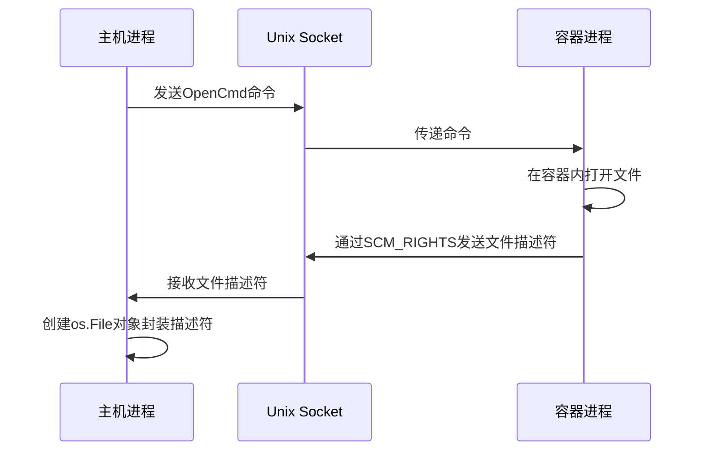
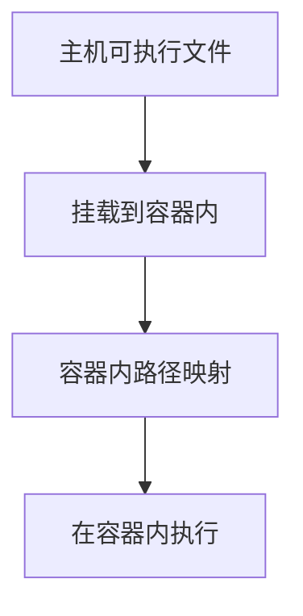
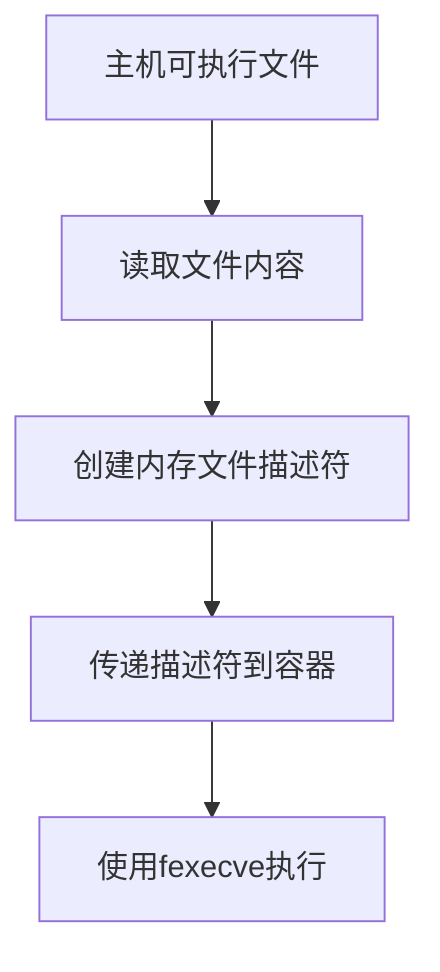
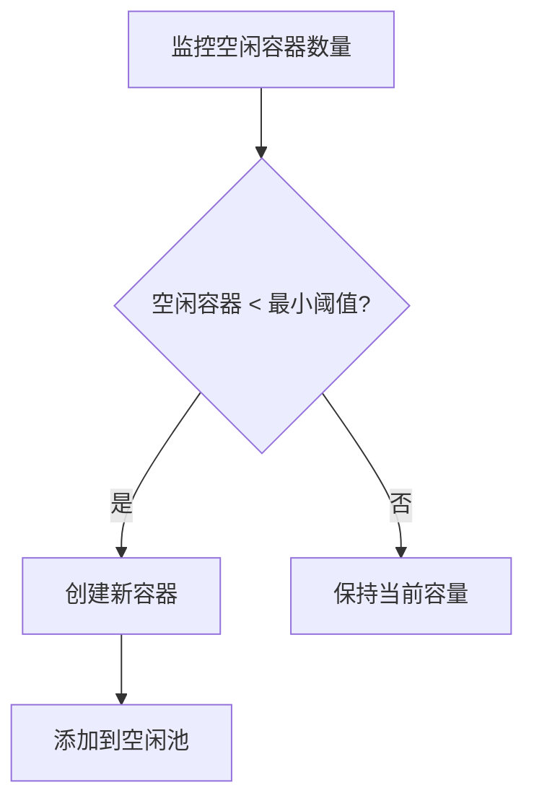
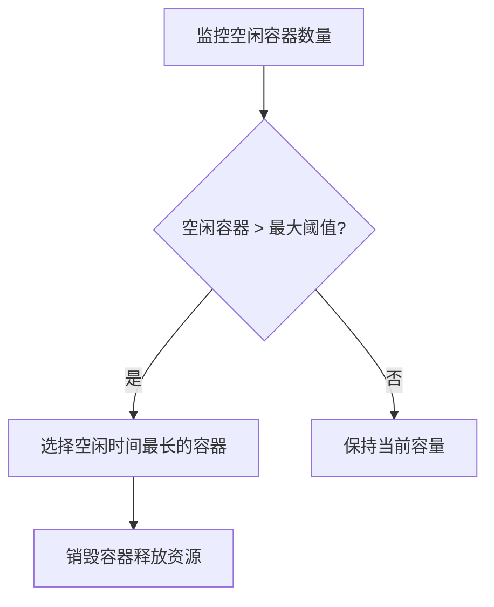

# Container 池化机制

> Container 池化是一种资源管理技术，通过预先创建和复用容器实例，减少容器创建和销毁的开销，提高系统性能和资源利用率。本文档详细介绍了 Container 池化的实现原理、关键组件以及资源利用流程。

## 容器池化的核心概念

> 容器池化的核心在于将容器的生命周期管理与业务逻辑分离，通过预创建、复用和回收容器来优化资源使用效率。

容器池化主要解决以下问题：
1. 减少容器创建的时间开销
2. 降低系统资源消耗
3. 提高任务执行效率
4. 实现资源的动态分配和回收

## 容器池的架构设计

> 容器池由池管理器、容器实例集合和资源监控组件组成，通过协同工作实现容器的高效管理和分配。



## 容器池化的实现机制

> 容器池化的实现依赖于预创建机制、连接复用和状态重置，确保容器能够安全高效地被多次使用。

### 预创建机制

容器池在系统启动或需要扩容时，会预先创建一定数量的容器实例。这些容器已完成初始化，处于待命状态，可以立即响应任务请求。预创建过程包括：

1. 创建容器环境（命名空间隔离）
2. 初始化文件系统挂载
3. 建立通信通道（Unix Socket）
4. 设置资源限制

### 容器复用流程



### 容器状态重置

为确保容器可以安全复用，每次任务执行完成后，容器池会执行状态重置操作：

1. 清理工作目录和临时文件
2. 终止所有子进程
3. 重置资源使用计数
4. 恢复初始环境变量

## 从连接池中利用资源

> 客户端通过统一的接口从容器池获取资源，使用完毕后归还，整个过程对业务逻辑透明。

### 资源获取流程

1. **请求资源**：客户端通过池管理器的 `Acquire()` 方法请求容器资源
2. **资源分配**：池管理器从空闲容器列表中选择一个可用容器
3. **状态检查**：对选中的容器执行 `Ping()` 操作，确保容器状态正常
4. **资源准备**：如有必要，执行 `Reset()` 操作重置容器环境

```go
// 伪代码示例
container, err := containerPool.Acquire(context.Background())
if err != nil {
    return err
}
defer containerPool.Release(container)

// 使用容器执行任务
result := container.Execve(ctx, execParams)
```

### 容器内文件操作详解

> 容器内文件操作通过 `Open()` 方法实现，该方法在容器内打开文件并返回文件描述符，支持各种文件操作模式和权限控制。

#### Open() 方法原理

`Open()` 方法允许在容器内部打开文件，其工作原理如下：

1. **命令传递**：主机进程通过 Unix Socket 向容器发送 `OpenCmd` 命令
2. **权限检查**：容器内进程检查请求的路径是否在允许访问的范围内
3. **文件操作**：容器内进程执行实际的文件打开操作
4. **描述符传递**：通过 Unix Socket 的带外数据（OOB）将文件描述符传回主机进程

```go
// OpenCmd 定义了打开文件的命令结构
type OpenCmd struct {
    Path string      // 文件路径
    Flag int         // 打开标志 (O_RDONLY, O_WRONLY, O_RDWR等)
    Perm os.FileMode // 文件权限
}

// 使用示例
files, err := container.Open([]OpenCmd{
    {Path: "/w/input.txt", Flag: os.O_RDONLY, Perm: 0},
    {Path: "/w/output.txt", Flag: os.O_WRONLY|os.O_CREATE, Perm: 0644},
})
```

#### 文件访问控制

容器内的文件访问受到严格控制：

1. **路径限制**：只能访问容器挂载点内的文件
2. **权限控制**：基于容器用户ID和组ID进行权限检查
3. **资源限制**：文件描述符数量受到容器资源限制的约束

#### 文件描述符传递机制

文件描述符通过 Unix Socket 的特殊功能进行传递：



### 容器内程序执行详解

> 容器内程序执行通过 `Execve()` 方法实现，该方法支持将主机上的可执行文件加载到容器内执行，同时提供完整的环境控制和资源限制。

#### Execve() 方法原理

`Execve()` 方法允许在容器内执行程序，其工作流程如下：

1. **参数准备**：主机进程准备执行参数、环境变量和资源限制
2. **命令传递**：通过 Unix Socket 将执行命令发送到容器
3. **程序执行**：容器内进程使用 `execve` 系统调用启动目标程序
4. **状态监控**：主机进程监控容器内程序的执行状态和资源使用情况

```go
// ExecveParam 定义了程序执行的参数结构
type ExecveParam struct {
    Args     []string          // 命令行参数
    Env      []string          // 环境变量
    Files    []uintptr         // 文件描述符
    ExecFile uintptr           // 可执行文件描述符(用于fexecve)
    RLimits  []syscall.Rlimit  // 资源限制
    Seccomp  Filter            // 安全计算模式过滤器
    SyncFunc func(pid int) error // 同步函数
}
```

#### 将主机程序加载到容器内执行

将主机上的可执行程序加载到容器内执行有两种主要方式：

##### 1. 通过文件系统挂载



这种方式的实现步骤：

1. **路径映射**：确定主机文件在容器内的路径
   ```go
   // 假设主机文件位于 /usr/bin/python
   // 容器内映射为 /usr/bin/python
   args := []string{"/usr/bin/python", "script.py"}
   ```

2. **执行调用**：使用映射后的路径在容器内执行
   ```go
   result := container.Execve(ctx, container.ExecveParam{
       Args: args,
       Env:  []string{"PATH=/usr/bin:/bin"},
   })
   ```

##### 2. 通过文件描述符传递（memfd）



这种方式特别适合执行容器外的临时程序或动态生成的代码：

1. **创建内存文件描述符**：
   ```go
   // 打开主机上的可执行文件
   hostFile, err := os.Open("/path/to/executable")
   if err != nil {
       return err
   }
   defer hostFile.Close()
   
   // 创建内存文件描述符
   memfd, err := memfd.DupToMemfd("program", hostFile)
   if err != nil {
       return err
   }
   defer memfd.Close()
   ```

2. **传递并执行**：
   ```go
   // 准备文件描述符
   files := []uintptr{
       memfd.Fd(), // 可执行文件描述符
       stdin.Fd(), // 标准输入
       stdout.Fd(), // 标准输出
       stderr.Fd(), // 标准错误
   }
   
   // 执行程序
   result := container.Execve(ctx, container.ExecveParam{
       Args:     []string{"program"}, // 程序名称（仅用于显示）
       Env:      []string{"PATH=/usr/bin:/bin"},
       Files:    files[1:], // 标准输入输出错误
       ExecFile: files[0], // 可执行文件描述符
       FdExec:   true, // 标记使用文件描述符执行
   })
   ```

#### 执行过程的安全控制

容器内程序执行受到多层安全机制保护：

1. **Seccomp 过滤**：限制可用的系统调用
   ```go
   // 创建 seccomp 过滤器
   filter, err := seccomp.NewFilter(allowedSyscalls)
   if err != nil {
       return err
   }
   
   // 应用到执行参数
   execParams.Seccomp = filter
   ```

2. **资源限制**：通过 rlimit 控制资源使用
   ```go
   // 设置资源限制
   execParams.RLimits = []syscall.Rlimit{
       {Type: syscall.RLIMIT_CPU, Cur: 1, Max: 1},        // CPU时间限制(秒)
       {Type: syscall.RLIMIT_AS, Cur: 256 * 1024 * 1024, Max: 256 * 1024 * 1024}, // 内存限制
       {Type: syscall.RLIMIT_NOFILE, Cur: 64, Max: 64},   // 文件描述符限制
   }
   ```

3. **命名空间隔离**：程序在隔离的命名空间内执行
4. **权能控制**：移除危险的系统权能

#### 执行状态监控与结果获取

执行过程中，主机进程可以监控容器内程序的状态：

1. **进程ID获取**：获取容器内程序的PID
2. **信号控制**：向容器内程序发送信号
3. **资源统计**：收集CPU、内存使用情况
4. **退出状态**：获取程序的退出码和终止信号

```go
// 执行结果包含详细信息
type Result struct {
    Status     Status        // 执行状态
    ExitStatus int           // 退出码
    Time       time.Duration // CPU时间
    Memory     Size          // 内存使用
    SetUpTime  time.Duration // 设置时间
    RunningTime time.Duration // 运行时间
}
```

### 实际应用场景示例

以下是一个完整的示例，展示如何从容器池获取容器，将主机上的程序加载到容器内执行，并获取结果：

```go
func RunProgramInContainer(ctx context.Context, programPath string, input []byte) ([]byte, error) {
    // 1. 从容器池获取容器
    container, err := containerPool.Acquire(ctx)
    if err != nil {
        return nil, fmt.Errorf("获取容器失败: %v", err)
    }
    defer containerPool.Release(container)
    
    // 2. 准备容器内的工作目录
    if err := container.Reset(); err != nil {
        return nil, fmt.Errorf("重置容器状态失败: %v", err)
    }
    
    // 3. 创建输入输出文件
    files, err := container.Open([]OpenCmd{
        {Path: "/w/input.txt", Flag: os.O_WRONLY|os.O_CREATE, Perm: 0644},
        {Path: "/w/output.txt", Flag: os.O_RDWR|os.O_CREATE, Perm: 0644},
    })
    if err != nil {
        return nil, fmt.Errorf("创建文件失败: %v", err)
    }
    
    // 4. 写入输入数据
    inputFile := files[0]
    defer inputFile.Close()
    if _, err := inputFile.Write(input); err != nil {
        return nil, fmt.Errorf("写入输入失败: %v", err)
    }
    inputFile.Close() // 关闭文件以便程序读取
    
    // 5. 准备执行参数
    outputFile := files[1]
    defer outputFile.Close()
    
    // 6. 创建内存文件描述符（用于加载主机程序）
    hostProgram, err := os.Open(programPath)
    if err != nil {
        return nil, fmt.Errorf("打开程序失败: %v", err)
    }
    defer hostProgram.Close()
    
    memfd, err := memfd.DupToMemfd("program", hostProgram)
    if err != nil {
        return nil, fmt.Errorf("创建内存文件描述符失败: %v", err)
    }
    defer memfd.Close()
    
    // 7. 执行程序
    result := container.Execve(ctx, ExecveParam{
        Args:     []string{"program", "/w/input.txt", "/w/output.txt"},
        Env:      []string{"PATH=/usr/bin:/bin"},
        ExecFile: memfd.Fd(),
        FdExec:   true,
        RLimits: []syscall.Rlimit{
            {Type: syscall.RLIMIT_CPU, Cur: 1, Max: 1},
            {Type: syscall.RLIMIT_AS, Cur: 256 * 1024 * 1024, Max: 256 * 1024 * 1024},
        },
    })
    
    // 8. 检查执行结果
    if result.Status != StatusNormal {
        return nil, fmt.Errorf("程序执行异常: %v", result.Status)
    }
    
    // 9. 读取输出
    outputFile.Seek(0, 0) // 回到文件开头
    output, err := io.ReadAll(outputFile)
    if err != nil {
        return nil, fmt.Errorf("读取输出失败: %v", err)
    }
    
    return output, nil
}
```

## 容器池的动态管理

> 容器池根据系统负载动态调整容器数量，保持资源利用与系统负载的平衡。

### 扩容策略

当系统负载增加，空闲容器数量低于阈值时，容器池会创建新的容器实例：



### 缩容策略

当系统负载降低，空闲容器过多时，容器池会回收部分容器资源：



### 健康检查

容器池定期对池中的容器执行健康检查，确保所有容器处于可用状态：

1. 执行 `Ping()` 操作验证容器响应
2. 检查容器资源使用情况
3. 对异常容器执行修复或替换

## 容器池的性能优化

> 通过参数调优和资源控制，容器池可以达到最佳性能表现。

### 关键参数

- **初始容量**：系统启动时预创建的容器数量
- **最大容量**：容器池允许的最大容器数量
- **最小空闲**：保持的最小空闲容器数量
- **最大空闲**：允许的最大空闲容器数量
- **超时时间**：容器获取的最大等待时间

### 资源限制

每个容器实例都有明确的资源限制，防止单个容器过度消耗系统资源：

- CPU 使用限制
- 内存使用上限
- 文件描述符数量
- 磁盘 I/O 带宽

## 总结

> 容器池化技术通过预创建和复用容器实例，显著提高了系统性能和资源利用率，是高性能容器化应用的关键技术。

容器池化的核心价值在于：
1. 减少容器启动延迟，提高响应速度
2. 降低系统资源开销，提高资源利用率
3. 实现资源的动态分配和回收，适应负载变化
4. 简化容器生命周期管理，提高系统可靠性