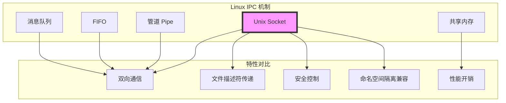
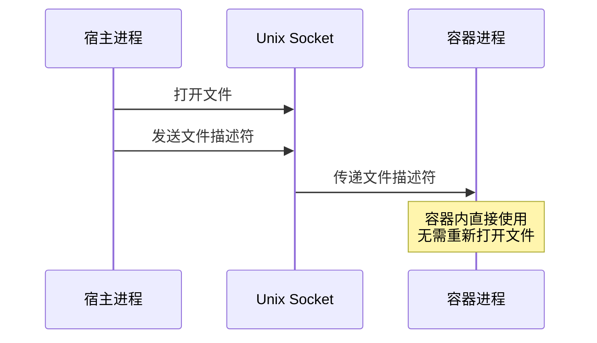
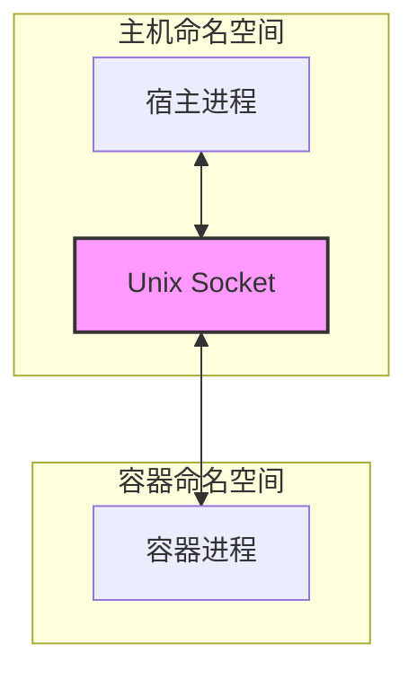
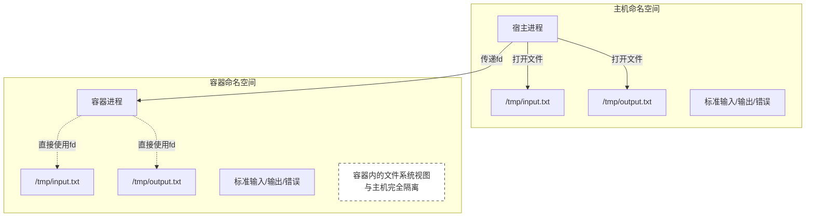
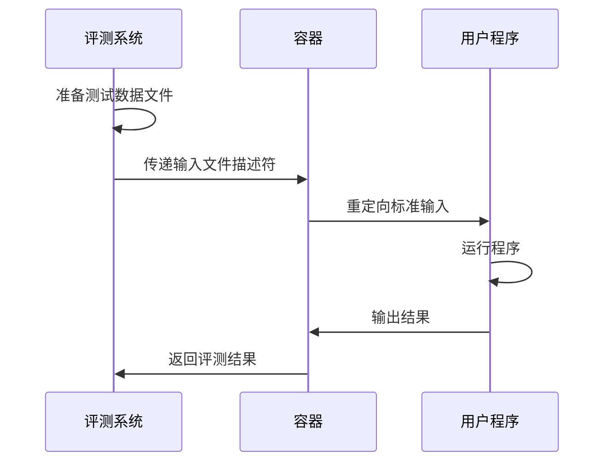
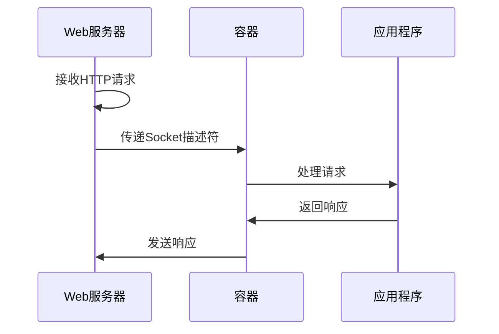
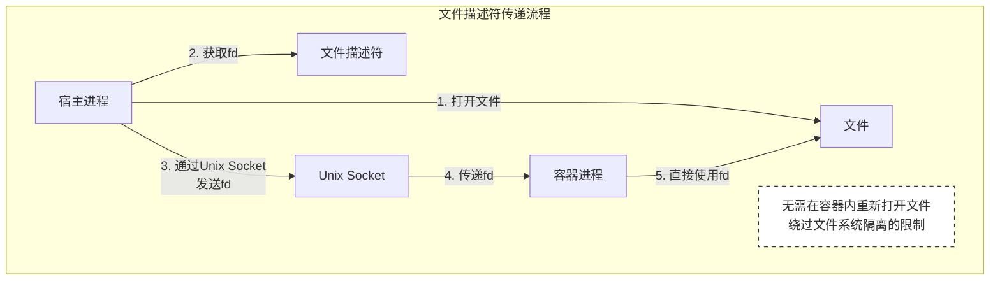
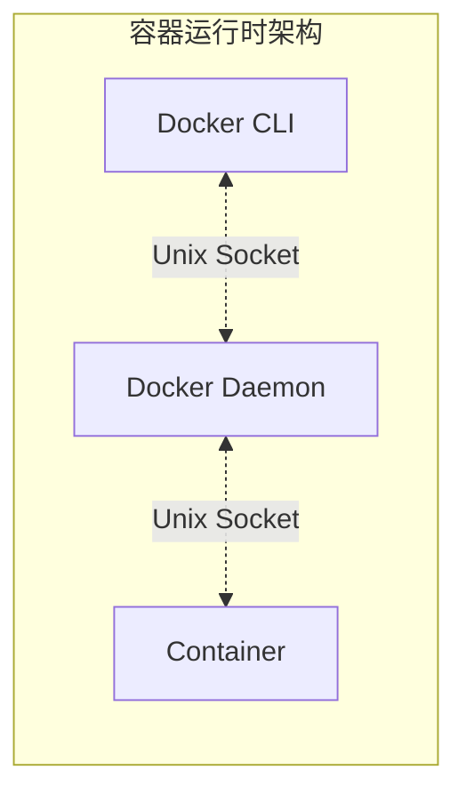
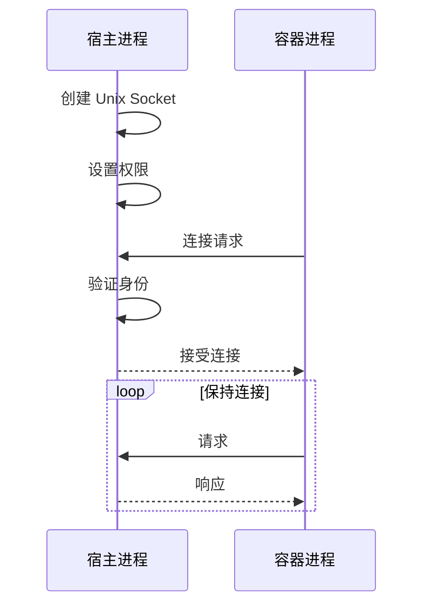

# 为什么选择 Unix Socket 作为沙箱通信方式

## Linux IPC 通信方式对比



## 各种 IPC 机制在沙箱场景中的问题

### 1. 管道（Pipe）
- ❌ 只能用于父子进程间通信
- ❌ 不支持文件描述符传递
- ❌ 单向通信，需要创建两个管道
- ✅ 简单易用
- ✅ 性能较好

### 2. 命名管道（FIFO）
- ❌ 不支持文件描述符传递
- ❌ 在容器命名空间隔离时需要特殊处理
- ✅ 支持无关进程间通信
- ✅ 持久化在文件系统中

### 3. 消息队列
- ❌ 不支持文件描述符传递
- ❌ 容器隔离时需要特殊处理
- ❌ 消息大小限制
- ✅ 支持消息优先级
- ✅ 系统级持久化

### 4. 共享内存
- ❌ 需要额外的同步机制
- ❌ 容器隔离时需要特殊处理
- ❌ 安全控制较难
- ✅ 最高的性能
- ✅ 适合大数据传输

### 5. Unix Socket
- ✅ 支持双向通信
- ✅ 支持文件描述符传递
- ✅ 与容器命名空间隔离兼容
- ✅ 完整的权限控制
- ✅ 面向流的可靠通信
- ❓ 性能略低于共享内存

## Unix Socket 在沙箱中的优势

### 1. 文件描述符传递能力


### 2. 命名空间隔离兼容性


### 3. 安全特性
- 基于文件系统权限控制
- 支持 SELinux/AppArmor 策略
- 可以限制连接的用户/组

## 文件描述符传递的重要性

### 1. 沙箱场景的特殊性



### 2. 不支持文件描述符传递的问题

1. **文件系统隔离的矛盾**
   ```mermaid
   sequenceDiagram
       participant H as 宿主进程
       participant C as 容器进程
       
       Note over H,C: 使用其他IPC机制（如管道）
       H->>H: 打开文件 "/tmp/input.txt"
       H->>C: 发送文件路径
       Note over C: 问题：容器内看不到<br>主机的文件系统
       C-->>H: 无法访问文件
   ```

2. **标准输入输出重定向**
   ```mermaid
   sequenceDiagram
       participant H as 宿主进程
       participant C as 容器进程
       
       Note over H,C: 使用 Unix Socket
       H->>H: 打开标准输入/输出
       H->>C: 传递文件描述符
       Note over C: 容器内可以直接使用<br>主机的标准输入/输出
       C->>H: 正常通信
   ```

### 3. 实际应用场景

1. **编程题评测系统**


2. **Web应用沙箱**


### 4. 其他IPC机制的局限性

| IPC机制 | 在沙箱中的主要问题 |
|---------|------------------|
| 管道 | 无法传递已打开的文件描述符，需要在容器内重新打开文件 |
| 消息队列 | 无法传递文件描述符，且在命名空间隔离时通信困难 |
| 共享内存 | 无法传递文件描述符，需要额外的同步机制 |
| 信号 | 无法传递任何数据 |

### 5. Unix Socket的解决方案



### 6. 安全性考虑

1. **文件访问控制**
   - 容器只能访问显式传递的文件描述符
   - 无法访问主机文件系统的其他部分
   - 精确控制文件访问权限

2. **资源隔离**
   - 文件描述符传递不破坏命名空间隔离
   - 保持容器的安全边界
   - 避免权限提升

3. **生命周期管理**
   - 容器退出时自动关闭传递的文件描述符
   - 避免资源泄露
   - 便于清理和重置

因此，在沙箱场景中，文件描述符传递能力是一个必需的特性，它解决了容器隔离和文件访问之间的矛盾，同时保持了安全性和可控性。Unix Socket 是唯一一个原生支持这个特性的 IPC 机制，这也是它成为沙箱通信首选方案的重要原因。

## 实际应用案例

### 1. Linux 守护进程通信
- systemd 使用 Unix Socket 进行进程间通信
- Docker daemon 使用 Unix Socket 接收命令
- Nginx 使用 Unix Socket 处理 FastCGI

### 2. 容器运行时通信


## 性能对比

| IPC 机制 | 延迟 | 吞吐量 | 文件描述符传递 | 安全控制 | 命名空间兼容 |
|---------|------|--------|--------------|---------|------------|
| Unix Socket | 低 | 高 | 支持 | 完整 | 原生支持 |
| Pipe | 低 | 高 | 不支持 | 有限 | 部分支持 |
| FIFO | 中 | 中 | 不支持 | 有限 | 需特殊处理 |
| 消息队列 | 中 | 中 | 不支持 | 有限 | 需特殊处理 |
| 共享内存 | 最低 | 最高 | 不支持 | 困难 | 需特殊处理 |

## 最佳实践

### 1. 连接管理


### 2. 错误处理
- 连接断开自动重连
- 文件描述符泄漏检测
- 死连接清理

### 3. 性能优化
- 使用长连接
- 批量传输文件描述符
- 适当的缓冲区大小

## 结论

在沙箱场景中，Unix Socket 是最佳的 IPC 选择，因为它：
1. 提供了必要的文件描述符传递能力
2. 与容器命名空间隔离机制完美兼容
3. 提供了完整的安全控制
4. 性能足够好，且使用简单可靠