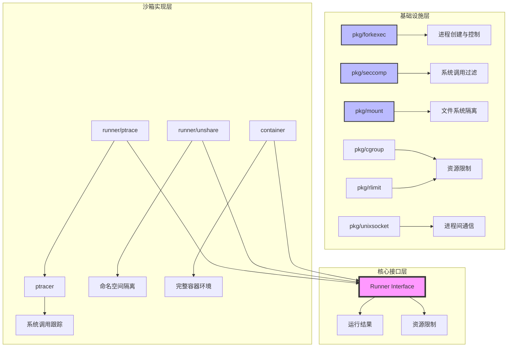
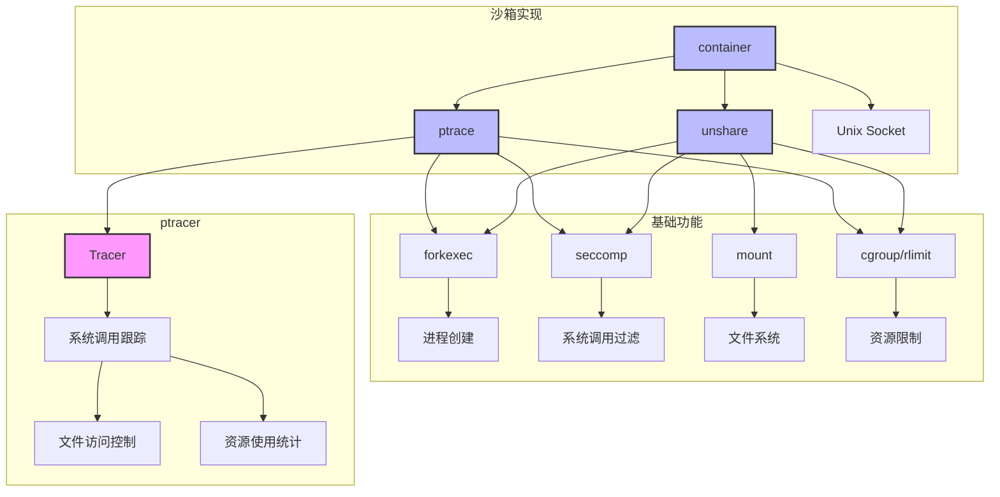
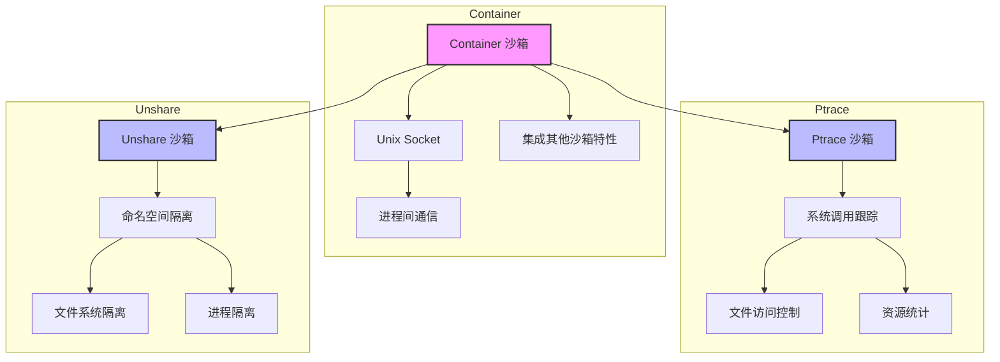
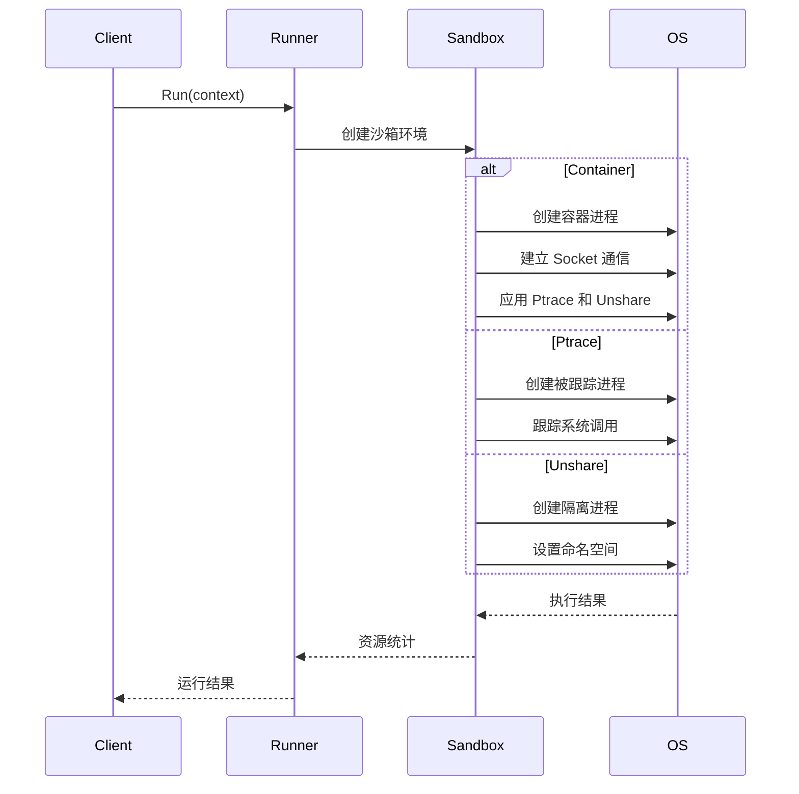

# Reproduce Sandbox 架构设计

## 1. 项目结构



## 2. 核心组件关系



## 3. 沙箱实现层次



## 4. 核心组件说明

### 4.1 基础设施层
1. **pkg/forkexec**：进程创建和控制
   - 提供类似 `syscall.ForkExec` 的功能
   - 支持更多的安全特性和隔离机制

2. **pkg/seccomp**：系统调用过滤
   - 定义系统调用过滤规则
   - 实现系统调用的精细控制

3. **pkg/mount**：文件系统隔离
   - 管理挂载点
   - 实现文件系统隔离

4. **pkg/cgroup & pkg/rlimit**：资源限制
   - CPU、内存等资源限制
   - 进程资源使用控制

### 4.2 ptracer 包
1. **核心功能**：
   - 实现系统调用跟踪
   - 提供底层的 ptrace 操作
   - 支持文件访问控制

2. **主要组件**：
   ```go
   type Tracer struct {
       Handler  // 系统调用处理器
       Runner   // 进程运行器
       Limit    // 资源限制
   }
   ```

### 4.3 沙箱实现
1. **Ptrace 沙箱**：
   ```go
   type Runner struct {
       Args []string      // 命令行参数
       Env  []string      // 环境变量
       Files []uintptr    // 文件描述符
       RLimits []RLimit   // 资源限制
       Seccomp Filter     // 系统调用过滤器
   }
   ```

2. **Unshare 沙箱**：
   ```go
   type Runner struct {
       Args []string
       Env  []string
       Root string        // 根目录
       Mounts []Mount     // 挂载点
       Seccomp Filter     // 系统调用过滤器
   }
   ```

3. **Container 沙箱**：
   ```go
   type container struct {
       socket *socket     // Unix Socket
       process *os.Process
       config containerConfig
   }
   ```

## 5. 执行流程



## 6. 特性对比

| 特性 | Ptrace | Unshare | Container |
|------|---------|----------|-----------|
| 隔离级别 | 系统调用 | 命名空间 | 完整 |
| 资源控制 | 基础 | 基础 | 完整 |
| 性能开销 | 高 | 低 | 中 |
| 安全级别 | 高 | 中 | 高 |
| 实现复杂度 | 中 | 低 | 高 |
| 调试能力 | 强 | 弱 | 强 |
| 通信机制 | 进程跟踪 | 无 | Socket |
| 依赖关系 | 独立 | 独立 | 依赖其他沙箱 |
