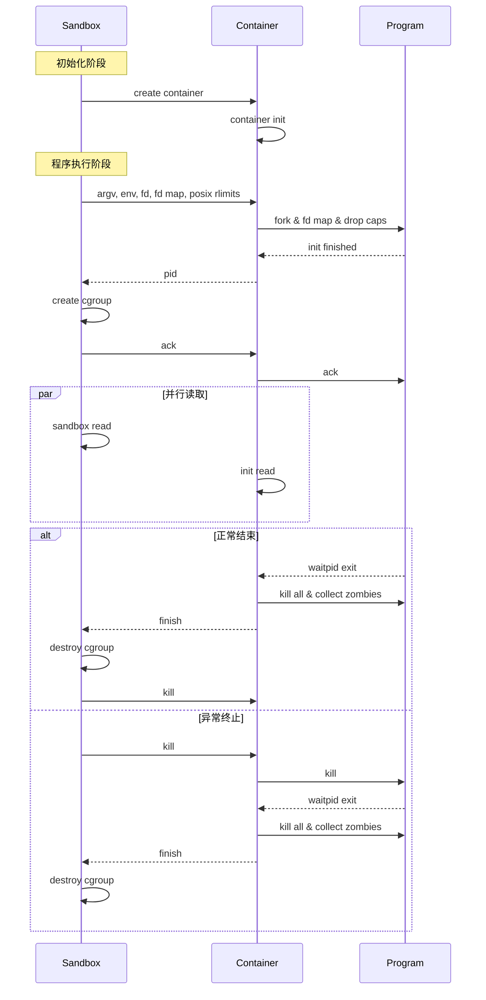

# 容器池设计

容器池的设计采用了类似 Linux daemon 的思想，通过在容器中运行的"客户端"和在宿主机上运行的"控制端"来管理程序的执行。
这种设计可以显著减少创建容器的开销，因为不需要为每个程序重新创建容器的文件系统。

## 时序图

## 主要组件说明

1. **Sandbox（沙箱控制端）**
   - 负责创建和管理容器
   - 控制资源限制（cgroup）
   - 处理程序执行结果

2. **Container（容器客户端）**
   - 在隔离环境中运行
   - 管理程序的执行
   - 处理文件描述符映射

3. **Program（用户程序）**
   - 在容器环境中执行
   - 受到资源限制和安全限制

## 优化特点

1. **性能优化**
   - 避免重复创建容器环境
   - 使用 Unix socket 进行高效通信
   - 支持文件描述符直接传递

2. **资源管理**
   - 使用 cgroup 进行精确资源控制
   - 支持僵尸进程清理
   - 完整的错误处理机制

3. **安全特性**
   - 支持能力限制（capability）
   - 文件系统隔离
   - 资源使用限制
