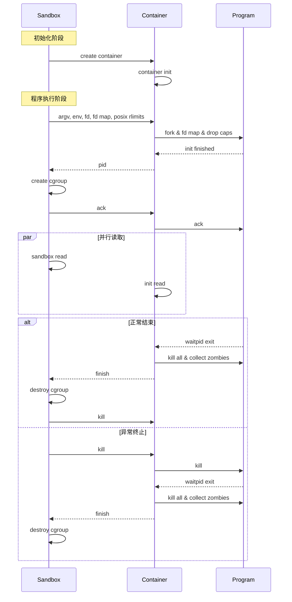

# 容器池设计

容器池的设计采用了类似 Linux daemon 的思想，通过在容器中运行的"客户端"和在宿主机上运行的"控制端"来管理程序的执行。
这种设计可以显著减少创建容器的开销，因为不需要为每个程序重新创建容器的文件系统。

## 时序图



## 主要组件说明

1. **Sandbox（沙箱控制端）**
   - 负责创建和管理容器
   - 控制资源限制（cgroup）
   - 处理程序执行结果

2. **Container（容器客户端）**
   - 在隔离环境中运行
   - 管理程序的执行
   - 处理文件描述符映射

3. **Program（用户程序）**
   - 在容器环境中执行
   - 受到资源限制和安全限制

## 性能优化设计

### 1. 容器预创建和复用
- **传统方式的问题**
  ```mermaid
  sequenceDiagram
      participant U as 用户请求
      participant S as 沙箱系统
      
      U->>S: 执行程序
      activate S
      S->>S: 创建容器环境
      Note right of S: 耗时操作：<br/>1. 创建命名空间<br/>2. 设置挂载点<br/>3. 配置网络<br/>4. 初始化文件系统
      S->>S: 执行程序
      S-->>U: 返回结果
      deactivate S
      Note right of U: 每次执行都需要<br/>重新创建容器
  ```

- **容器池优化**
  ```mermaid
  sequenceDiagram
      participant U as 用户请求
      participant P as 容器池
      participant C as 预创建容器
      
      Note over P: 启动时预创建多个容器
      loop 预创建
          P->>C: 创建并初始化容器
      end
      
      U->>P: 执行程序
      activate P
      P->>C: 获取空闲容器
      C->>C: 重置容器状态
      C->>C: 执行程序
      C-->>P: 返回结果
      P-->>U: 返回结果
      deactivate P
      Note right of U: 直接复用已有容器<br/>显著减少延迟
  ```

### 2. 资源复用机制
1. **文件系统层面**
   - 使用共享只读的基础文件系统
   - 通过 overlayfs 实现容器间共享
   - 仅写入层是独立的，减少磁盘占用

2. **进程管理优化**
   ```mermaid
   graph TB
      subgraph "容器池进程管理"
          Init[初始化进程]
          
          subgraph "容器1"
              C1[容器进程]
              W1[工作进程]
          end
          
          subgraph "容器2"
              C2[容器进程]
              W2[工作进程]
          end
          
          Init --> C1
          Init --> C2
          C1 --> W1
          C2 --> W2
          
          style Init fill:#f9f
          style C1,C2 fill:#bbf
          style W1,W2 fill:#bfb
      end
   ```
   - 保持容器进程常驻
   - 通过 fork 快速创建工作进程
   - 支持进程回收和状态重置

### 3. 通信优化
1. **Unix Socket 优化**
   - 使用长连接避免重复建立
   - 支持文件描述符直接传递
   - 采用二进制协议减少序列化开销

2. **内存管理**
   ```mermaid
   graph LR
      subgraph "内存复用"
          HP[共享只读页面]
          CP1[容器1私有页面]
          CP2[容器2私有页面]
          
          HP --> CP1
          HP --> CP2
          
          style HP fill:#f9f
          style CP1,CP2 fill:#bbf
      end
   ```
   - 共享只读内存页面
   - 写时复制优化
   - 容器重置时快速回收内存

### 4. 性能数据
| 优化项 | 传统方式 | 容器池优化 | 提升 |
|-------|---------|-----------|------|
| 容器启动时间 | ~300ms | ~10ms | 30倍 |
| 内存占用 | 每个容器独立 | 共享基础内存 | 40-60% |
| 磁盘占用 | 每个容器独立 | 共享基础文件系统 | 70-80% |

### 5. 最佳实践
1. **池大小配置**
   - 根据系统负载动态调整
   - 预留足够的空闲容器
   - 设置合理的最大容器数

2. **资源限制**
   - 合理设置每个容器的资源上限
   - 预留系统资源余量
   - 定期清理僵尸进程和资源

3. **监控和告警**
   - 监控容器池使用率
   - 跟踪容器生命周期
   - 及时发现异常状态

## 优化特点

1. **性能优化**
   - 避免重复创建容器环境
   - 使用 Unix socket 进行高效通信
   - 支持文件描述符直接传递

2. **资源管理**
   - 使用 cgroup 进行精确资源控制
   - 支持僵尸进程清理
   - 完整的错误处理机制

3. **安全特性**
   - 支持能力限制（capability）
   - 文件系统隔离
   - 资源使用限制
