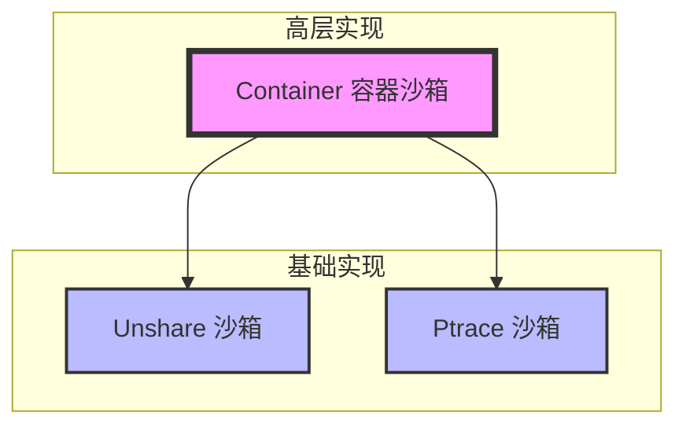
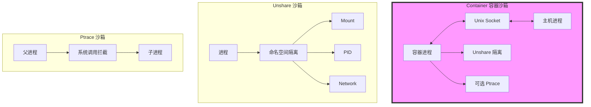
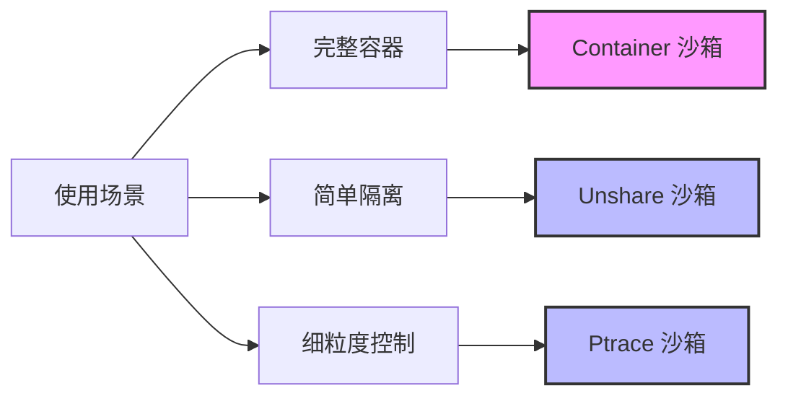

# 沙箱实现架构关系

## 1. 三种实现的层次关系



## 2. 功能对比

| 特性 | Container 容器沙箱 | Unshare 沙箱 | Ptrace 沙箱 |
|------|------------------|-------------|------------|
| 隔离级别 | 完整容器隔离 | 命名空间隔离 | 系统调用隔离 |
| 实现复杂度 | 高 | 中 | 中 |
| 性能开销 | 中 | 低 | 高 |
| 功能完整性 | 完整 | 基础 | 基础 |
| 通信机制 | Unix Socket | 无 | 进程跟踪 |
| 资源管理 | 完整 | 基础 | 基础 |
| 文件系统 | 完整隔离 | 部分隔离 | 访问控制 |

## 3. 架构关系



## 4. 关系说明

### 4.1 Container 容器沙箱
- **集成了 Unshare 和 Ptrace 的功能**
  - 使用 Unshare 实现基础的命名空间隔离
  - 可选择性地使用 Ptrace 进行更细粒度的控制
- **增加了更多高级特性**
  - 预分叉设计提高性能
  - 完整的进程通信机制
  - 更完善的资源管理
  - 文件系统完全隔离

### 4.2 基础实现的定位
1. **Unshare 沙箱**
   - 作为容器沙箱的基础隔离机制
   - 提供命名空间级别的隔离
   - 轻量级，性能好

2. **Ptrace 沙箱**
   - 作为可选的增强安全机制
   - 提供系统调用级别的控制
   - 适用于需要细粒度控制的场景

## 5. 使用场景



### 5.1 选择建议
1. **使用 Container 沙箱当：**
   - 需要完整的容器功能
   - 需要高级的资源管理
   - 需要完整的文件系统隔离
   - 性能要求适中

2. **使用 Unshare 沙箱当：**
   - 只需要基本的隔离
   - 性能是主要考虑因素
   - 不需要细粒度控制

3. **使用 Ptrace 沙箱当：**
   - 需要系统调用级别的控制
   - 安全性要求高
   - 可以接受性能开销

## 6. 技术栈对比

### 6.1 Container 容器沙箱
```go
// 完整的容器实现
type containerServer struct {
    socket *socket          // 通信
    containerConfig        // 配置
    defaultEnv []string    // 环境
    // ... 更多字段
}
```

### 6.2 Unshare 沙箱
```go
// 基础的命名空间隔离
type Runner struct {
    Args []string
    Env []string
    WorkDir string
    Files []uintptr
    RLimits []rlimit.RLimit
    Limit runner.Limit
    Seccomp seccomp.Filter
}
```

### 6.3 Ptrace 沙箱
```go
// 系统调用控制
type Runner struct {
    Args []string
    Env []string
    WorkDir string
    Files []uintptr
    RLimits []rlimit.RLimit
    Limit runner.Limit
    Handler Handler        // 系统调用处理
    ShowDetails bool
}
```

## 7. 总结

Container 容器沙箱是一个更高层次的实现，它：
1. 集成了 Unshare 和 Ptrace 的优点
2. 提供了更完整的功能集
3. 增加了更多的管理和控制能力
4. 适合更复杂的应用场景

而 Unshare 和 Ptrace 则是两种不同的基础隔离机制，各自适合不同的使用场景。Container 容器沙箱通过组合这两种机制，提供了一个更完整的解决方案。
