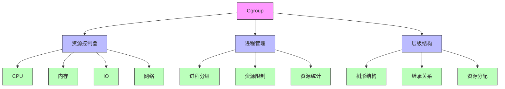
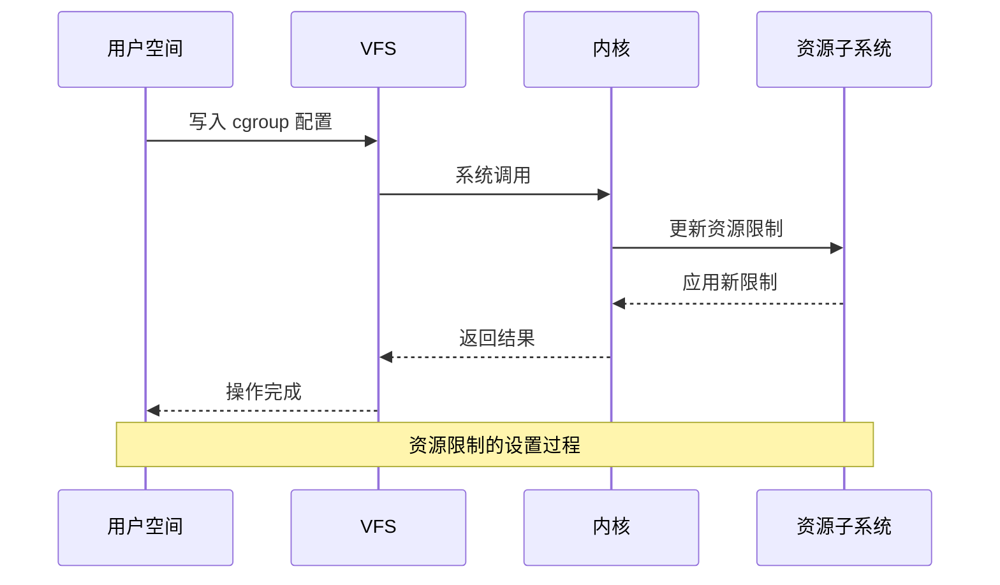
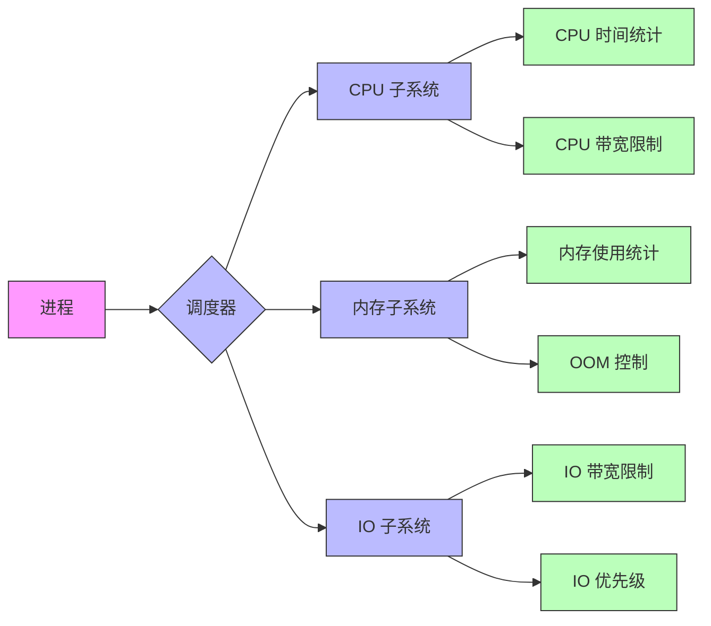
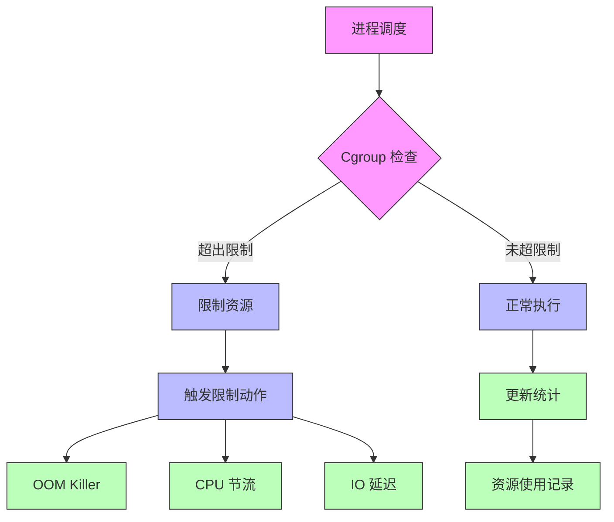
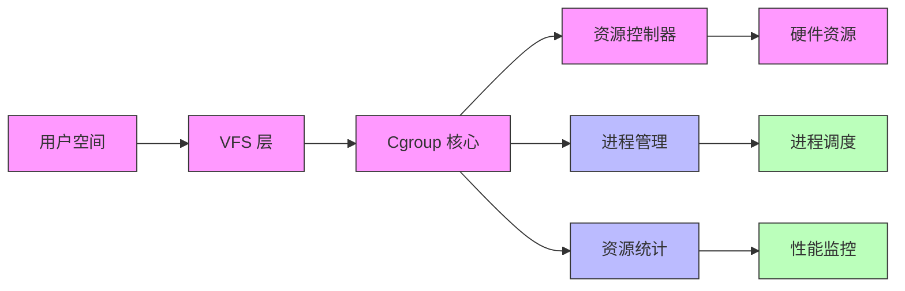
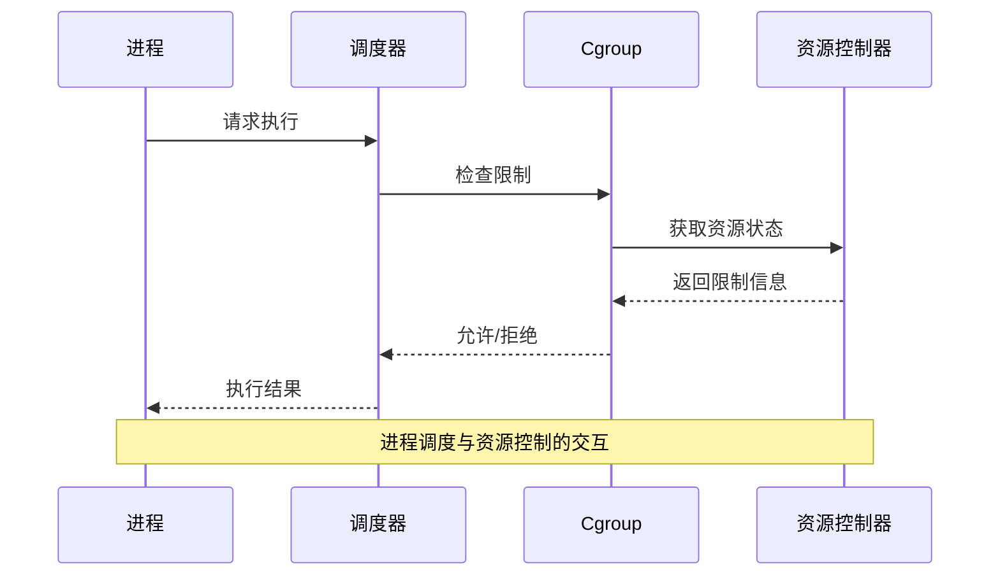
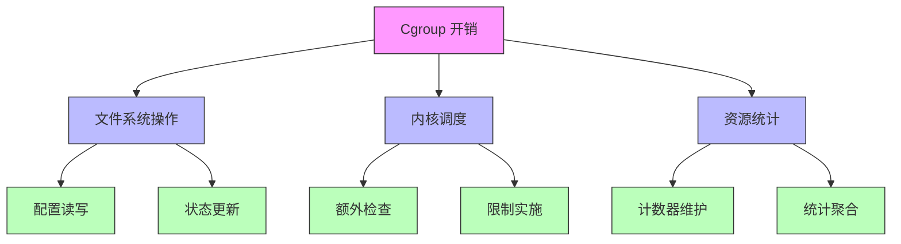
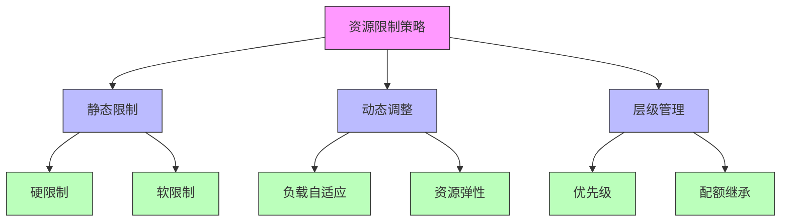

# Cgroup 与 Linux 内核的关系

## 1. Cgroup 的本质



### 1.1 核心概念

cgroup（Control Groups）本质上是 Linux 内核提供的一种资源管理机制，它通过以下方式实现：

1. **虚拟文件系统接口**
```
/sys/fs/cgroup/
├── cpu
├── memory
├── pids
└── ...
```

2. **内核数据结构**
```c
// 内核中的 cgroup 结构
struct cgroup {
    struct cgroup_subsys_state **subsys;  // 子系统状态
    struct cgroup_root *root;             // cgroup 根节点
    struct cgroup *parent;                // 父 cgroup
    struct list_head children;            // 子 cgroup 列表
    struct list_head tasks;               // 任务列表
    // ...
}
```

## 2. 与内核的交互



### 2.1 资源控制实现



## 3. 内核实现机制

### 3.1 资源限制实现



### 3.2 内核数据流



## 4. 技术细节

### 4.1 资源控制器实现

每个资源控制器在内核中都有其特定的实现：

1. **CPU 控制器**：
```c
struct cgroup_subsys cpu_cgroup_subsys = {
    .name = "cpu",
    .attach = cpu_cgroup_attach,
    .create = cpu_cgroup_create,
    .destroy = cpu_cgroup_destroy,
    // ...
};
```

2. **内存控制器**：
```c
struct cgroup_subsys memory_cgroup_subsys = {
    .name = "memory",
    .attach = mem_cgroup_attach,
    .create = mem_cgroup_create,
    .destroy = mem_cgroup_destroy,
    // ...
};
```

### 4.2 调度实现



## 5. 性能影响

### 5.1 开销分析



## 6. 最佳实践

### 6.1 资源限制策略



## 总结

1. **本质**：
   - 内核级资源管理机制
   - 通过虚拟文件系统暴露接口
   - 提供精细的资源控制能力

2. **与内核关系**：
   - 直接集成在内核中
   - 通过系统调用实现控制
   - 影响调度和资源分配决策

3. **性能考虑**：
   - 轻量级实现
   - 最小化调度开销
   - 高效的资源统计
