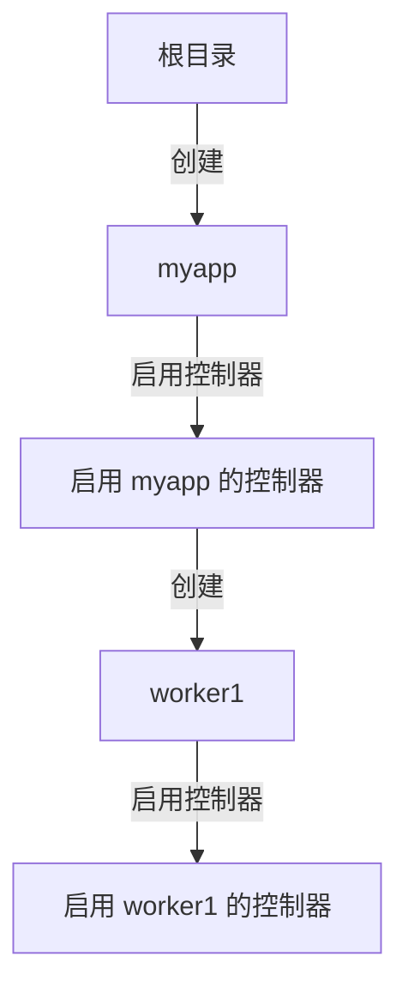

# Cgroup V2 创建过程详解

## 1. 概述

cgroup v2 的创建过程涉及多个步骤，包括目录创建、控制器启用和错误处理。本文详细解释这个过程。

## 2. 初始化阶段

### 2.1 基础结构初始化

```go
v2 := &V2{
    path:    path.Join(basePath, prefix),
    control: ct,
}
```

- `basePath`: 通常是 `/sys/fs/cgroup`
- `prefix`: 用户指定的 cgroup 路径，例如 "myapp/worker1"
- `control`: 需要启用的控制器列表

### 2.2 存在性检查

```go
if _, err := os.Stat(v2.path); err == nil {
    v2.existing = true
}
```

这一步检查 cgroup 是否已经存在：
- 如果目录已存在，标记 `existing = true`
- 这个标记后续用于错误处理和清理

### 2.3 清理机制

```go
defer func() {
    if err != nil && !v2.existing {
        remove(v2.path)
    }
}()
```

错误处理机制：
- 只有创建新 cgroup 失败时才清理
- 如果是已存在的 cgroup，不进行清理
- 确保不会留下部分创建的目录

## 3. 控制器准备

### 3.1 控制器命令构建

```go
s := ct.Names()
controlMsg := []byte("+" + strings.Join(s, " +"))
```

生成控制器启用命令：
- 假设要启用 cpu 和 memory 控制器
- 生成的命令形如："+cpu +memory"
- 这个命令将写入 cgroup.subtree_control 文件

## 4. 目录创建过程

### 4.1 路径解析

```go
entries := strings.Split(prefix, "/")
current := ""
```

例如，对于路径 "myapp/worker1"：
- entries = ["myapp", "worker1"]
- 将逐级处理每个目录

### 4.2 逐级处理



对每一级目录：
1. 构建完整路径
2. 检查目录是否存在
3. 必要时创建目录
4. 在父目录启用控制器

### 4.3 目录创建

```go
if _, err := os.Stat(path.Join(basePath, current)); os.IsNotExist(err) {
    if err := os.Mkdir(path.Join(basePath, current), dirPerm); err != nil {
        return nil, err
    }
}
```

- 使用 0755 权限创建目录
- 如果目录已存在则跳过
- 任何其他错误都会导致失败

## 5. 控制器启用

### 5.1 控制器检查

```go
ect, err := getAvailableControllerV2(current)
if err != nil {
    return nil, err
}
if ect.Contains(ct) {
    continue
}
```

每个目录级别都要：
1. 检查可用的控制器
2. 验证所需控制器是否已启用
3. 如果已启用则跳过

### 5.2 控制器启用

```go
if err := writeFile(path.Join(basePath, parent, cgroupSubtreeControl), controlMsg, filePerm); err != nil {
    return nil, err
}
```

在父目录中启用控制器：
- 写入 cgroup.subtree_control 文件
- 使用 0644 权限
- 写入形如 "+cpu +memory" 的命令

## 6. 错误处理

### 6.1 可能的错误

1. 权限错误：
   - 没有写入权限
   - 没有目录创建权限

2. 控制器错误：
   - 控制器不可用
   - 控制器启用失败

3. 文件系统错误：
   - 目录创建失败
   - 文件写入失败

### 6.2 错误恢复

1. 立即返回错误
2. defer 函数自动清理
3. 保持文件系统一致性

## 7. 使用示例

```go
// 创建带有 CPU 和内存控制器的 cgroup
ct := &Controllers{
    CPU: true,
    Memory: true,
}

cg, err := newV2("myapp/worker1", ct)
if err != nil {
    log.Fatal(err)
}
```

## 8. 注意事项

1. **权限要求**：
   - 需要 root 权限或适当的 capabilities
   - 需要写入权限来创建目录和启用控制器

2. **控制器限制**：
   - 子 cgroup 只能使用父 cgroup 启用的控制器
   - 一旦启用控制器，就不能随意禁用

3. **路径限制**：
   - 路径不能包含特殊字符
   - 建议使用简单的字母数字组合

4. **性能考虑**：
   - 创建过程是同步的
   - 每级目录都需要文件系统操作
   - 建议适当缓存 cgroup 对象
