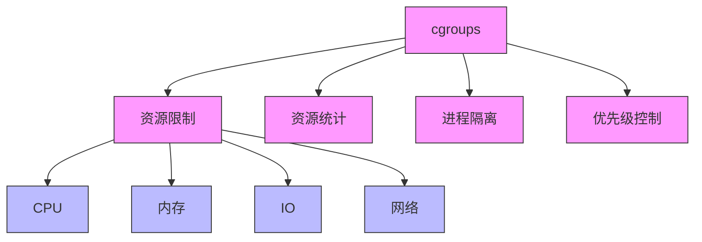
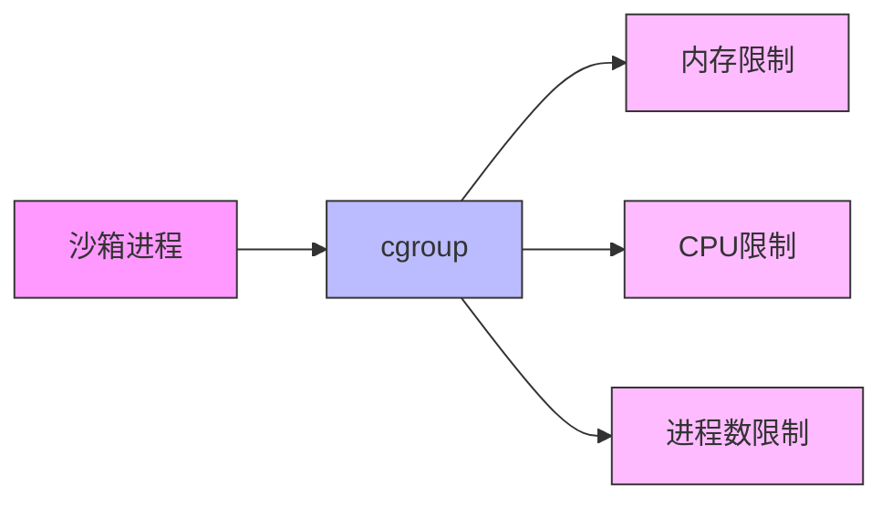
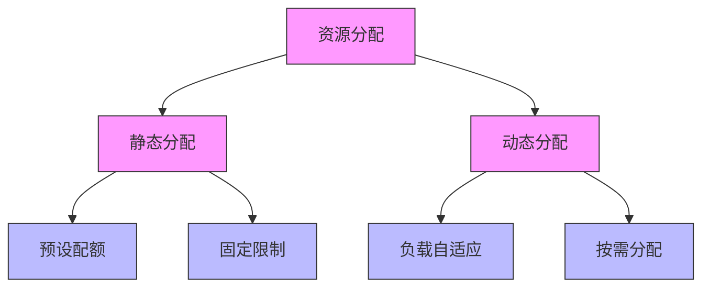

# Linux Control Groups (cgroups)

## 概述

cgroups（Control Groups）是 Linux 内核提供的一种资源限制、隔离和统计功能。它允许将一组进程组织成层次结构，并对这些进程组应用资源限制。



## cgroups 版本

### cgroups v1
- 最初的实现
- 每个子系统独立的层次结构
- 复杂的规则和限制

### cgroups v2
- 统一的层次结构
- 更简单的规则
- 更好的性能
- 更强的安全性

## 主要子系统

1. **cpu**
   - CPU 时间分配
   - CPU 核心绑定
   - 调度优先级

2. **memory**
   ```ini
   memory.limit_in_bytes=100M    # 内存限制
   memory.swappiness=0          # 禁用 swap
   memory.oom_control=1         # OOM 控制
   ```

3. **blkio**
   - 块设备 I/O 限制
   - 读写速率控制
   - I/O 优先级

4. **devices**
   - 设备访问控制
   - 设备白名单/黑名单

## 在沙箱中的应用

### 1. 资源限制
```go
type CgroupConfig struct {
    MemoryLimit    int64  // 内存限制（字节）
    CPUQuota      int64  // CPU 配额（微秒）
    PidsLimit     int    // 进程数限制
    BlkioWeight   uint16 // I/O 权重
}
```

### 2. 安全隔离


### 3. 资源监控
```go
type CgroupStats struct {
    MemoryStats    MemoryStats    // 内存使用统计
    CPUStats       CPUStats       // CPU 使用统计
    BlkioStats     BlkioStats     // I/O 使用统计
    PidsStats      PidsStats      // 进程数统计
}
```

## 目录结构

### v1 版本
```
/sys/fs/cgroup/
├── cpu
│   └── sandbox
│       ├── cpu.shares
│       └── tasks
├── memory
│   └── sandbox
│       ├── memory.limit_in_bytes
│       └── tasks
└── blkio
    └── sandbox
        ├── blkio.weight
        └── tasks
```

### v2 版本
```
/sys/fs/cgroup/
└── sandbox
    ├── cgroup.controllers
    ├── cgroup.subtree_control
    ├── cpu.max
    ├── memory.max
    └── io.weight
```

## 使用最佳实践

### 1. 资源限制
- 设置合理的限制值
- 考虑资源的相互影响
- 预留足够的缓冲

### 2. 监控和告警
```go
// 监控示例
for {
    stats := cgroup.GetStats()
    if stats.MemoryStats.Usage > warningThreshold {
        alert("内存使用超过警戒值")
    }
    time.Sleep(interval)
}
```

### 3. 清理策略
```go
func cleanup() {
    // 1. 终止所有进程
    killAll()
    
    // 2. 取消挂载
    unmount()
    
    // 3. 删除 cgroup 目录
    removeAll()
}
```

## 常见问题

### 1. OOM Killer
- 内存超限时的处理
- OOM 评分机制
- 保护关键进程

### 2. CPU 调度
- CPU shares vs CPU quota
- 实时调度考虑
- 多核心分配

### 3. 嵌套 cgroups
- 继承规则
- 资源分配策略
- 限制传播

## 安全考虑

### 1. 权限控制
```ini
# /etc/cgconfig.conf
group sandbox {
    perm {
        admin {
            uid = sandbox
            gid = sandbox
        }
    }
}
```

### 2. 资源耗尽防护
- 设置硬限制
- 配置 OOM 行为
- 监控和自动恢复

### 3. 逃逸防护
- 正确设置层次结构
- 限制设备访问
- 禁用不安全特性

## 性能优化

### 1. 资源分配


### 2. 监控开销
- 合理的采样间隔
- 批量统计
- 异步处理

### 3. 配置优化
```ini
# 优化示例
cpu.shares=1024        # 默认权重
memory.swappiness=0    # 禁用 swap
blkio.weight=100      # I/O 权重