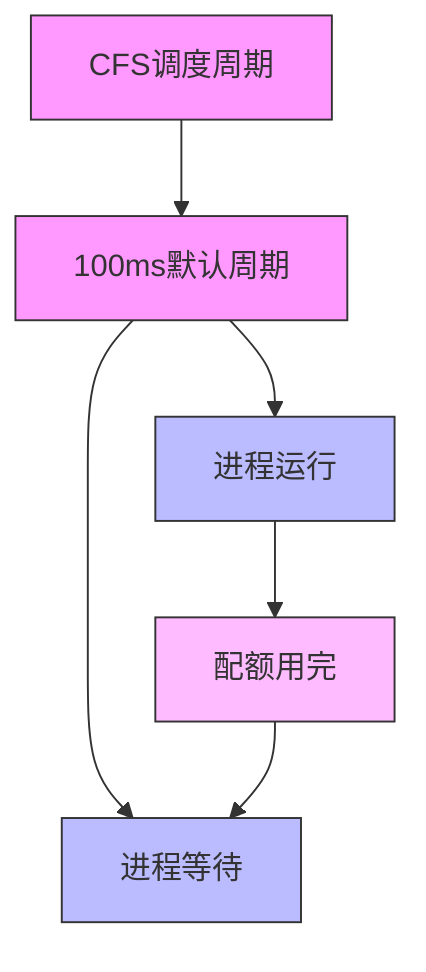
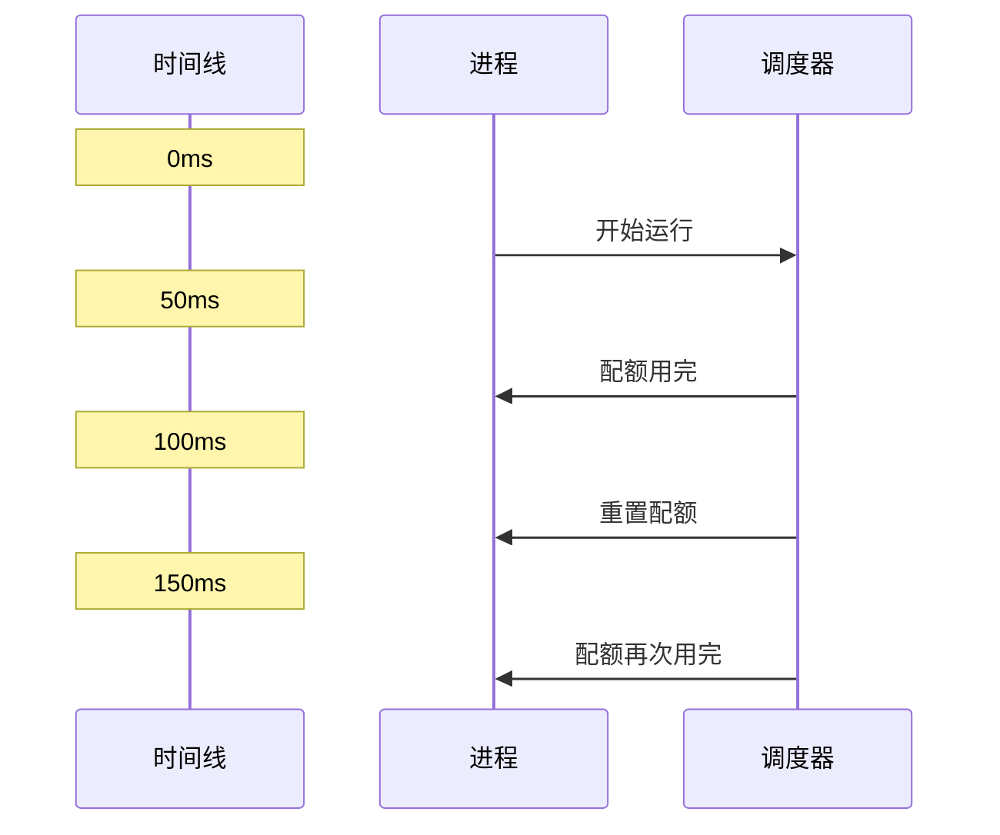
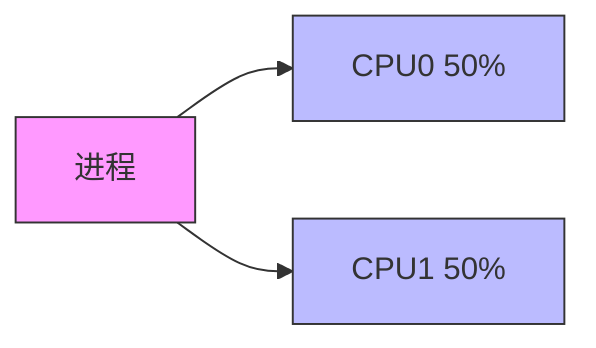

# CPU 配额详解

## 基本概念

CPU 配额使用 CFS (Completely Fair Scheduler) 调度器来实现，主要通过两个参数控制：

```ini
cpu.cfs_period_us = 100000   # 时间周期（微秒）
cpu.cfs_quota_us  = 50000    # CPU 配额（微秒）
```

### 计算方式
```
CPU 使用率 = (cfs_quota_us / cfs_period_us) * 100%

例如：
50000 / 100000 = 0.5 = 50% CPU
```

## 工作原理



### 示例场景

1. **单核限制 50%**
```ini
cpu.cfs_period_us = 100000  # 100ms
cpu.cfs_quota_us  = 50000   # 50ms
```
这意味着在每 100ms 的周期内，进程最多可以运行 50ms。

2. **多核限制**
```ini
# 允许使用 2 个完整的 CPU 核心
cpu.cfs_period_us = 100000   # 100ms
cpu.cfs_quota_us  = 200000   # 200ms
```

3. **精细控制**
```ini
# 允许使用 1.5 个 CPU 核心
cpu.cfs_period_us = 100000   # 100ms
cpu.cfs_quota_us  = 150000   # 150ms
```

## 实际应用

### 1. 配置示例
```go
type CPUConfig struct {
    // 100ms 内允许使用的 CPU 时间（微秒）
    QuotaUS  int64 // 50000 表示 50% CPU
    PeriodUS int64 // 通常为 100000
}

// 设置 50% CPU 限制
config := &CPUConfig{
    QuotaUS:  50000,
    PeriodUS: 100000,
}
```

### 2. 运行效果


## 常见问题

### 1. CPU 节流
当进程达到配额限制时：
- 进程被暂停运行
- 等待下一个周期
- 可能导致性能波动

### 2. 负载均衡


### 3. 性能影响
- 频繁的调度切换
- 缓存失效
- 上下文切换开销

## 优化建议

### 1. 周期设置
- 较短的周期：响应更快，但开销更大
- 较长的周期：开销小，但响应较慢
- 建议使用默认值（100ms）

### 2. 配额分配
```go
// 根据任务类型分配配额
switch taskType {
case "计算密集":
    quota = 80000  // 80% CPU
case "IO密集":
    quota = 30000  // 30% CPU
case "后台任务":
    quota = 20000  // 20% CPU
}
```

### 3. 监控指标
```go
type CPUStats struct {
    // 实际使用的 CPU 时间
    UsageUS int64
    
    // 受限制的次数
    ThrottledCount int64
    
    // 被限制的总时间
    ThrottledUS int64
}
```

## 最佳实践

1. **合理设置**
   - 考虑应用特性
   - 预留足够余量
   - 避免过度限制

2. **监控和调整**
   ```go
   // 监控 CPU 使用情况
   if stats.ThrottledCount > threshold {
       // 可能需要调整配额
       adjustQuota()
   }
   ```

3. **错误处理**
   ```go
   if err := setCPUQuota(quota); err != nil {
       // 处理设置失败
       log.Printf("设置 CPU 配额失败: %v", err)
       // 使用备选方案
       setFallbackLimit()
   }
   ```
