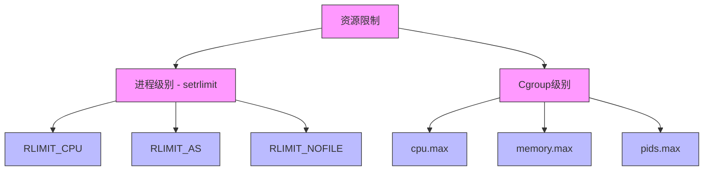
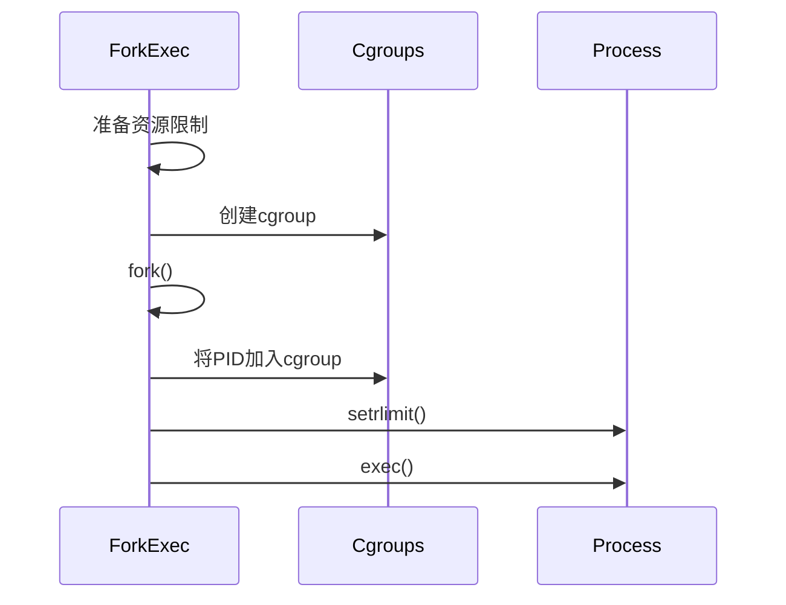

# ForkExec 与 Cgroups 的集成

## 资源限制的两个层面



## 区别与联系

### 1. 进程级别限制 (setrlimit)
```go
// forkexec 中的资源限制
type RLimit struct {
    Type int
    Cur  uint64
    Max  uint64
}

// 在 fork_child_linux.go 中设置
for _, rlimit := range r.RLimits {
    unix.Setrlimit(rlimit.Type, &unix.Rlimit{
        Cur: rlimit.Cur,
        Max: rlimit.Max,
    })
}
```

### 2. Cgroup 级别限制
```go
// cgroup 中的资源限制
type CgroupConfig struct {
    MemoryLimit    int64
    CPUQuota      int64
    PidsLimit     int
}

// 在 cgroup 中设置
echo "100M" > memory.limit_in_bytes
echo "50000" > cpu.cfs_quota_us
```

## 主要差异

| 特性 | setrlimit (ForkExec) | Cgroups |
|------|---------------------|----------|
| 作用范围 | 单个进程及其子进程 | 进程组 |
| 灵活性 | 固定，fork时设置 | 动态可调整 |
| 精细度 | 进程级别 | 资源组级别 |
| 监控能力 | 有限 | 丰富的统计信息 |

## 集成方式

### 1. 创建时集成


### 2. 配置示例
```go
// 1. ForkExec 配置
runner := &Runner{
    RLimits: []RLimit{
        {Type: RLIMIT_CPU, Cur: 1, Max: 1},    // CPU时间限制
        {Type: RLIMIT_AS, Cur: 100<<20, Max: 100<<20},  // 地址空间限制
    },
}

// 2. Cgroup 配置
cgroup := &Cgroup{
    Memory: &Memory{
        Limit: 100 << 20,  // 100MB
    },
    CPU: &CPU{
        Quota: 50000,      // 50ms/100ms
    },
}
```

## 协同工作

### 1. 双重保护
```go
func setupLimits(pid int) error {
    // 1. 进程级别限制
    if err := setProcessLimits(); err != nil {
        return err
    }
    
    // 2. Cgroup 级别限制
    if err := setCgroupLimits(pid); err != nil {
        return err
    }
    
    return nil
}
```

### 2. 监控和统计
```go
type ResourceUsage struct {
    // 进程级统计
    ProcessCPUTime uint64
    ProcessMemory  uint64
    
    // Cgroup 统计
    CgroupCPUUsage   uint64
    CgroupMemoryUsage uint64
}
```

## 最佳实践

### 1. 限制配置
- 进程级限制设置硬限制
- Cgroup 设置弹性限制
- 合理配置两者的阈值

### 2. 错误处理
```go
func setupSandbox(pid int) error {
    // 1. 设置进程限制
    if err := setRlimits(); err != nil {
        cleanup()
        return fmt.Errorf("设置rlimit失败: %v", err)
    }
    
    // 2. 设置cgroup限制
    if err := setupCgroups(pid); err != nil {
        cleanup()
        return fmt.Errorf("设置cgroup失败: %v", err)
    }
    
    return nil
}
```

### 3. 资源释放
```go
func cleanup() {
    // 1. 清理进程
    killProcess()
    
    // 2. 清理cgroup
    removeCgroup()
}
```

## 使用场景

### 1. 即时限制
- 使用 setrlimit 设置进程启动时的硬限制
- 适用于一次性的、明确的限制

### 2. 动态控制
- 使用 cgroups 进行运行时的资源调整
- 适用于需要动态调整的场景

### 3. 监控需求
- 使用 cgroups 收集详细的资源使用统计
- 用于性能分析和资源使用优化
