# ForkExec 基准测试结果

## 测试环境

- CPU: 12th Gen Intel(R) Core(TM) i7-12700K
- 操作系统: Linux
- 架构: amd64
- Go 版本: 最新稳定版
- 测试工具: Go 标准测试框架（`go test -bench`）
- 运行环境: Docker 容器（privileged 模式）

## 测试项目

我们测试了不同类型的进程创建和命名空间隔离操作的性能。每个测试都在并行模式下运行，以模拟真实的多进程场景。

### 基准测试结果

| 测试项目 | 每次操作耗时 (ns) | 内存分配 (B/op) | 分配次数 (allocs/op) |
|---------|-----------------|----------------|-------------------|
| 标准 Fork (StdFork) | 17,415 | 102 | 6 |
| 简单 Fork (SimpleFork) | 120,260 | 132 | 8 |
| PID 命名空间隔离 | 117,625 | 129 | 8 |
| 用户命名空间隔离 | 126,022 | 234 | 14 |
| UTS 命名空间隔离 | 122,439 | 129 | 8 |
| Cgroup 命名空间隔离 | 120,916 | 129 | 8 |
| IPC 命名空间隔离 | 156,817 | 129 | 8 |
| 挂载命名空间隔离 | 112,141 | 129 | 8 |
| 网络命名空间隔离 | 295,620 | 128 | 8 |
| 快速挂载+Pivot | 226,876 | 259 | 15 |
| 完全命名空间隔离 | 377,804 | 234 | 14 |
| 完全隔离+Pivot | 505,491 | 261 | 15 |

### 性能分析

```mermaid
gantt
    title 各操作耗时对比 (纳秒)
    dateFormat X
    axisFormat %s

    section 基本操作
    标准 Fork           :0, 17415
    简单 Fork           :0, 120260

    section 单一命名空间
    PID                :0, 117625
    用户               :0, 126022
    UTS                :0, 122439
    Cgroup             :0, 120916
    IPC                :0, 156817
    挂载               :0, 112141
    网络               :0, 295620

    section 组合操作
    快速挂载+Pivot     :0, 226876
    完全命名空间隔离   :0, 377804
    完全隔离+Pivot     :0, 505491
```

### 关键发现

1. **基本 Fork 操作性能**
   - 标准库的 `syscall.ForkExec` 性能最优，仅需 17.4μs
   - 相比之下，我们的简单 Fork 实现需要 120.2μs，主要是因为额外的安全检查和设置

2. **命名空间隔离开销**
   - 单一命名空间隔离的开销相近，大约在 112-157μs 之间
   - 挂载命名空间隔离最快（112μs）
   - 网络命名空间隔离最慢（296μs）
   - IPC 命名空间隔离有明显额外开销（157μs）

3. **组合操作性能**
   - 操作复杂度与执行时间呈正相关
   - 完全隔离+Pivot 最慢，需要 505μs
   - 快速挂载+Pivot 通过优化减少了 55% 的开销

4. **内存分配情况**
   - 基本 Fork 操作内存分配最少（102B）
   - 涉及用户命名空间的操作内存分配较多（234B）
   - Pivot 操作需要额外内存（约 260B）

### 优化建议

1. **选择性隔离**
   - 不是所有容器都需要完全隔离，可根据需求选择必要的命名空间
   - 例如，如果不需要网络隔离，可以节省约 296μs

2. **快速路径优化**
   - 对于简单场景，使用标准库的 `syscall.ForkExec`
   - 对于需要隔离的场景，优先使用 FastUnshareMountPivot

3. **资源分配优化**
   - 可以考虑使用对象池复用一些通用的数据结构
   - 优化 Pivot 相关操作的内存分配

### 后续工作

1. **性能优化方向**
   - 研究简单 Fork 实现与标准库的性能差距
   - 优化网络命名空间的创建性能
   - 改进完全隔离场景的性能

2. **监控指标**
   - 添加详细的性能监控
   - 跟踪各类操作的成功率和错误类型
   - 监控内存使用峰值

3. **基准测试完善**
   - 添加更多真实场景的测试用例
   - 测试不同系统负载下的性能表现
   - 进行长期稳定性测试
