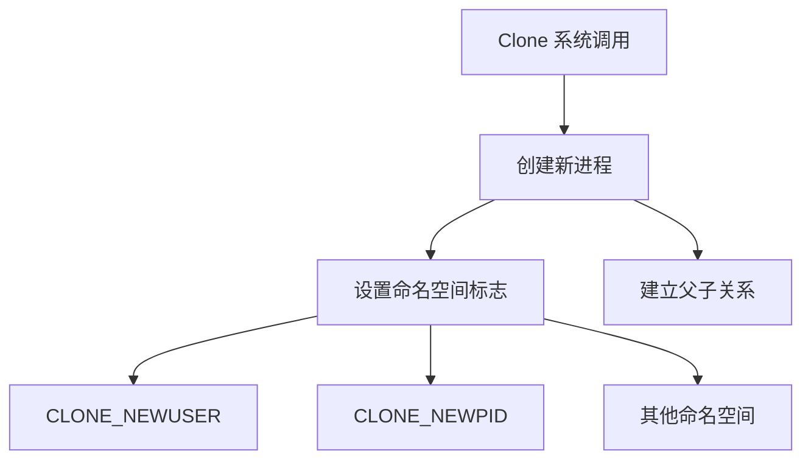
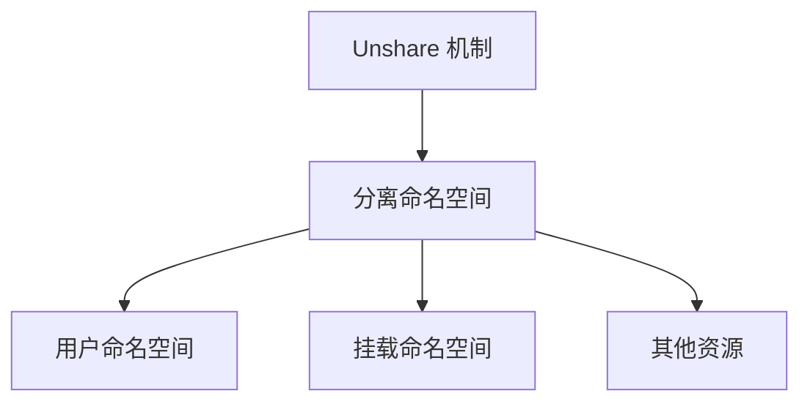
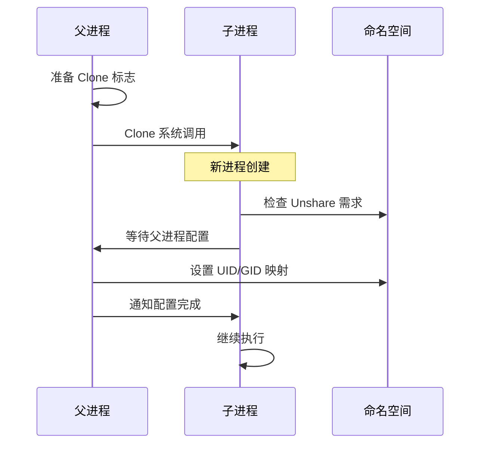
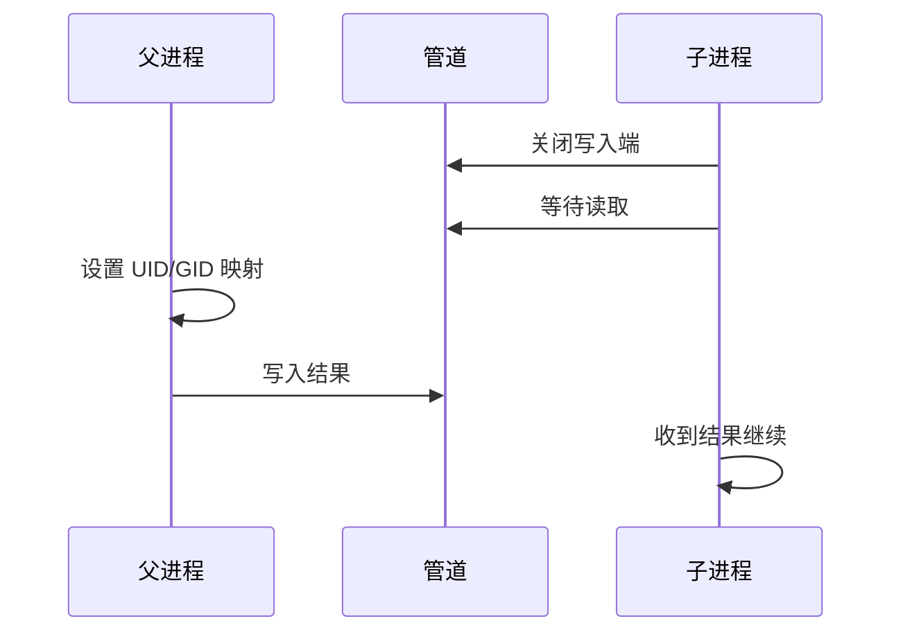
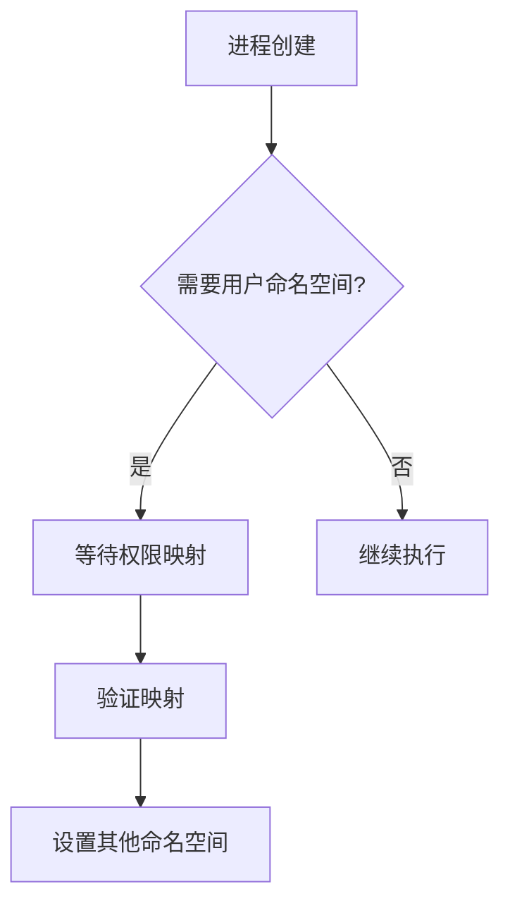
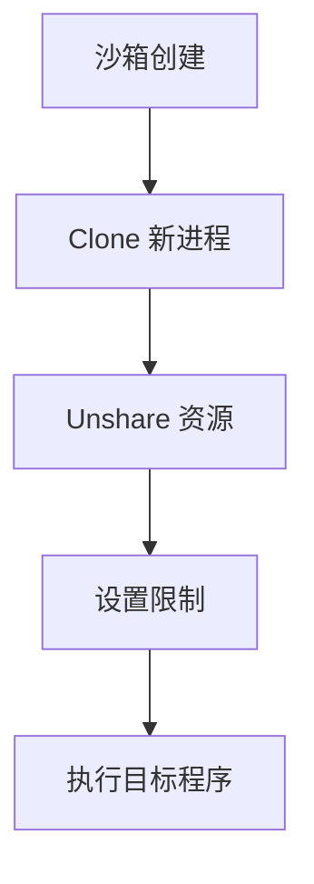
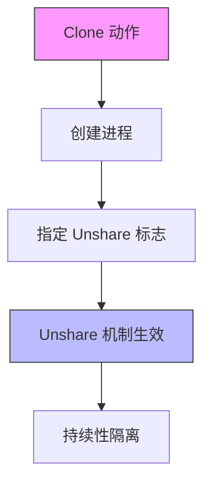

# Clone 和 Unshare 的协同工作机制

## 1. 基本概念

### 1.1 Clone 系统调用


### 1.2 Unshare 机制


## 2. 协同工作流程

### 2.1 基本流程


### 2.2 命名空间处理顺序
1. **用户命名空间**：
   ```go
   // 检查是否需要用户命名空间
   unshareUser = r.CloneFlags&unix.CLONE_NEWUSER == unix.CLONE_NEWUSER
   ```

2. **其他命名空间**：
   ```go
   // UnshareFlags 定义
   UnshareFlags = unix.CLONE_NEWIPC | unix.CLONE_NEWNET | 
                 unix.CLONE_NEWNS | unix.CLONE_NEWPID | 
                 unix.CLONE_NEWUSER | unix.CLONE_NEWUTS | 
                 unix.CLONE_NEWCGROUP
   ```

## 3. 同步机制

### 3.1 父子进程同步


### 3.2 错误处理
```go
if unshareUser {
    // 1. 读取父进程的配置结果
    r1, _, err1 = syscall.RawSyscall(syscall.SYS_READ, 
        uintptr(pipe), 
        uintptr(unsafe.Pointer(&err2)), 
        unsafe.Sizeof(err2))
        
    // 2. 检查读取是否成功
    if err1 != 0 {
        childExitError(pipe, LocUnshareUserRead, err1)
    }
    
    // 3. 验证数据完整性
    if r1 != unsafe.Sizeof(err2) {
        err1 = syscall.EINVAL
        childExitError(pipe, LocUnshareUserRead, err1)
    }
}
```

## 4. 权限和安全

### 4.1 权限控制流程


### 4.2 安全考虑
1. **用户命名空间优先**：
   - 必须首先建立用户命名空间
   - 确保后续操作有正确权限

2. **权限映射**：
   - 在父进程中设置
   - 子进程等待完成
   - 确保安全性

## 5. 实际应用场景

### 5.1 沙箱环境


### 5.2 资源隔离
1. **文件系统**：
   - 通过 CLONE_NEWNS
   - 配合 pivot_root

2. **网络**：
   - 通过 CLONE_NEWNET
   - 配置独立网络栈

3. **进程空间**：
   - 通过 CLONE_NEWPID
   - 独立的进程树

### 总结

