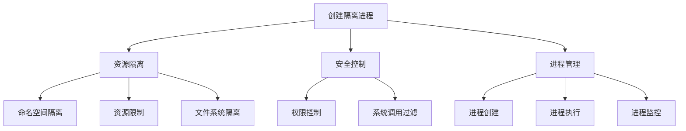
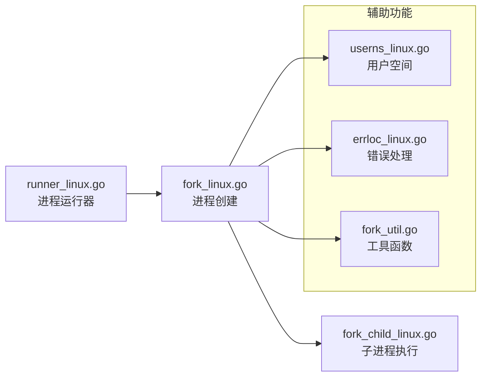
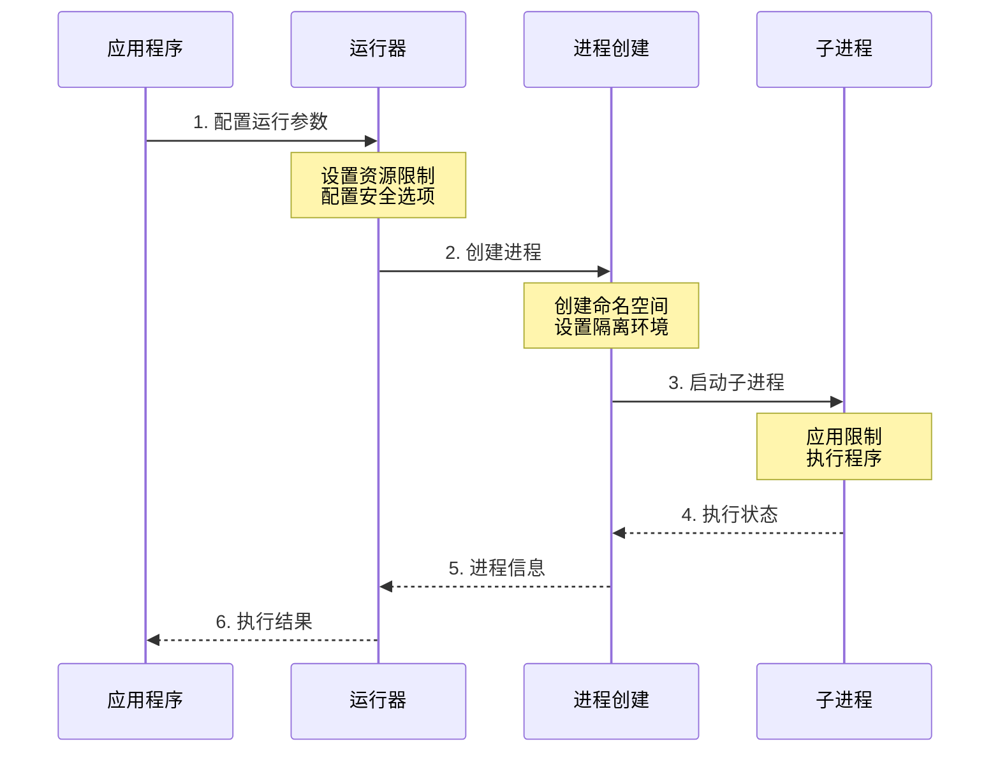

# forkexec 包结构说明

## 1. 包的核心功能

forkexec 包的主要目标是：**在 Linux 系统上安全地创建和运行隔离的进程**



## 2. 文件组织

### 2.1 核心文件及其关系


### 2.2 文件功能说明

1. **runner_linux.go**：进程运行的控制中心
   - 配置进程运行环境
   - 管理资源限制
   - 控制进程生命周期

2. **fork_linux.go**：进程创建的核心实现
   - 实现 fork 操作
   - 设置命名空间隔离
   - 管理子进程通信

3. **fork_child_linux.go**：子进程的具体实现
   - 配置执行环境
   - 应用安全限制
   - 执行目标程序

4. **辅助文件**：
   - `userns_linux.go`：用户命名空间配置
   - `errloc_linux.go`：错误定位和处理
   - `fork_util.go`：通用工具函数

## 3. 执行流程



## 4. 关键功能点

### 4.1 资源隔离
- 命名空间隔离（PID、网络、挂载等）
- 资源限制（CPU、内存、文件等）
- 文件系统隔离（pivot_root）

### 4.2 安全机制
- seccomp 系统调用过滤
- 用户空间隔离
- 权限控制

### 4.3 进程管理
- 进程创建和执行
- 资源清理
- 错误处理

## 5. 使用示例

```go
runner := &Runner{
    // 基本配置
    Args: []string{"/bin/program"},
    Env:  []string{"PATH=/bin"},
    
    // 资源限制
    RLimits: []rlimit.RLimit{...},
    
    // 安全选项
    NoNewPrivs: true,
    Seccomp:    seccompFilter,
    
    // 隔离配置
    CloneFlags: unix.CLONE_NEWPID | unix.CLONE_NEWNS,
}

// 执行程序
err := runner.Start()