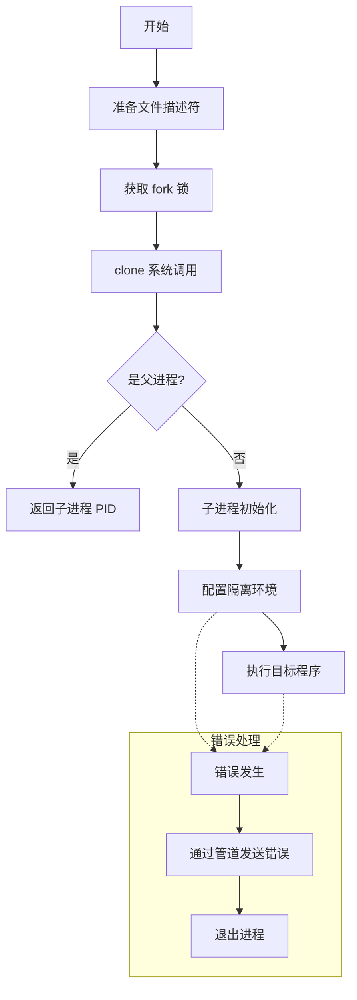
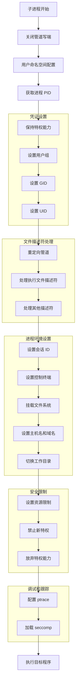
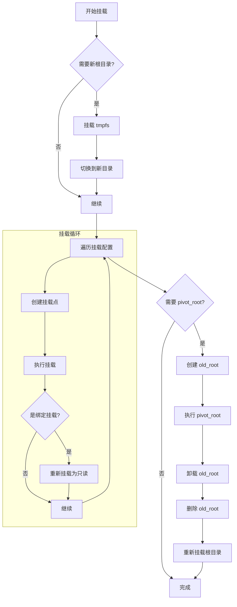
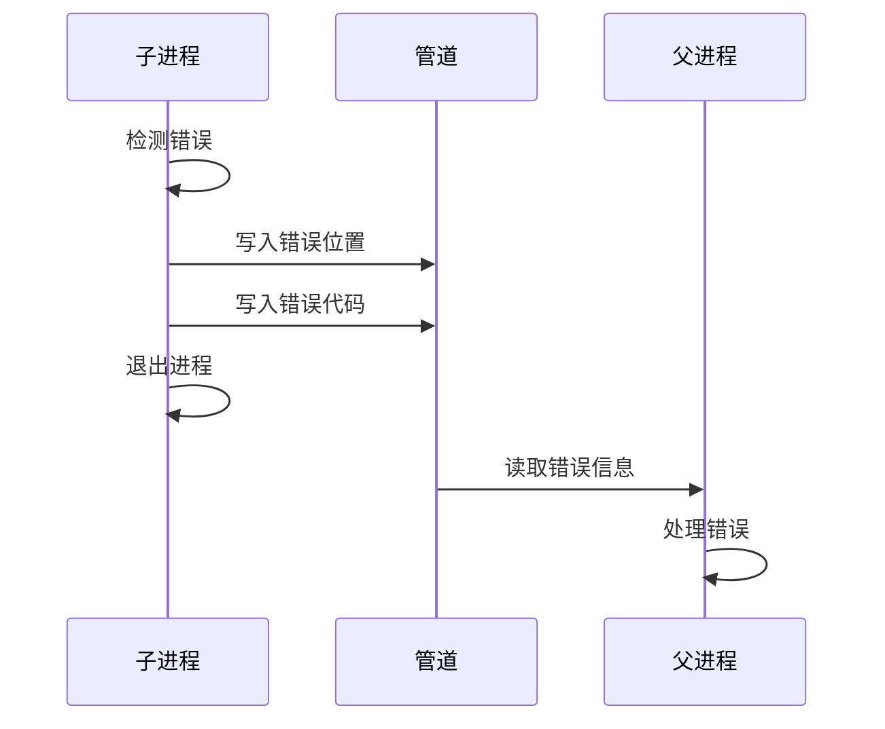
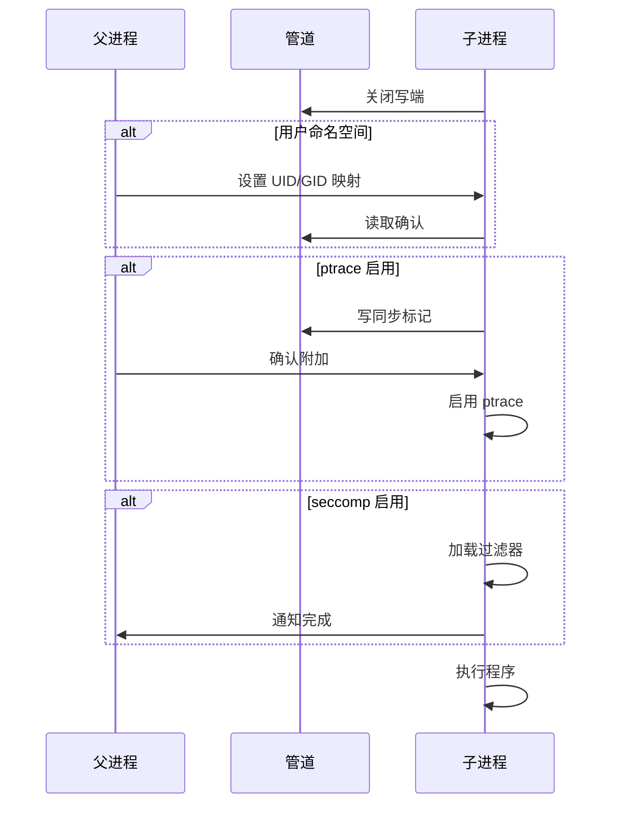
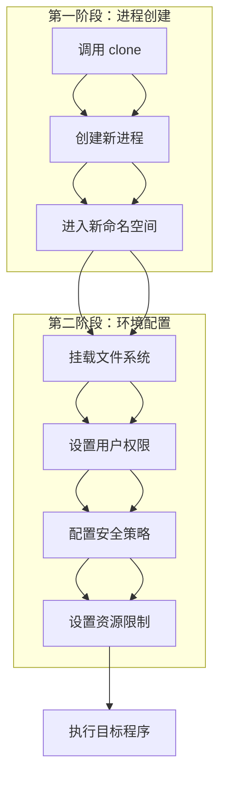
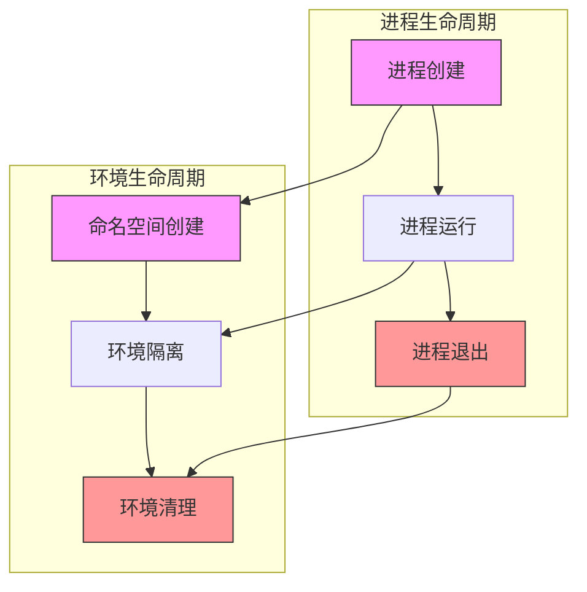
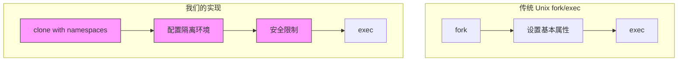
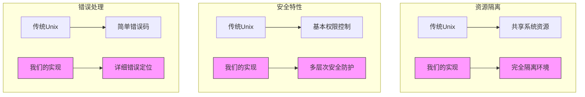

# fork_child_linux.go 工作流程

本文档详细说明了 `fork_child_linux.go` 中的进程创建和配置流程。这个文件是沙箱系统的核心组件，负责创建一个安全、隔离的环境来运行不可信代码。

## 1. 整体流程



### 父子进程判断说明

```go
// fork 系统调用的返回值判断
pid, err := syscall.RawSyscall(syscall.SYS_CLONE, uintptr(flags), 0, 0)
if err != 0 {
    // 错误处理
}

// 关键判断
if pid > 0 {
    // 父进程：pid 是子进程的 PID
    return pid, nil
} else if pid == 0 {
    // 子进程：自己的 pid 为 0
    // 进行子进程的初始化工作
}
```

fork 系统调用的特点：
1. **一次调用，两次返回**
   - 在父进程中返回子进程的 PID（大于 0）
   - 在子进程中返回 0

2. **进程区分**
   - 父进程：继续执行原来的代码路径
   - 子进程：需要进行初始化和配置

3. **内存空间**
   - 父进程：保持原有内存空间
   - 子进程：获得父进程内存空间的副本

4. **资源继承**
   - 文件描述符
   - 环境变量
   - 工作目录
   - 用户权限等

5. **常见用法**
```go
switch pid := syscall.RawSyscall(syscall.SYS_CLONE, ...); {
case pid > 0:
    // 父进程：等待子进程或继续执行
case pid == 0:
    // 子进程：设置新的命名空间、权限等
default:
    // 错误处理
}
```

## 2. 子进程配置流程



## 3. 文件系统挂载流程



## 4. 错误处理机制



## 5. 关键功能说明

### 5.1 进程隔离
- 使用命名空间隔离各种系统资源
  - 用户命名空间 (CLONE_NEWUSER)
  - PID 命名空间 (CLONE_NEWPID)
  - 挂载命名空间 (CLONE_NEWNS)
  - 网络命名空间 (CLONE_NEWNET)
  - IPC 命名空间 (CLONE_NEWIPC)
  - UTS 命名空间 (CLONE_NEWUTS)

### 5.2 安全机制
- seccomp 系统调用过滤
- 能力（capabilities）控制
- 资源限制（rlimit）
- 只读文件系统
- ptrace 跟踪支持

### 5.3 文件系统隔离
- pivot_root 切换根目录
- 只读绑定挂载
- tmpfs 临时文件系统
- 私有挂载传播

## 6. 同步机制



## 7. 错误位置映射

所有可能的错误位置都在 `errloc_linux.go` 中定义，按照进程配置的顺序排列：

1. 进程创建阶段
   - LocClone: 克隆失败
   - LocCloseWrite: 关闭管道失败
   
2. 用户配置阶段
   - LocUnshareUserRead: 用户命名空间配置失败
   - LocSetGroups: 设置用户组失败
   - LocSetGid: 设置组 ID 失败
   - LocSetUid: 设置用户 ID 失败

3. 文件系统阶段
   - LocMountRoot: 根目录挂载失败
   - LocPivotRoot: 切换根目录失败
   - LocMountRootReadonly: 只读重挂载失败

4. 安全配置阶段
   - LocSetNoNewPrivs: 禁止特权失败
   - LocSeccomp: seccomp 配置失败
   - LocPtraceMe: ptrace 配置失败

## 8. 最佳实践

1. **错误处理**
   - 所有错误都应该通过管道报告给父进程
   - 错误信息应该包含具体的位置和原因
   - 子进程遇到错误应立即退出

2. **资源清理**
   - 确保所有文件描述符正确关闭
   - 正确卸载不需要的挂载点
   - 清理临时文件和目录

3. **安全配置**
   - 尽早放弃不需要的特权
   - 确保文件系统只读挂载
   - 严格控制系统调用权限

## 9. 进程创建的两个阶段

进程的创建是一个两阶段的过程，包括基础进程创建和环境配置：



## 10. 进程和环境的生命周期

进程和其运行环境的生命周期是完全绑定的，它们同时创建，同时销毁：



这种生命周期绑定的设计确保了：

1. **安全性**
   - 进程无法逃离其环境
   - 环境无法被外部进程访问
   - 资源会被自动清理

2. **隔离性**
   - 每个进程都有自己独立的环境
   - 环境之间互不影响
   - 不会有资源泄露

3. **简单性**
   - 不需要额外的生命周期管理
   - 内核自动处理清理工作
   - 不会有孤立的环境存在

4. **一致性**
   - 环境总是与进程同步创建
   - 环境总是与进程同步销毁
   - 不会有不匹配的状态

这种设计使得沙箱系统能够保证每个被执行的程序都在一个完全隔离的、生命周期受控的环境中运行，而且不需要额外的管理机制。当进程退出时，所有相关的资源都会被内核自动清理，不会留下任何残留。

## 11. 与传统 Unix fork/exec 的对比

传统的 Unix fork/exec 实现主要关注进程的创建和程序的执行，而我们的实现增加了大量的安全和隔离特性：



### 11.1 核心增强功能

1. **命名空间隔离** (传统实现没有)
   - 用户命名空间 (USER)
   - 进程命名空间 (PID)
   - 挂载命名空间 (MNT)
   - 网络命名空间 (NET)
   - IPC 命名空间 (IPC)
   - UTS 命名空间 (UTS)
   - Cgroup 命名空间

2. **文件系统安全** (传统实现仅支持 chroot)
   - pivot_root 切换根目录
   - 私有挂载命名空间
   - 只读挂载
   - tmpfs 临时文件系统
   - 细粒度的挂载点控制

3. **进程安全** (传统实现基本没有)
   - seccomp 系统调用过滤
   - capabilities 能力控制
   - 禁止获取新特权
   - ptrace 跟踪支持
   - cgroup 资源限制

4. **用户权限** (传统实现较简单)
   - UID/GID 映射
   - 完整的用户命名空间
   - 精细的权限控制
   - 特权分离

5. **错误处理** (传统实现较简单)
   - 详细的错误位置定位
   - 错误传递管道
   - 结构化的错误报告
   - 完整的错误上下文

### 11.2 主要区别



### 11.3 优势总结

1. **更强的隔离性**
   - 传统: 共享系统资源
   - 我们: 完全隔离的运行环境

2. **更好的安全性**
   - 传统: 基本的用户权限控制
   - 我们: 多层次的安全防护机制

3. **更精细的控制**
   - 传统: 粗粒度的进程控制
   - 我们: 细粒度的资源和权限管理

4. **更完善的错误处理**
   - 传统: 简单的错误返回
   - 我们: 详细的错误位置和上下文

5. **更适合沙箱场景**
   - 传统: 主要用于普通进程创建
   - 我们: 专门设计用于不可信代码执行
