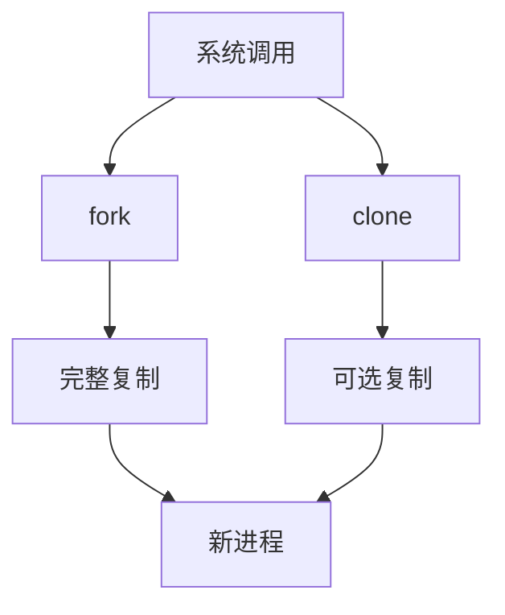
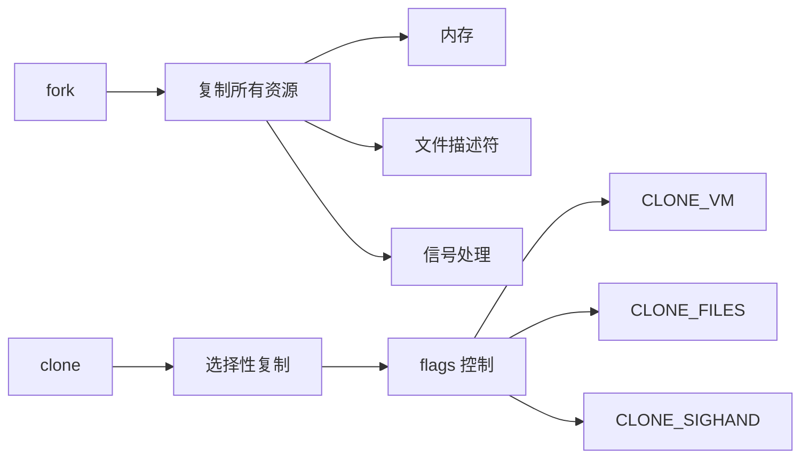
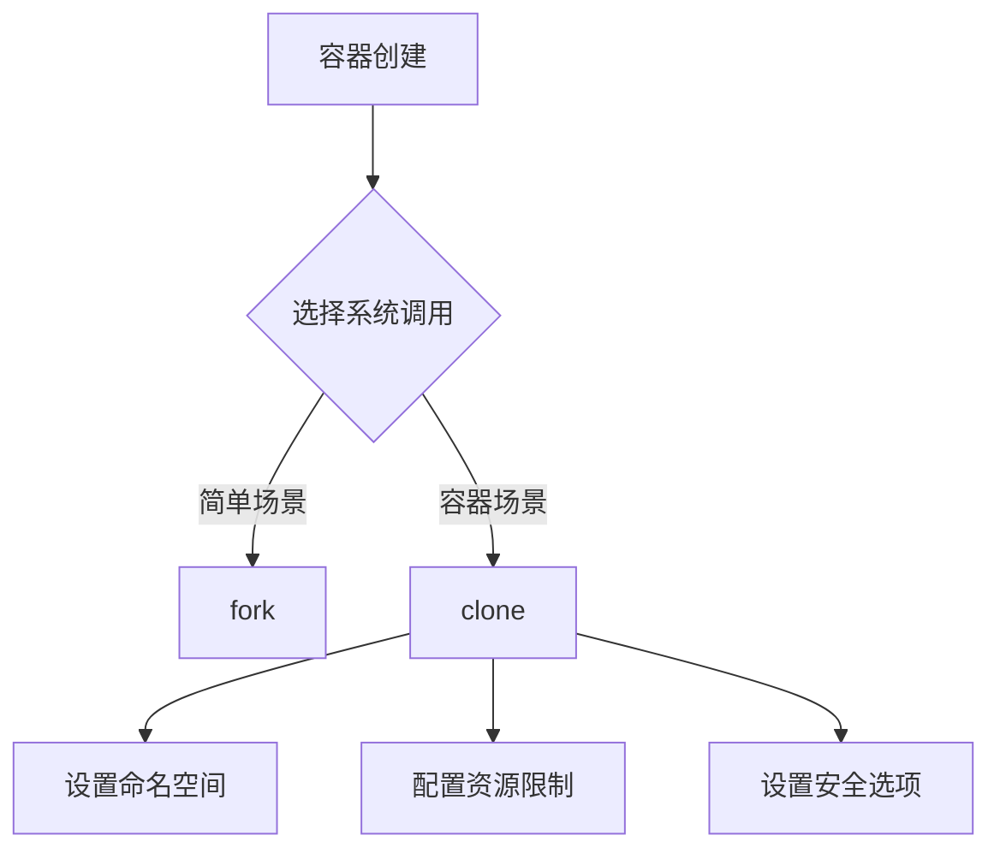
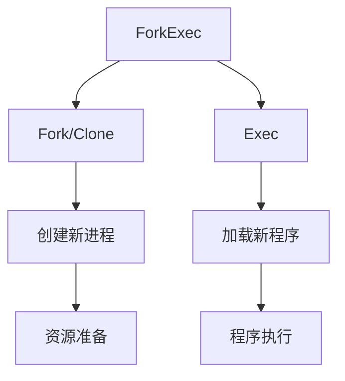
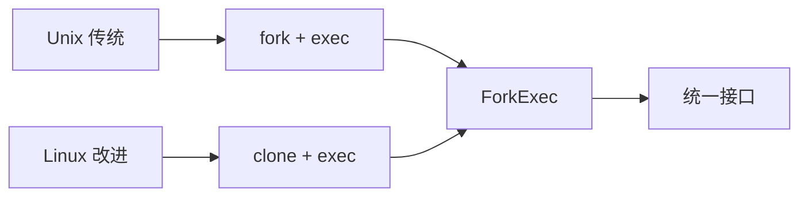

# Fork 与 Clone 的关系

## 1. 基本概念



### 1.1 历史演进
1. **fork 出现在先**
   - Unix 传统系统调用
   - 完整复制父进程
   - 简单但资源消耗大

2. **clone 是 Linux 特有的改进**
   - 更灵活的进程创建机制
   - 可以选择性地共享资源
   - 支持线程和容器特性

## 2. 主要区别

### 2.1 资源处理


1. **fork**：
   - 完整复制父进程的地址空间
   - 复制所有文件描述符
   - 复制信号处理器

2. **clone**：
   - 通过 flags 控制要共享的资源
   - 可以选择不复制某些资源
   - 支持更细粒度的控制

### 2.2 功能特性

```go
// fork 示例
pid_t fork(void)

// clone 示例
int clone(int (*fn)(void *), void *stack, int flags, void *arg, ...)
```

1. **fork 特点**：
   - 简单直接
   - 子进程从 fork 返回处开始执行
   - 返回值区分父子进程

2. **clone 特点**：
   - 更多参数控制
   - 可以指定子进程的入口函数
   - 可以自定义栈空间
   - 支持命名空间隔离

## 3. 在容器中的应用

### 3.1 命名空间隔离
```go
// 使用 clone 创建带命名空间的进程
flags := syscall.CLONE_NEWUTS | syscall.CLONE_NEWPID | syscall.CLONE_NEWNS
```

1. **fork 局限性**：
   - 无法直接创建命名空间
   - 需要额外的 unshare 调用

2. **clone 优势**：
   - 直接支持命名空间创建
   - 一次调用完成所有隔离
   - 更好的性能

### 3.2 实际使用



## 4. 在 forkexec 中的实现

### 4.1 代码示例
```go
// 使用 clone 系统调用
pid, err := syscall.RawSyscall(syscall.SYS_CLONE,
    uintptr(flags),  // 包含各种命名空间标志
    0,               // 栈指针
    0,               // 父线程 ID
)

// 判断返回值
if pid > 0 {
    // 父进程逻辑
} else if pid == 0 {
    // 子进程逻辑
    // 设置命名空间
    // 加载安全策略
    // 执行目标程序
}
```

### 4.2 选择建议

1. **使用 fork 的场景**：
   - 简单的进程创建
   - 不需要命名空间隔离
   - 完整复制父进程资源

2. **使用 clone 的场景**：
   - 需要命名空间隔离
   - 需要细粒度的资源控制
   - 实现容器功能
   - 创建线程

## 5. 性能考虑

### 5.1 内存使用
1. **fork**：
   - 完整复制内存页
   - 写时复制优化
   - 初始内存占用大

2. **clone**：
   - 可选择性共享内存
   - 更低的内存开销
   - 更快的创建速度

### 5.2 最佳实践
1. **容器场景**：
   - 优先使用 clone
   - 配置适当的命名空间
   - 注意权限控制

2. **普通进程**：
   - fork 足够使用
   - 代码更简单
   - 兼容性更好

## 6. ForkExec 机制

### 6.1 概念解释



1. **组合操作**：
   - Fork/Clone：创建新进程
   - Exec：在新进程中加载新程序
   - 两步操作的原子化组合

2. **为什么需要组合**：
   - Fork/Clone 只复制进程
   - 需要 Exec 来加载新程序
   - 保证资源正确设置

### 6.2 执行流程

```go
// 典型的 forkexec 流程
func ForkExec(executable string, args []string, attr *ProcAttr) (pid int, err error) {
    // 1. Fork/Clone 创建新进程
    pid, err = fork()
    if pid != 0 { // 父进程
        return pid, err
    }
    
    // 2. 子进程中
    // 设置各种属性（环境变量、工作目录等）
    setupAttr(attr)
    
    // 3. 执行新程序
    exec(executable, args)
}
```

### 6.3 三者关系



1. **历史演进**：
   - 最初：fork + exec 模式
   - 改进：clone + exec 模式
   - 现代：统一的 forkexec 接口

2. **实现差异**：
   - Unix 系统：主要用 fork
   - Linux 系统：可以用 clone
   - Go 运行时：根据系统选择

### 6.4 在容器中的应用

1. **资源控制**：
   - Fork/Clone 阶段：设置命名空间和资源限制
   - Exec 阶段：加载目标程序
   - 中间阶段：可以进行各种配置

2. **安全考虑**：
   - 在 Exec 前：设置权限和限制
   - 加载程序：使用受限的权限
   - 完整性：保证设置不被绕过

3. **最佳实践**：
```go
// 容器场景的 forkexec
func ContainerForkExec(config *Config) (pid int, err error) {
    // 1. 使用 clone 创建隔离的进程
    pid, err = clone(CLONE_NEWNS | CLONE_NEWPID | ...)
    if pid != 0 {
        return pid, err
    }
    
    // 2. 子进程中设置环境
    setupNamespaces()
    setupCgroups()
    setupRootfs()
    
    // 3. 执行目标程序
    exec(config.Command, config.Args)
}
```

### 6.5 优势和注意事项

1. **优势**：
   - 统一的接口
   - 原子性操作
   - 灵活的配置
   - 安全的执行环境

2. **注意事项**：
   - 资源清理
   - 错误处理
   - 权限控制
   - 安全隔离
