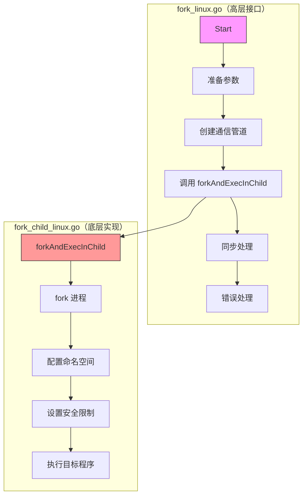
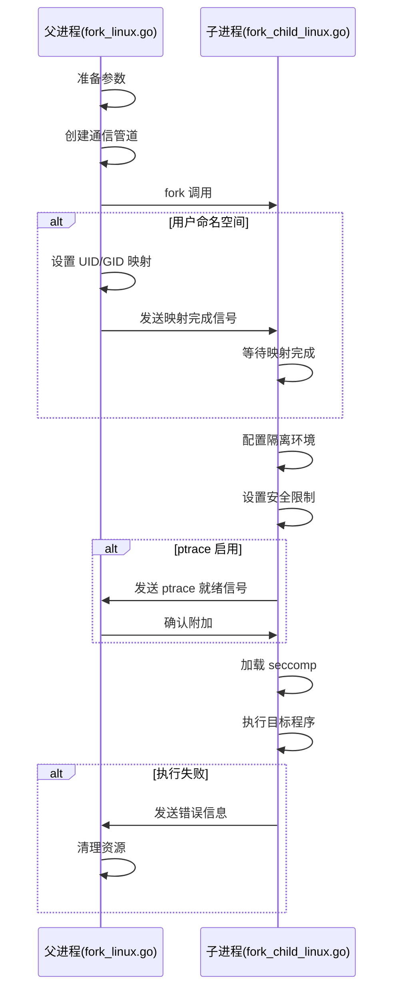
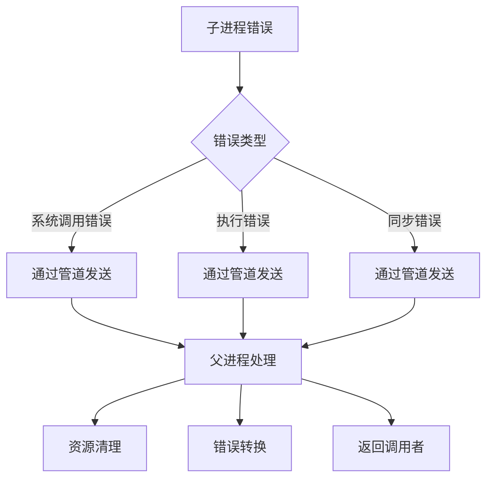

# fork 实现的分层设计

本文档详细说明了 `fork_linux.go` 和 `fork_child_linux.go` 之间的分层关系和职责划分。

## 1. 整体架构

## 2. 职责划分

### 2.1 fork_linux.go（高层接口）

1. **参数准备**
   - 程序路径和参数
   - 环境变量
   - 工作目录
   - 主机名和域名
   - 根目录切换参数

2. **进程同步**
   - 创建父子进程通信管道
   - 处理 UID/GID 映射
   - 执行用户定义的同步函数
   - 处理 ptrace 相关同步

3. **错误处理**
   - 参数验证错误
   - 系统调用错误
   - 子进程返回的错误
   - 同步过程中的错误

4. **资源管理**
   - 文件描述符清理
   - 进程清理（避免僵尸进程）
   - 错误状态下的资源释放

### 2.2 fork_child_linux.go（底层实现）

1. **进程创建**
   - 执行 clone 系统调用
   - 设置进程属性
   - 准备执行环境

2. **安全隔离**
   - 命名空间配置
   - 挂载点隔离
   - 用户空间隔离
   - 网络隔离

3. **安全限制**
   - seccomp 规则加载
   - capabilities 控制
   - 资源限制设置
   - ptrace 跟踪设置

4. **环境配置**
   - 文件系统挂载
   - 工作目录设置
   - 主机名配置
   - 文件描述符处理

## 3. 交互流程

## 4. 错误处理机制

### 4.1 错误传递

### 4.2 错误分类

1. **参数错误**
   - 无效的参数值
   - 路径转换错误
   - 环境变量错误

2. **系统调用错误**
   - clone 失败
   - execve 失败
   - 权限不足

3. **同步错误**
   - 管道通信失败
   - UID/GID 映射失败
   - ptrace 附加失败

4. **配置错误**
   - 命名空间配置失败
   - 挂载点设置失败
   - seccomp 加载失败

## 5. 安全考虑

1. **进程隔离**
   - 完整的命名空间隔离
   - 文件系统隔离
   - 网络隔离

2. **权限控制**
   - 最小权限原则
   - capabilities 精细控制
   - seccomp 系统调用过滤

3. **资源限制**
   - 内存限制
   - CPU 限制
   - 文件系统限制

4. **错误处理**
   - 完整的错误捕获
   - 资源泄露防护
   - 僵尸进程防护

## 6. 最佳实践

1. **参数验证**
   - 在高层接口进行参数验证
   - 确保所有路径都是有效的
   - 验证环境变量的合法性

2. **错误处理**
   - 始终检查系统调用返回值
   - 正确处理 EINTR 中断
   - 确保资源正确清理

3. **安全配置**
   - 使用最严格的安全策略
   - 仔细审查权限设置
   - 定期更新安全规则

4. **性能优化**
   - 最小化进程间通信
   - 避免不必要的系统调用
   - 优化资源使用
