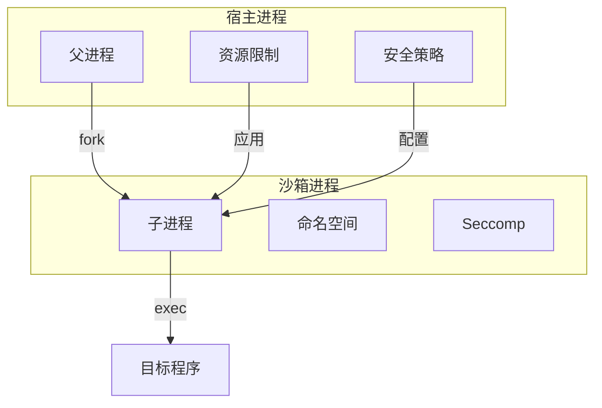
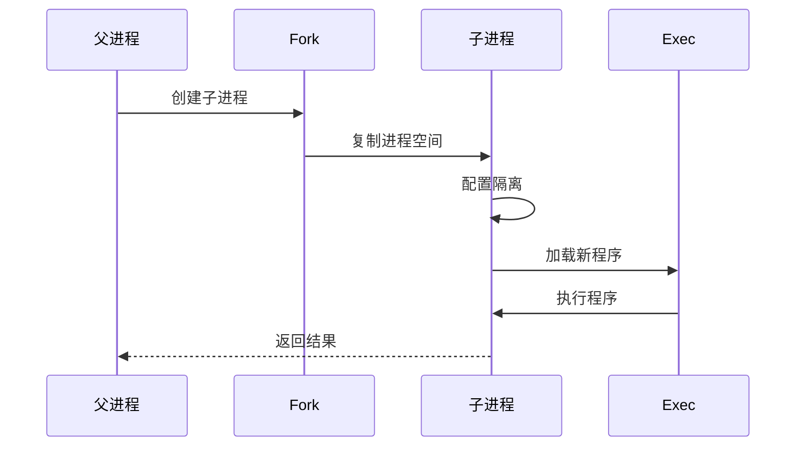
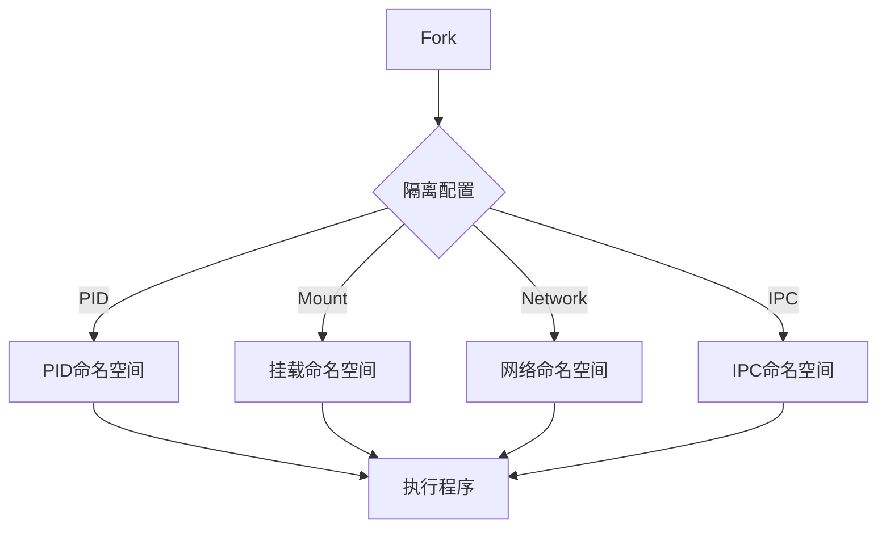
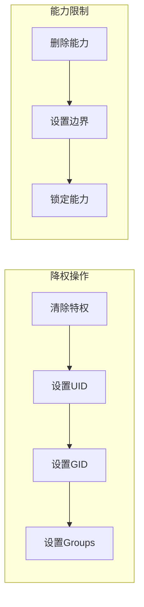
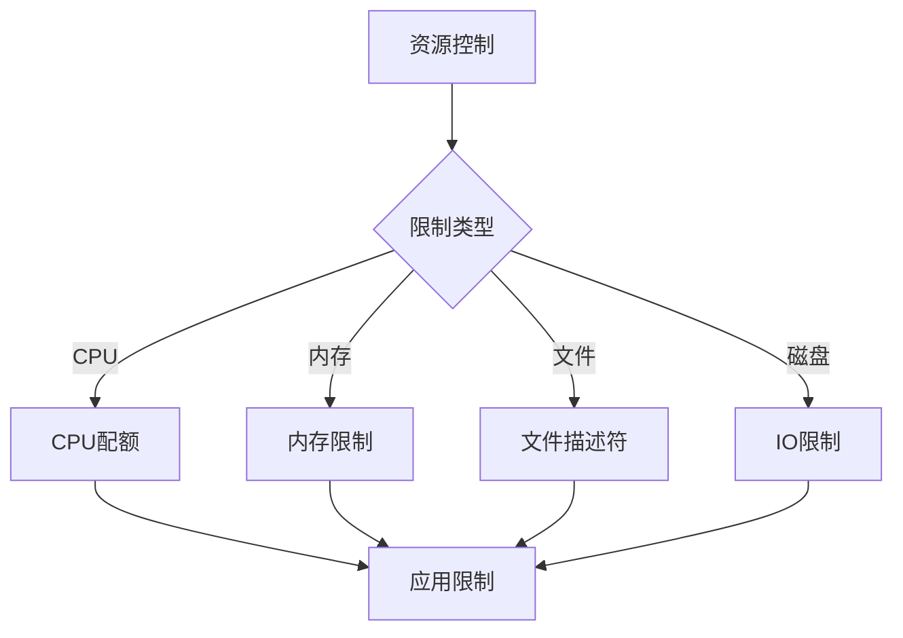
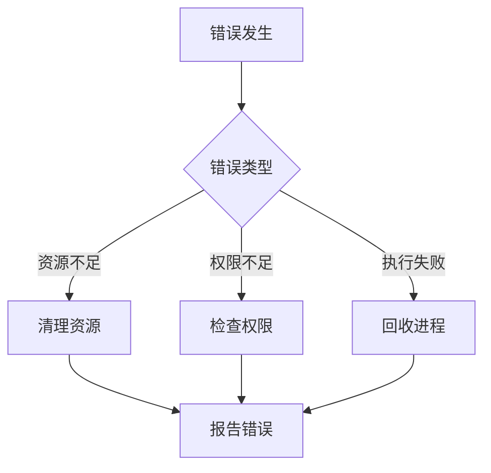
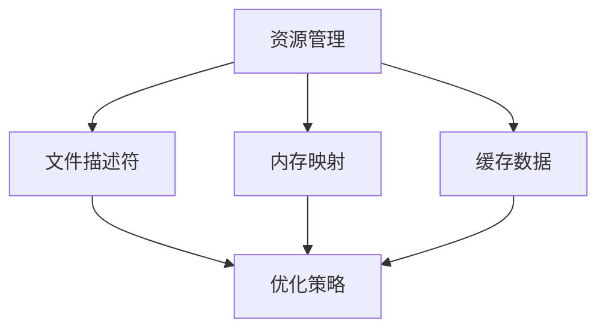
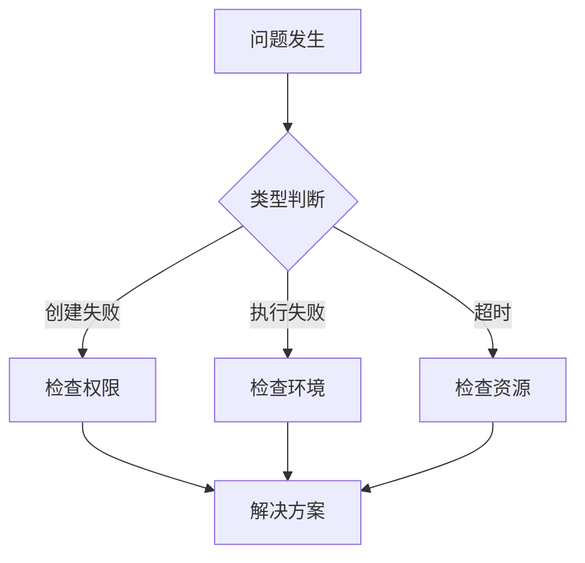
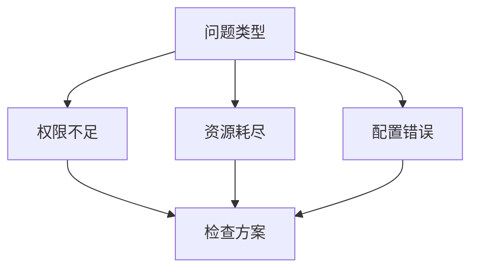

# Fork/Exec 与沙箱系统

## 概述

Fork/Exec 是 Unix 系统中创建新进程的基本机制。在沙箱系统中，它被用来创建隔离的子进程，并在子进程中加载和执行目标程序。这个过程需要精确控制以确保安全性和资源隔离。

## 系统架构



## 工作机制

### 1. 进程创建流程



### 2. 资源隔离



## 安全机制

### 1. 权限控制



### 2. 资源限制



## 实现细节

### 1. Fork 过程


### 2. 错误处理



## 性能优化

### 1. 内存管理


### 2. 资源复用



## 实现示例

### 1. 基本创建

```go
// 创建带隔离的子进程
cmd := &exec.Cmd{
    Path: "/path/to/program",
    Args: []string{"program", "arg1", "arg2"},
    SysProcAttr: &syscall.SysProcAttr{
        Cloneflags: syscall.CLONE_NEWNS |
                   syscall.CLONE_NEWUTS |
                   syscall.CLONE_NEWIPC |
                   syscall.CLONE_NEWPID |
                   syscall.CLONE_NEWNET,
    },
}

// 启动进程
if err := cmd.Start(); err != nil {
    return err
}
```

### 2. 资源限制

```go
// 设置资源限制
cmd.SysProcAttr.Rlimit = []syscall.Rlimit{
    {
        Cur: 1024,
        Max: 1024,
    },
}

// 设置进程属性
cmd.SysProcAttr.Credential = &syscall.Credential{
    Uid: 1000,
    Gid: 1000,
}
```

## 调试技巧

### 1. 问题定位



### 2. 日志分析


## 最佳实践

### 1. 安全配置

- 最小权限原则
- 资源限制
- 错误处理

### 2. 性能优化

- 资源预分配
- 缓存复用
- 并发控制

### 3. 可靠性

- 进程监控
- 错误恢复
- 资源清理

## 注意事项

### 1. 安全风险

- 权限提升
- 资源泄露
- 隔离突破

### 2. 性能影响

- 创建开销
- 内存占用
- 上下文切换

### 3. 兼容性

- 系统调用
- 内核版本
- 特性支持

## 故障排除

### 1. 常见问题



### 2. 解决方案


## 高级特性

### 1. 进程通信

- 管道通信
- 共享内存
- 信号处理

### 2. 状态监控

- 资源使用
- 性能指标
- 错误统计

### 3. 自动恢复

- 错误检测
- 进程重启
- 状态恢复
