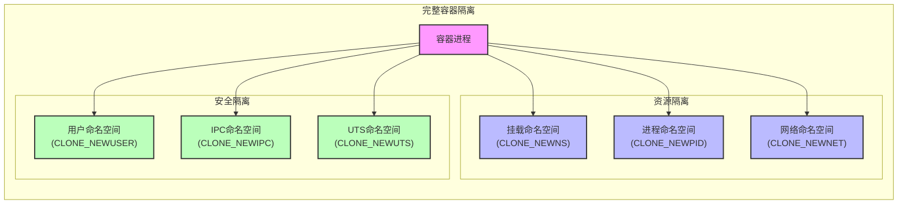
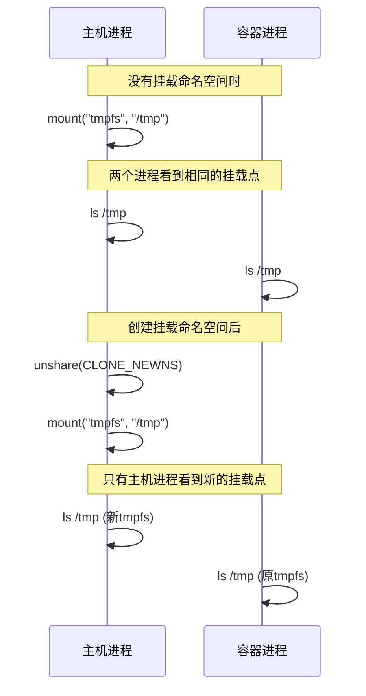
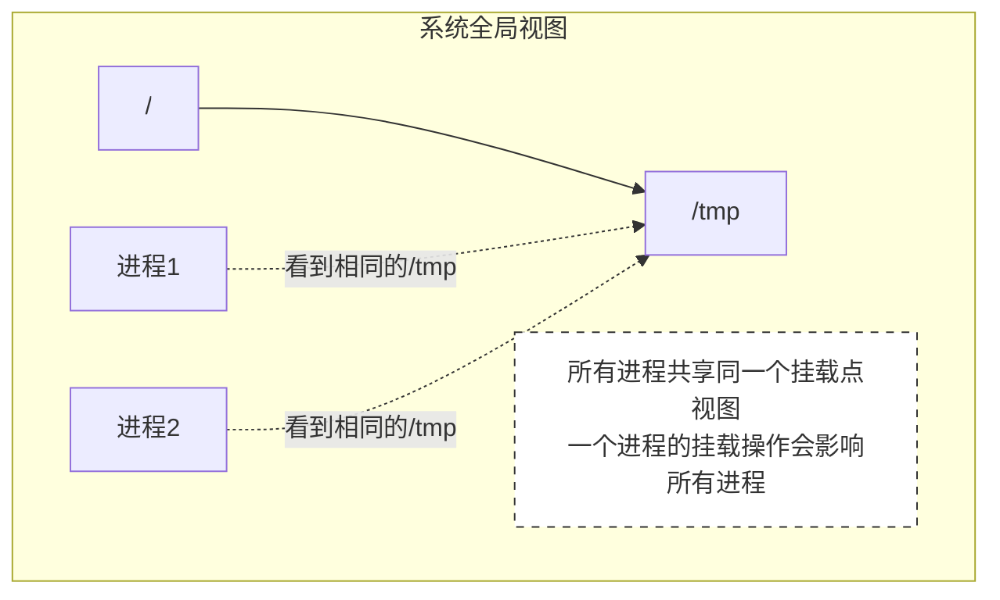
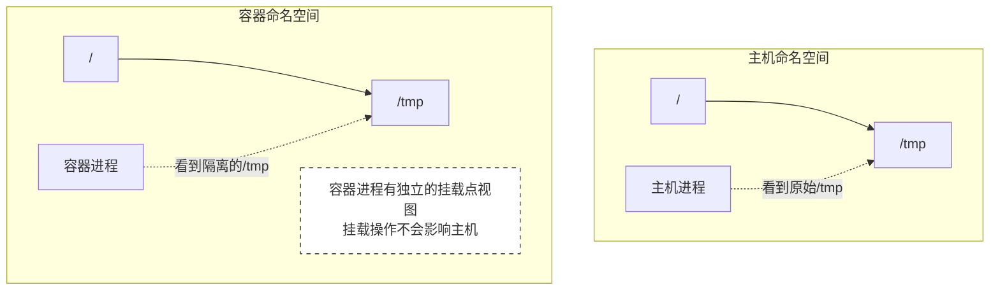
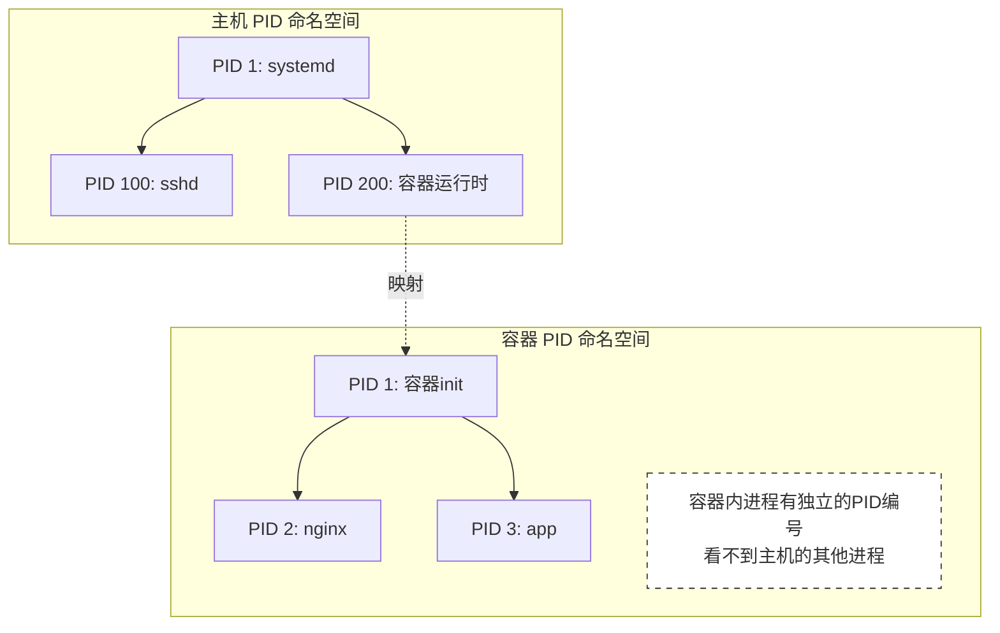
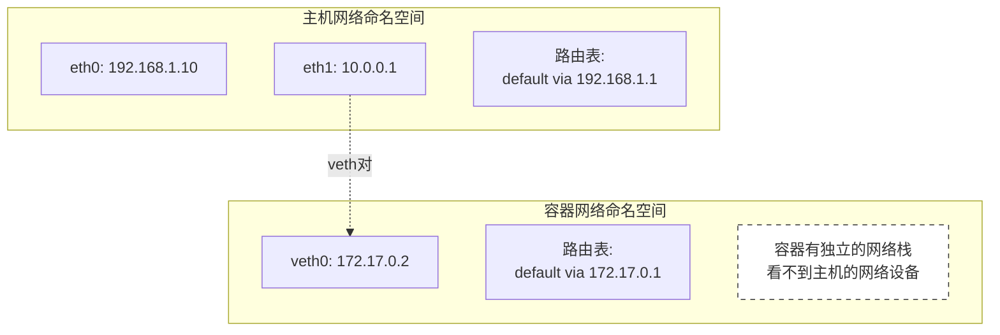

# Linux 命名空间详解

Linux 命名空间是内核提供的资源隔离机制，每种类型的命名空间用于隔离特定的系统资源。

## 命名空间类型

### 1. 挂载命名空间 (CLONE_NEWNS)
- **功能**：隔离文件系统挂载点
- **作用**：
  - 每个命名空间有独立的挂载点列表
  - 可以在不影响主机的情况下修改文件系统结构
  - 支持 pivot_root 切换根目录
- **应用**：
  - 容器文件系统隔离
  - 沙箱环境构建
  - 只读文件系统实现

### 2. 进程命名空间 (CLONE_NEWPID)
- **功能**：隔离进程 ID 空间
- **作用**：
  - 每个命名空间有独立的进程编号
  - 子命名空间中的 PID 1 是 init 进程
  - 父命名空间可以看到子命名空间的进程
- **应用**：
  - 容器进程管理
  - 进程迁移
  - 系统初始化隔离

### 3. 网络命名空间 (CLONE_NEWNET)
- **功能**：隔离网络资源
- **作用**：
  - 独立的网络设备
  - 独立的 IP 地址
  - 独立的路由表
  - 独立的防火墙规则
- **应用**：
  - 网络虚拟化
  - 容器网络隔离
  - 网络安全沙箱

### 4. IPC 命名空间 (CLONE_NEWIPC)
- **功能**：隔离进程间通信资源
- **作用**：
  - 独立的 System V IPC 对象
  - 独立的 POSIX 消息队列
  - 独立的命名信号量
- **应用**：
  - 容器 IPC 隔离
  - 多租户系统
  - 安全隔离层

### 5. UTS 命名空间 (CLONE_NEWUTS)
- **功能**：隔离主机名和域名
- **作用**：
  - 独立的主机名
  - 独立的 NIS 域名
  - 不影响其他命名空间的主机标识
- **应用**：
  - 容器主机名管理
  - 多租户环境
  - 测试环境隔离

### 6. 用户命名空间 (CLONE_NEWUSER)
- **功能**：隔离用户和组 ID
- **作用**：
  - 独立的用户 ID 映射
  - 独立的组 ID 映射
  - 可以赋予非特权用户特权操作能力
- **应用**：
  - 非特权容器
  - 安全沙箱
  - 权限隔离

## 命名空间的组合使用



## 命名空间的本质

命名空间的本质是**资源视图的隔离**。每个命名空间都为进程提供了一个特定系统资源的独立视图，就像给进程戴上了一个特殊的眼镜，让它看到的系统资源是被隔离的。

### 以挂载命名空间为例



### 具体例子：没有挂载命名空间



### 具体例子：使用挂载命名空间



### 实际操作演示

```bash
# 在主机上
$ mount | grep /tmp
tmpfs on /tmp type tmpfs (rw,nosuid,nodev)

# 创建新的挂载命名空间
$ unshare -m /bin/bash
$ mount | grep /tmp  # 初始时继承主机的挂载点
tmpfs on /tmp type tmpfs (rw,nosuid,nodev)

# 在新命名空间中重新挂载 /tmp
$ mount -t tmpfs -o size=100m tmpfs /tmp
$ mount | grep /tmp
tmpfs on /tmp type tmpfs (rw,size=100m)

# 此时主机上的 /tmp 不受影响
$ # 在主机的另一个终端中
$ mount | grep /tmp
tmpfs on /tmp type tmpfs (rw,nosuid,nodev)  # 保持不变
```

### 其他命名空间的类似例子

#### PID 命名空间



#### 网络命名空间



### 命名空间的关键特性

1. **视图隔离**
   - 每个命名空间提供特定资源的独立视图
   - 进程只能看到和操作自己命名空间内的资源
   - 对资源的修改只影响同一命名空间的进程

2. **资源继承**
   ```mermaid
   graph TB
       P1[父进程] --> P2[子进程]
       
       subgraph "命名空间继承"
           NS1["父进程命名空间"]
           NS2["子进程新命名空间"]
           
           note5["子进程可以:
           1. 继承父进程的命名空间
           2. 创建新的命名空间
           3. 加入已存在的命名空间"]
       end
       
       P1 -.继承.-> NS1
       P2 -.创建/继承/加入.-> NS2
       
       classDef note fill:#fff,stroke:#333,stroke-width:1px,stroke-dasharray: 5 5
       class note5 note
   ```

3. **嵌套关系**
   ```mermaid
   graph TB
       subgraph "命名空间层次"
           Host["主机命名空间"]
           Container1["容器1命名空间"]
           Container2["容器2命名空间"]
           
           Host --> Container1
           Host --> Container2
           
           note6["父命名空间可以看到子命名空间
           子命名空间看不到父命名空间"]
       end
       
       classDef note fill:#fff,stroke:#333,stroke-width:1px,stroke-dasharray: 5 5
       class note6 note
   ```

通过这些图和例子，我们可以看到命名空间的本质是为进程提供一个隔离的资源视图，就像每个容器都生活在自己的"小世界"里，互不干扰。这种隔离是轻量级的，因为它们共享同一个内核，只是每个进程看到的资源视图不同。

需要我详细解释某个具体的例子吗？

## 命名空间的特点

1. **层次结构**
   - 命名空间可以嵌套
   - 父命名空间可以看到子命名空间
   - 子命名空间与父命名空间隔离

2. **生命周期**
   - 随进程创建而创建
   - 最后一个进程退出时销毁
   - 可以通过 bind mount 持久化

3. **权限要求**
   - 大多需要 root 权限
   - 用户命名空间例外
   - 可以通过 capabilities 细粒度控制

4. **性能影响**
   - 轻量级隔离
   - 最小化开销
   - 按需使用不同类型

## 最佳实践

1. **安全考虑**
   - 优先使用用户命名空间
   - 最小权限原则
   - 谨慎处理特权操作

2. **资源管理**
   - 合理组合不同类型
   - 避免不必要的隔离
   - 注意资源限制

3. **调试技巧**
   - 使用 lsns 查看命名空间
   - 使用 nsenter 进入命名空间
   - 使用 unshare 创建命名空间
