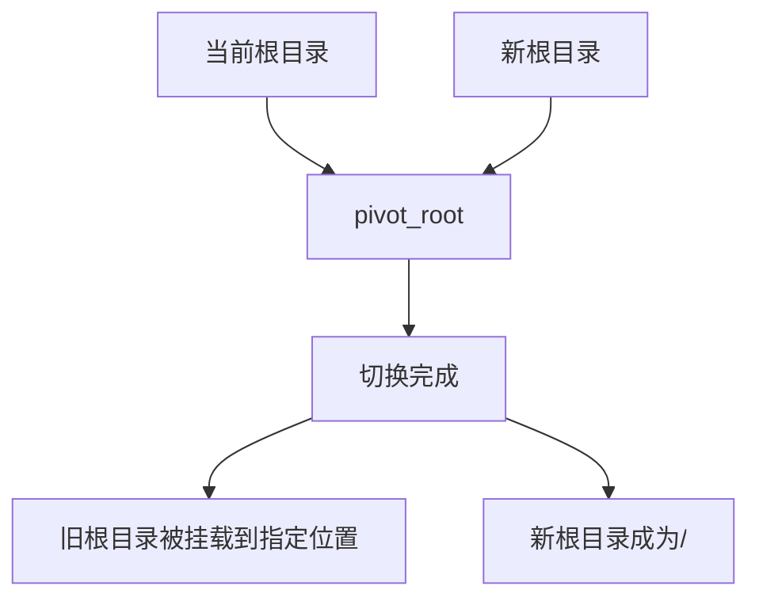
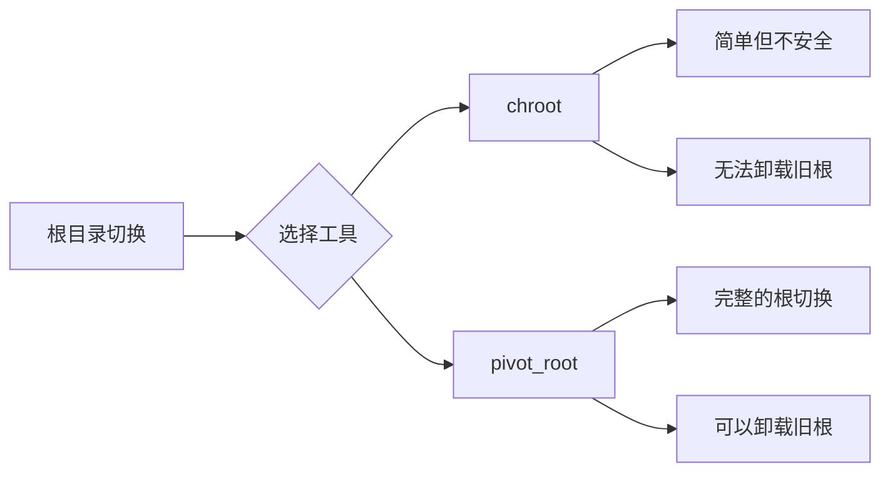
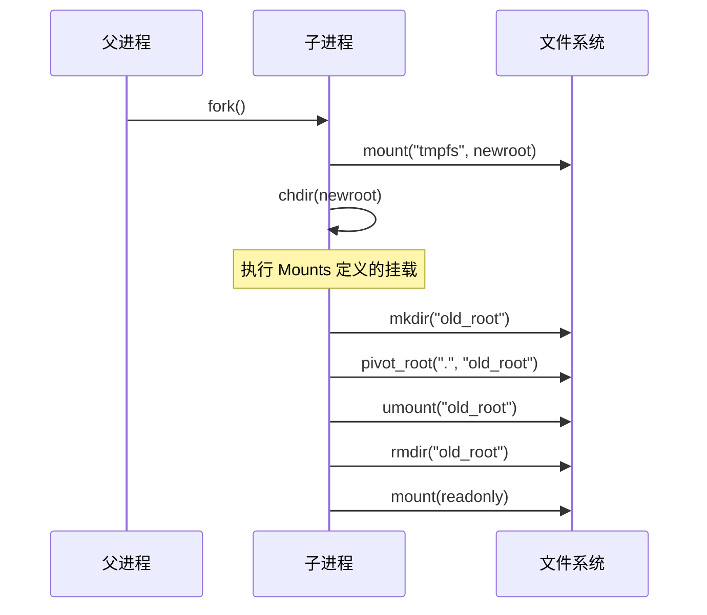
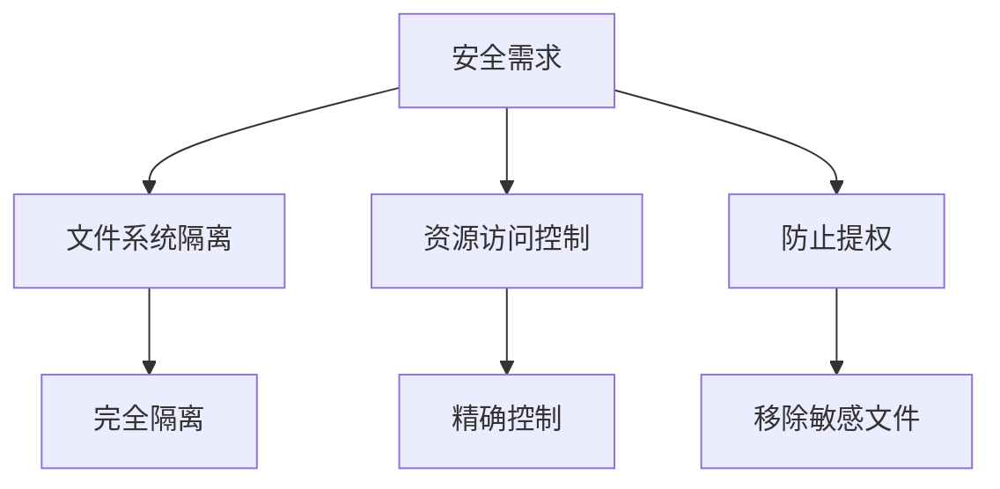
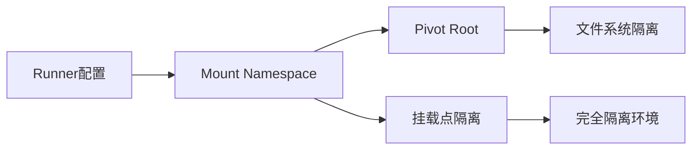
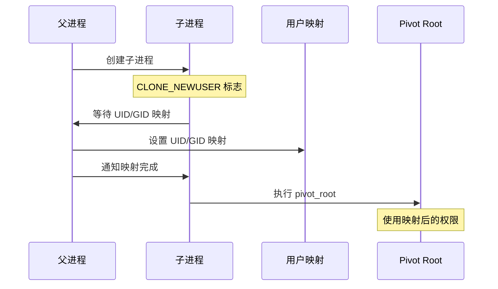

# Pivot Root 详解

本文档详细说明了 `pivot_root` 系统调用的工作原理，以及它在 forkexec 包中的应用和实现。

## 1. 基本概念

### 1.1 什么是 pivot_root


pivot_root 系统调用用于改变进程的根文件系统。它：
1. 将当前根文件系统移动到指定位置
2. 将新的文件系统设置为根文件系统
3. 保证文件系统的连续性和可访问性

### 1.2 与 chroot 的区别


## 2. 在 forkexec 包中的实现

### 2.1 配置结构
```go
type Runner struct {
    // ... 其他字段 ...
    
    // PivotRoot 定义新的根目录
    // 必须是绝对路径
    PivotRoot string
    
    // Mounts 定义挂载点
    // 在 pivot_root 之前执行
    Mounts []mount.SyscallParams
}
```

### 2.2 执行流程


## 3. 安全考虑

### 3.1 为什么需要 pivot_root


1. **完全隔离**：
   - 切断对宿主系统的访问
   - 防止信息泄露
   - 控制资源访问

2. **安全边界**：
   - 限制文件系统访问
   - 防止权限提升
   - 保护宿主系统

### 3.2 实现细节
```go
// 执行步骤示例
func setupRoot(root string) error {
    // 1. 首先挂载 tmpfs
    if err := mount("tmpfs", root, "tmpfs", 0, ""); err != nil {
        return err
    }
    
    // 2. 切换到新目录
    if err := chdir(root); err != nil {
        return err
    }
    
    // 3. 创建旧根目录挂载点
    if err := mkdir("old_root", 0700); err != nil {
        return err
    }
    
    // 4. 执行 pivot_root
    if err := pivotRoot(".", "old_root"); err != nil {
        return err
    }
    
    // 5. 卸载并删除旧根
    if err := umount2("old_root", MNT_DETACH); err != nil {
        return err
    }
    
    return rmdir("old_root")
}
```

## 4. 与其他功能的关系

### 4.1 命名空间集成


### 4.2 与用户命名空间的关系



1. **权限要求**：
   - pivot_root 需要 CAP_SYS_ADMIN 权限
   - 在用户命名空间中，进程可以获得此权限
   - UID/GID 映射决定了进程的实际权限

2. **执行顺序**：
   ```go
   // 正确的执行顺序
   1. 创建用户命名空间（CLONE_NEWUSER）
   2. 设置 UID/GID 映射
   3. 创建挂载命名空间（CLONE_NEWNS）
   4. 执行 pivot_root
   ```

3. **权限映射示例**：
   ```go
   type Runner struct {
       // 用户命名空间配置
       UIDMappings []syscall.SysProcIDMap
       GIDMappings []syscall.SysProcIDMap
       
       // pivot_root 配置
       PivotRoot string
       Mounts    []mount.SyscallParams
   }
   
   // 映射示例
   runner.UIDMappings = []syscall.SysProcIDMap{
       {
           ContainerID: 0,    // 容器内 root
           HostID:      1000, // 主机普通用户
           Size:        1,
       },
   }
   ```

4. **安全考虑**：
   - 容器内的 root 映射到主机普通用户
   - 限制对主机文件系统的访问权限
   - 防止通过 pivot_root 提权

5. **常见问题**：
   - 权限不足：检查 UID/GID 映射
   - 操作失败：确认用户命名空间设置
   - 挂载失败：验证权限映射是否正确

### 4.3 与资源限制的关系
1. **与 Seccomp 的关系**：
   - 在 pivot_root 后加载 seccomp 规则
   - 确保在受限环境中执行
   - 防止通过文件系统操作绕过限制

2. **与 Capability 的关系**：
   - 需要 CAP_SYS_ADMIN 权限
   - 在用户命名空间中执行
   - 权限精确控制

## 5. 使用示例

### 5.1 基本配置
```go
runner := &Runner{
    PivotRoot: "/path/to/new/root",
    Mounts: []mount.SyscallParams{
        {
            Source: "proc",
            Target: "/proc",
            FSType: "proc",
        },
        {
            Source: "tmpfs",
            Target: "/tmp",
            FSType: "tmpfs",
        },
    },
}
```

### 5.2 最佳实践
1. **准备工作**：
   - 确保新根目录存在且合适
   - 准备必要的挂载点
   - 检查权限要求

2. **执行顺序**：
   - 先创建命名空间
   - 执行必要的挂载
   - 最后进行 pivot_root

3. **清理工作**：
   - 确保正确卸载旧根
   - 删除临时文件
   - 设置适当的权限

## 6. 故障排除

### 6.1 常见问题
1. 权限不足
2. 挂载点忙
3. 文件系统不支持
4. 路径问题

### 6.2 调试建议
1. 检查权限和 capability
2. 验证文件系统类型
3. 确认挂载点状态
4. 检查路径配置

## 7. 结论

pivot_root 是实现安全容器化的关键组件：
1. 提供完整的根文件系统隔离
2. 支持精确的资源访问控制
3. 与其他安全机制协同工作
4. 是构建安全沙箱的基础
