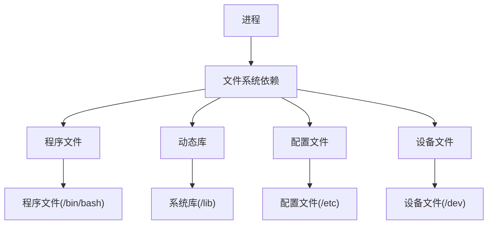
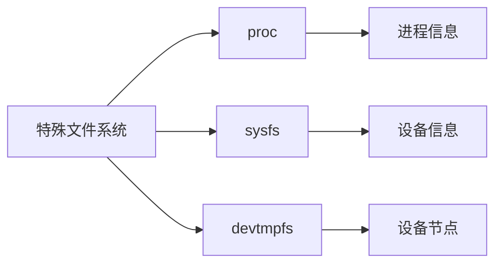
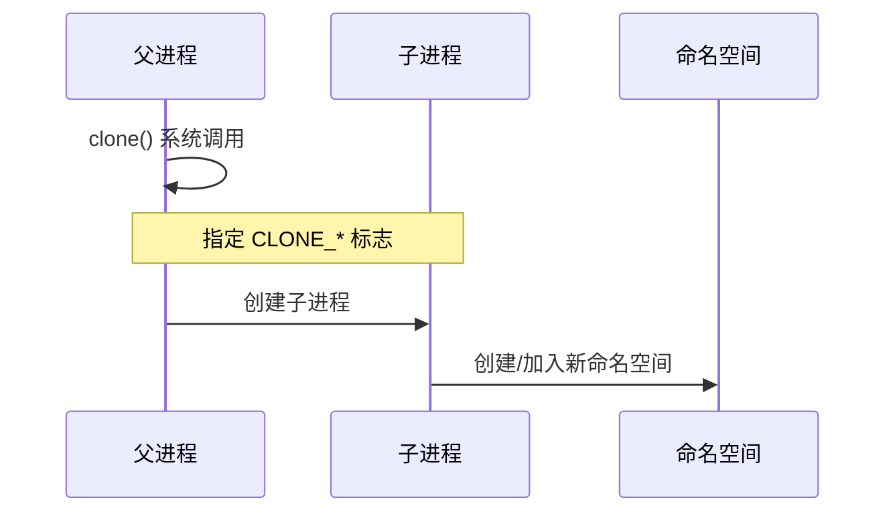
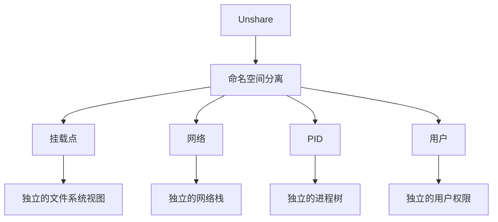
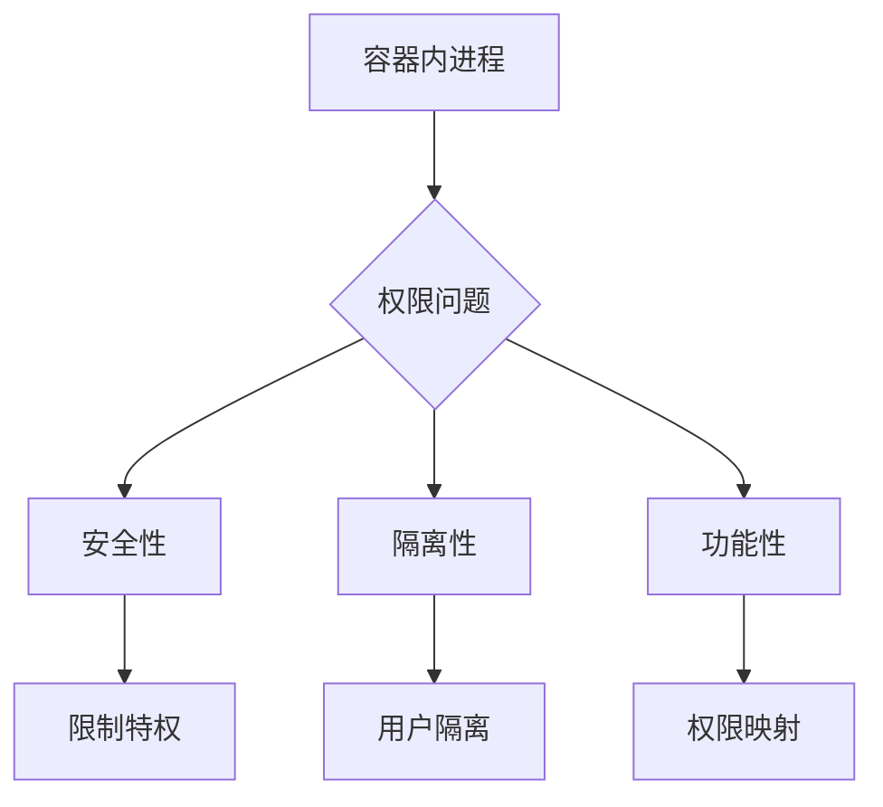
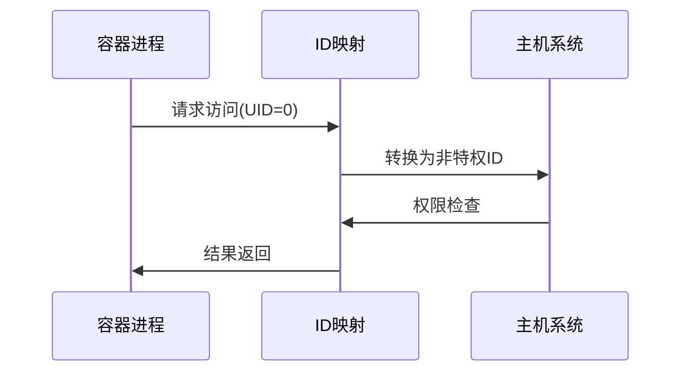
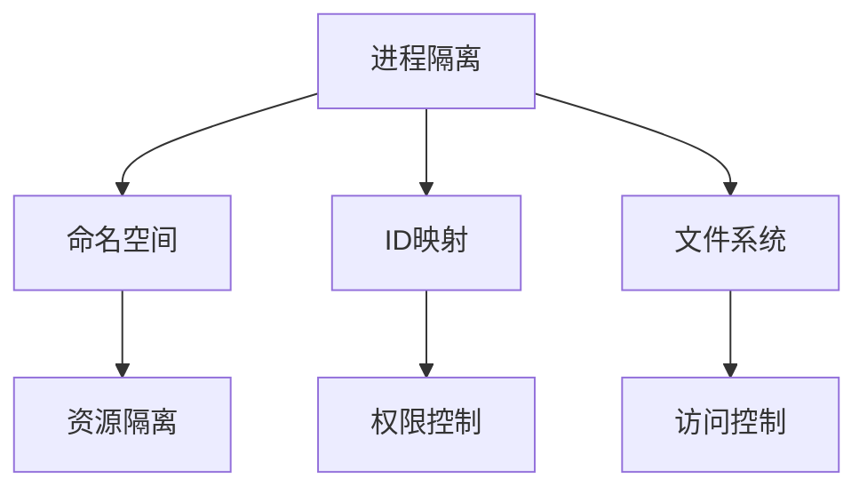

# Linux 进程隔离机制详解

## 1. 进程与文件系统的关系

### 1.1 为什么进程依赖文件系统


1. **必要性**：
   - 程序二进制文件需要从文件系统加载
   - 动态链接库存储在文件系统中
   - 配置文件和数据文件的访问
   - 设备访问（通过设备文件）

2. **基本操作**：
   ```bash
   # 进程启动时的文件系统操作
   1. 读取可执行文件
   2. 加载动态库
   3. 读取配置
   4. 访问设备
   ```

### 1.2 Linux 中的特殊文件系统


## 2. 克隆和 Unshare 机制

### 2.1 克隆（Clone）


1. **克隆标志的作用**：
   ```c
   // 常用的克隆标志
   CLONE_NEWNS   // 新的挂载命名空间
   CLONE_NEWUTS  // 新的 UTS 命名空间
   CLONE_NEWPID  // 新的 PID 命名空间
   CLONE_NEWNET  // 新的网络命名空间
   CLONE_NEWUSER // 新的用户命名空间
   ```

### 2.2 Unshare 机制


1. **作用**：
   - 将进程从原有命名空间分离
   - 创建新的独立命名空间
   - 实现资源隔离

2. **与 Clone 的区别**：
   ```plaintext
   Clone：创建新进程时设置命名空间
   Unshare：为现有进程创建新命名空间
   ```

## 3. 用户和组 ID 映射

### 3.1 为什么需要 ID 映射


### 3.2 ID 映射的工作原理
```go
type SysProcIDMap struct {
    ContainerID int // 容器内的 ID
    HostID      int // 主机上的 ID
    Size        int // 映射范围大小
}
```

1. **映射示例**：
   ```plaintext
   容器内 UID 0-999  → 主机 UID 100000-100999
   容器内 GID 0-999  → 主机 GID 200000-200999
   ```

2. **安全考虑**：
   - 容器内 root (0) 映射到主机非特权用户
   - 防止容器突破权限边界
   - 实现最小权限原则

### 3.3 实际应用


## 4. 完整的隔离环境

### 4.1 组件协作


### 4.2 安全保障
1. **文件系统隔离**：
   - 限制对主机文件的访问
   - 提供独立的文件系统视图
   - 控制敏感文件访问

2. **用户隔离**：
   - 映射 UID/GID
   - 防止权限提升
   - 控制资源访问

3. **资源隔离**：
   - 独立的进程空间
   - 独立的网络栈
   - 独立的 IPC 机制

## 5. 最佳实践

### 5.1 配置建议
1. **文件系统**：
   - 使用最小化的根文件系统
   - 只挂载必要的目录
   - 合理设置权限

2. **用户映射**：
   - 使用足够大的 ID 范围
   - 避免与主机 ID 冲突
   - 谨慎处理特权操作

3. **资源限制**：
   - 设置合理的资源限额
   - 启用必要的安全特性
   - 监控资源使用

## 6. 故障排除

### 6.1 常见问题
1. 权限不足
2. 资源访问受限
3. ID 映射冲突
4. 文件系统问题

### 6.2 调试方法
1. 检查权限配置
2. 验证 ID 映射
3. 检查挂载点
4. 查看系统日志
