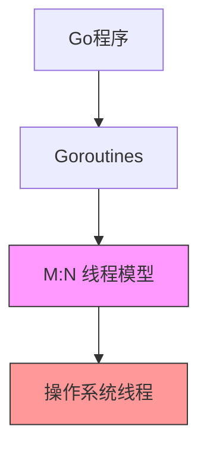
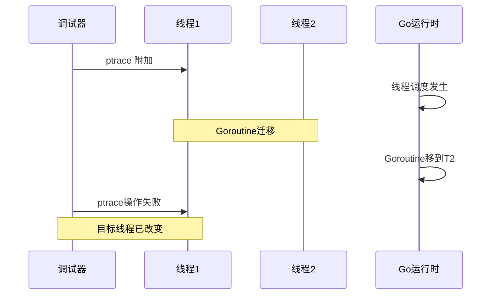
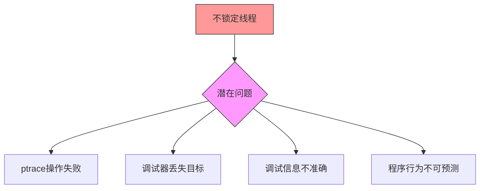
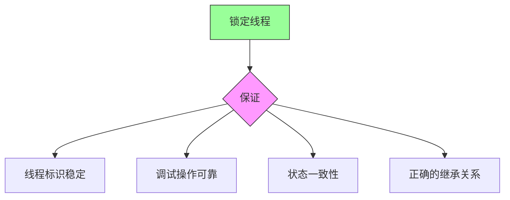

# Ptrace 与线程锁定

本文档解释了为什么在使用 ptrace 时必须锁定操作系统线程，以及这个要求背后的技术原理。

## 1. 基本概念

### 1.1 Go 的线程模型


- Go 使用 M:N 线程模型
- Goroutines 可以在线程间迁移
- 运行时可动态创建和销毁线程
- 默认情况下没有线程亲和性

### 1.2 Ptrace 的工作方式


- ptrace 直接操作操作系统线程
- 使用实际的线程 ID
- 需要稳定的线程标识
- 基于线程而非进程级别的操作

## 2. 问题场景

### 2.1 不锁定线程的问题


### 2.2 错误的实现示例
```go
// 错误示例：不锁定线程
func debugProcess() {
    pid := syscall.Getpid()  // 获取当前进程ID
    
    // 危险：goroutine可能在此时被调度到其他线程
    
    syscall.PtraceAttach(pid)  // ptrace可能失败
    // 因为目标线程可能已经改变
}
```

## 3. 正确的实现

### 3.1 线程锁定
```go
// 正确示例：锁定线程
func debugProcess() {
    runtime.LockOSThread()  // 确保线程稳定
    defer runtime.UnlockOSThread()
    
    pid := syscall.Getpid()  // 现在pid是稳定的
    syscall.PtraceAttach(pid)  // ptrace可以正确工作
}
```

### 3.2 在 Runner 中的应用
```go
func (r *Runner) Start() (int, error) {
    if r.Ptrace {
        // 在fork之前锁定线程
        runtime.LockOSThread()
        defer runtime.UnlockOSThread()
    }
    
    // 现在可以安全地进行fork和ptrace操作
    pid, err := forkAndExecInChild(...)
    if err != nil {
        return 0, err
    }
    
    return pid, nil
}
```

## 4. 影响和后果

### 4.1 不锁定线程的后果


### 4.2 锁定线程的保证


## 5. 技术细节

### 5.1 线程锁定的工作原理
1. `runtime.LockOSThread()`
   - 将当前 goroutine 绑定到其当前线程
   - 阻止 goroutine 迁移到其他线程
   - 保持线程存活

2. 线程状态
   - 锁定状态会被维护
   - 其他 goroutine 不会使用该线程
   - 直到显式解锁

### 5.2 ptrace 操作的要求
1. 稳定的线程 ID
2. 可预测的线程状态
3. 正确的权限和访问
4. 可靠的调试信息

## 6. 最佳实践

### 6.1 使用准则
1. 总是在使用 ptrace 前锁定线程
2. 使用 defer 确保正确解锁
3. 验证线程状态
4. 处理错误情况

### 6.2 检查清单
- [ ] 调用 `runtime.LockOSThread()`
- [ ] 使用 defer 解锁
- [ ] 验证 ptrace 操作结果
- [ ] 检查错误处理
- [ ] 测试边界情况

## 7. 调试建议

### 7.1 常见问题
1. ptrace 操作失败
2. 线程状态不一致
3. 调试信息不准确
4. 权限问题

### 7.2 诊断步骤
1. 确认线程锁定状态
2. 检查线程 ID 稳定性
3. 验证 ptrace 操作
4. 检查错误日志

## 8. 结论

线程锁定对于 ptrace 操作是必要的，因为：
1. 确保调试器能够可靠地跟踪目标
2. 维护调试操作的一致性
3. 保证正确的线程状态继承
4. 提供稳定的调试环境

这不是性能优化，而是功能正确性的要求。如果不遵守这个规则，调试功能可能完全失效。
