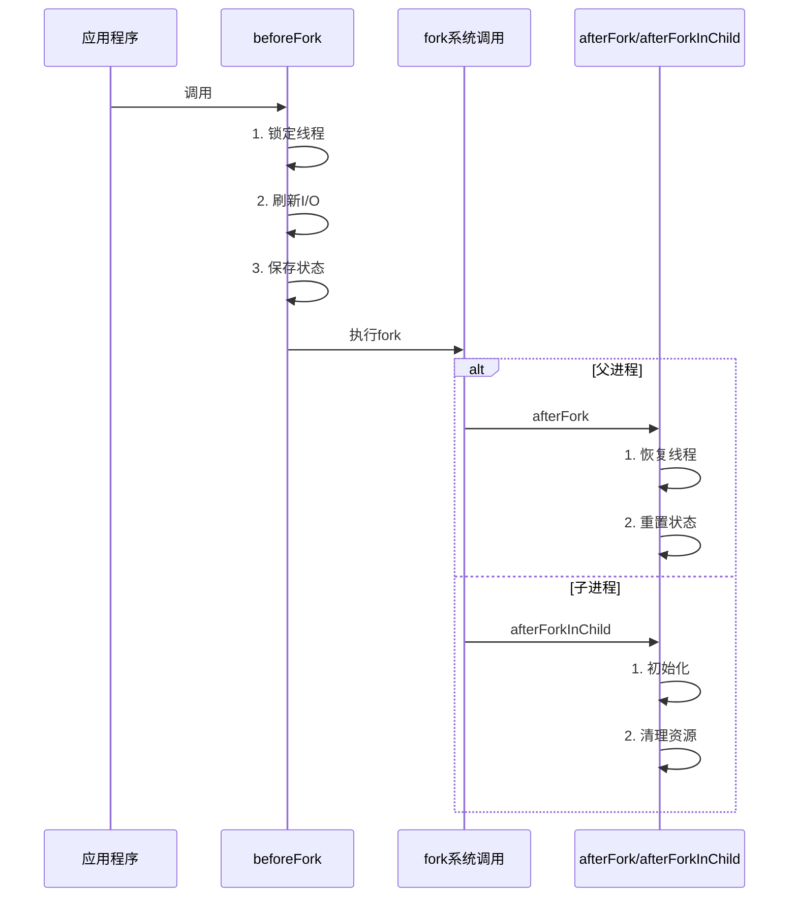
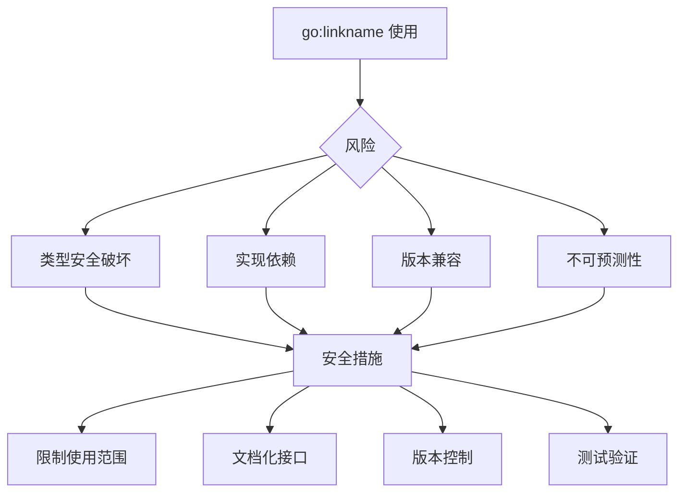
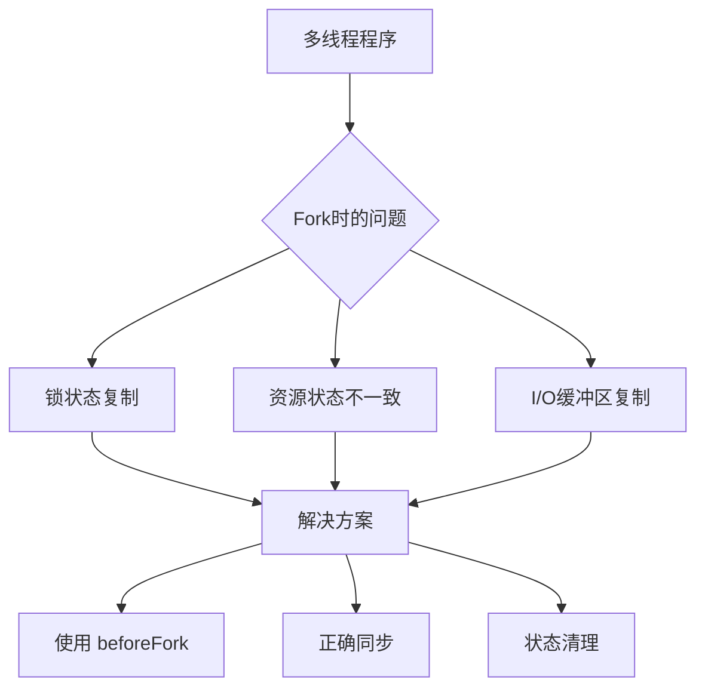

# Go 运行时链接机制详解

本文档详细说明了在 fork 实现中使用的 Go 运行时链接机制，特别是 `go:linkname` 指令的使用和相关的安全考虑。

## 1. 基本概念

### 1.1 空白导入
```go
import _ "unsafe"  // 空白导入
```

空白导入的特点：
1. 使用 `_` 作为包名
2. 不直接使用包中的任何标识符
3. 仅为了包的副作用
4. 在编译时会被检查和执行初始化

### 1.2 go:linkname 指令
```go
//go:linkname localName importPath.name
```

指令格式说明：
- `localName`：当前包中声明的函数名
- `importPath.name`：要链接到的目标函数的完整路径
- 必须紧接着函数声明
- 不能有空行

## 2. 在 Fork 实现中的应用

### 2.1 运行时函数链接
```go
// 必需的 unsafe 导入
import _ "unsafe"

// 链接到运行时的 fork 相关函数
//go:linkname beforeFork syscall.runtime_BeforeFork
func beforeFork()

//go:linkname afterFork syscall.runtime_AfterFork
func afterFork()

//go:linkname afterForkInChild syscall.runtime_AfterForkInChild
func afterForkInChild()
```

### 2.2 函数说明



## 3. 安全考虑

### 3.1 使用风险


### 3.2 正确使用示例
```go
// 好的做法：使用文档化的接口
//go:linkname beforeFork syscall.runtime_BeforeFork
func beforeFork()

// 危险的做法：随意链接运行时函数
//go:linkname myFunc runtime.someRandomFunc  // 不要这样做！
```

### 3.3 使用限制
1. 必须导入 `unsafe` 包
2. 只能链接到已知的接口
3. 需要特别的编译器支持
4. 可能受到运行时版本的影响

## 4. 多线程 Fork 的安全性

### 4.1 问题场景


### 4.2 解决方案
```go
beforeFork()     // 1. 锁定所有线程
pid := fork()    // 2. 安全地执行 fork
if pid == 0 {
    afterForkInChild()  // 3a. 子进程初始化
} else {
    afterFork()         // 3b. 父进程恢复
}
```

## 5. 最佳实践

### 5.1 使用准则
1. 仅在必要时使用
2. 保持最小权限原则
3. 充分测试
4. 文档化所有使用

### 5.2 安全检查清单
- [ ] 确认是否真的需要 `go:linkname`
- [ ] 验证目标函数的稳定性
- [ ] 检查版本兼容性
- [ ] 添加适当的测试
- [ ] 记录使用原因
- [ ] 评估安全影响

### 5.3 文档化要求
1. 明确标注使用原因
2. 记录潜在风险
3. 说明版本依赖
4. 提供替代方案
5. 维护注意事项

## 6. 调试和故障排除

### 6.1 常见问题
1. 编译错误
2. 运行时崩溃
3. 版本不兼容
4. 性能问题

### 6.2 调试技巧
1. 使用 `-gcflags` 编译选项
2. 检查汇编输出
3. 运行时跟踪
4. 压力测试

## 7. 结论

`go:linkname` 是一个强大但危险的特性，在 fork 实现中的使用是必要的，因为：
1. 需要精确控制线程状态
2. 必须访问运行时的内部函数
3. 对性能和安全性有严格要求

但使用时必须谨慎，确保：
1. 充分理解使用影响
2. 严格控制使用范围
3. 保持良好的文档
4. 定期检查兼容性
