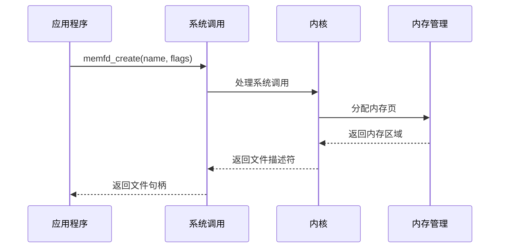
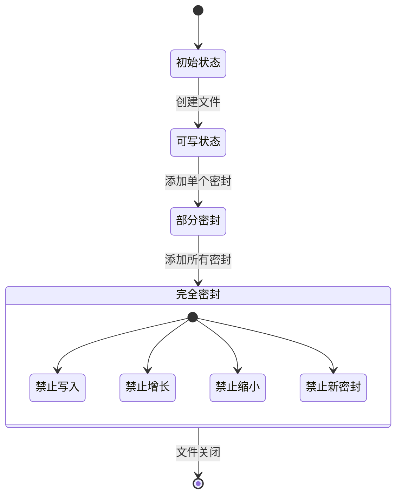
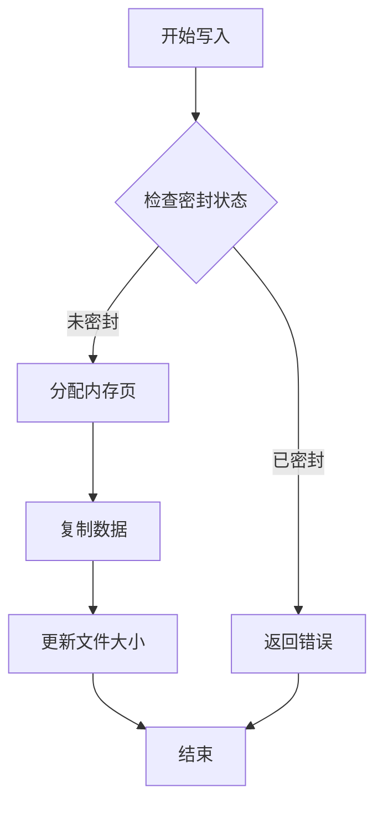
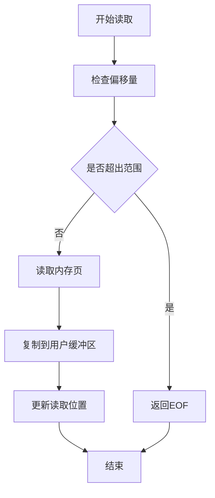
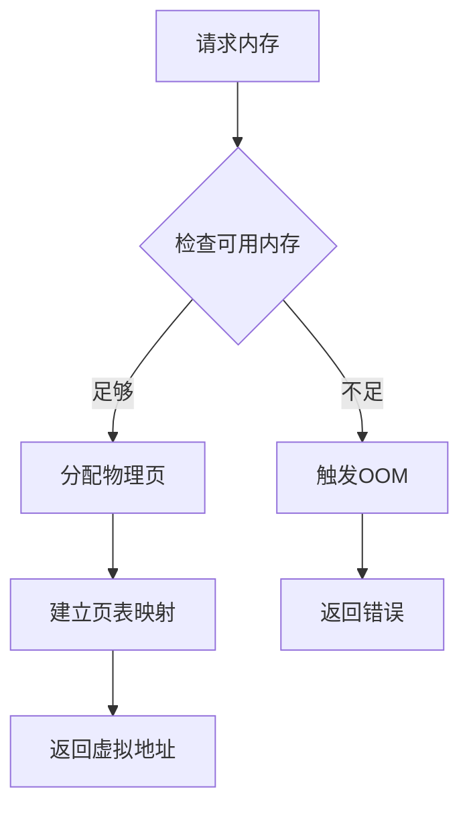
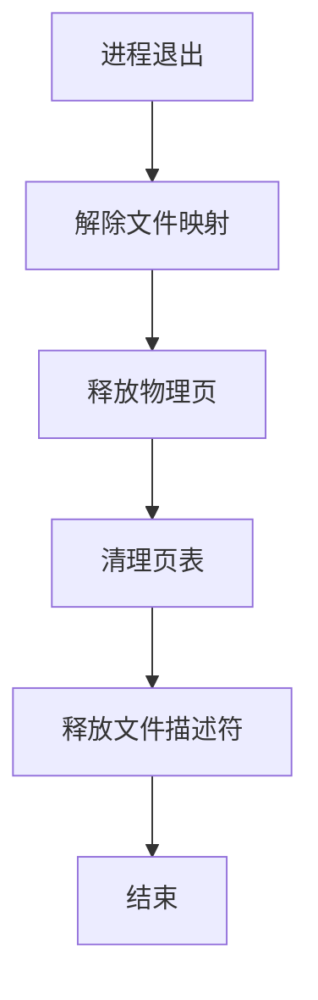
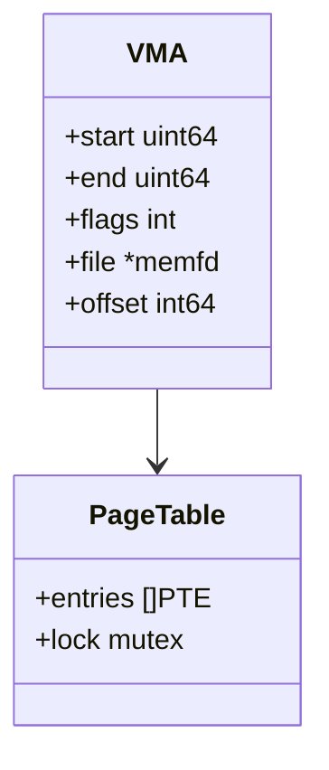
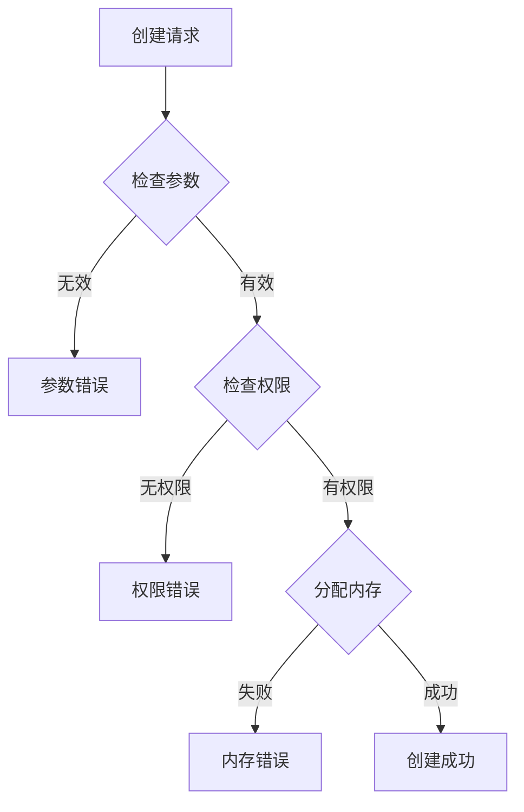
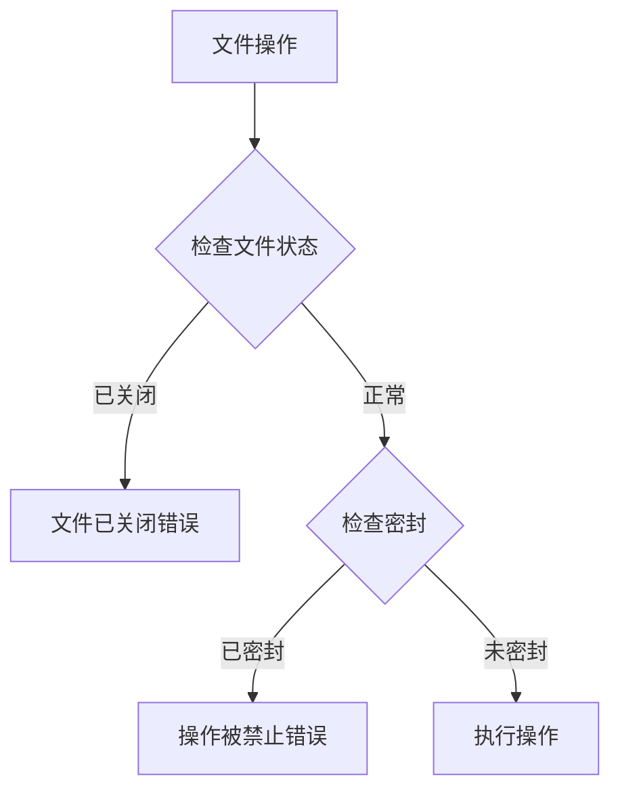
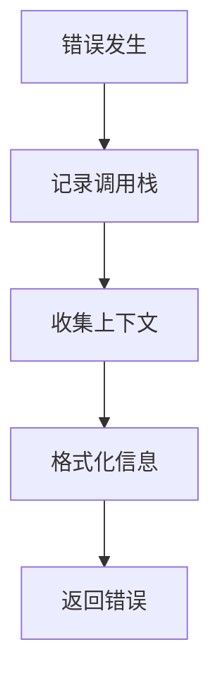

# memfd 技术实现详解

## 系统调用流程



## 内存布局


## 密封机制实现



## 文件操作实现

### 1. 写入操作


### 2. 读取操作


## 内存管理

### 1. 页面分配


### 2. 内存回收


## 关键数据结构

### 1. 文件描述符
```go
type memfd struct {
    fd      int        // 文件描述符
    name    string     // 文件名
    flags   int        // 创建标志
    seals   int        // 密封状态
    size    int64      // 文件大小
    mapping uintptr    // 内存映射地址
}
```

### 2. 内存映射


## 性能优化

### 1. 写入优化


### 2. 读取优化


## 错误处理

### 1. 创建错误


### 2. 操作错误


## 安全机制

### 1. 访问控制


### 2. 资源控制


## 调试支持

### 1. 状态检查


### 2. 错误追踪

