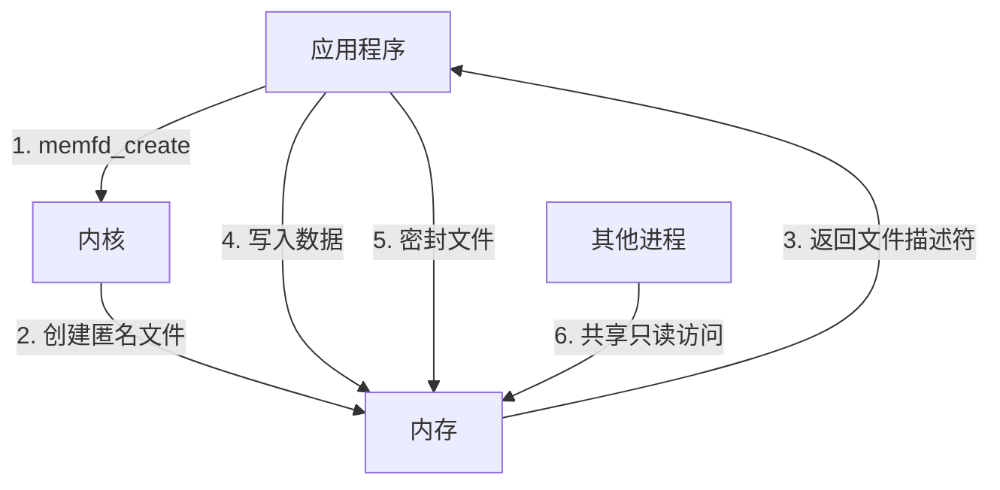
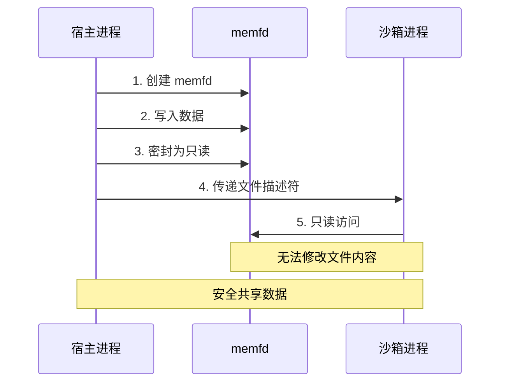
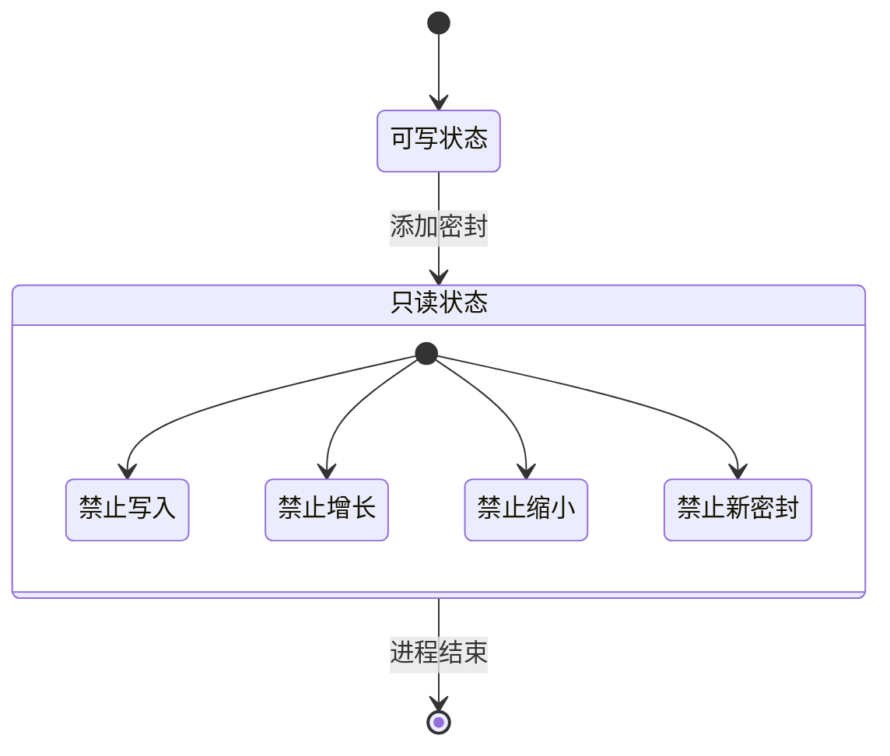
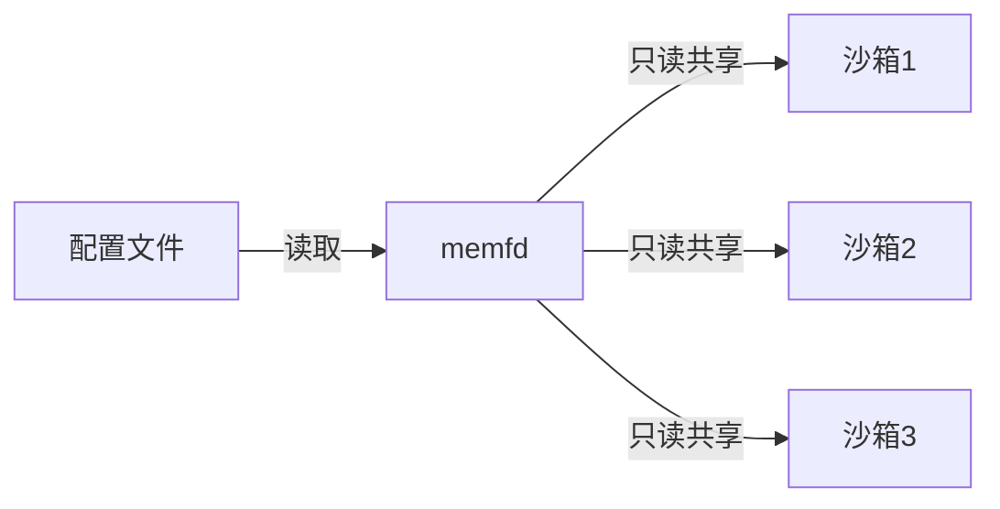
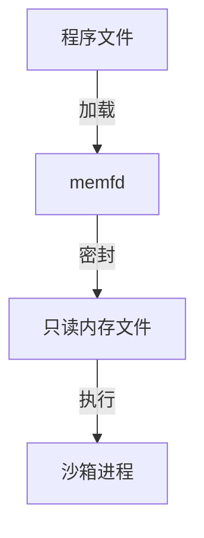

# Linux memfd 内存文件系统

## 概述

memfd（memory file descriptor）是 Linux 内核提供的一种特殊文件系统机制，允许在内存中创建匿名文件。这些文件完全驻留在内存中，不会写入磁盘，并且可以被密封（sealed）以防止修改。

## 工作原理



## 密封机制


## 在沙箱中的应用



## 主要特性

### 1. 内存驻留
- 文件完全存在于内存中
- 不会写入磁盘
- 进程结束时自动清理

### 2. 密封机制


### 3. 安全共享
- 支持跨进程共享
- 可以限制为只读访问
- 适合在沙箱环境中使用

## 使用场景

### 1. 配置文件共享


### 2. 程序文件加载


### 3. 临时文件处理


## 代码示例

### 1. 创建 memfd
```go
file, err := memfd.New("example")
if err != nil {
    log.Fatal(err)
}
defer file.Close()
```

### 2. 创建只读副本
```go
source := bytes.NewReader([]byte("data"))
sealed, err := memfd.DupToMemfd("readonly", source)
if err != nil {
    log.Fatal(err)
}
defer sealed.Close()
```

## 性能优势

### 1. 零拷贝操作
- 避免了磁盘 I/O
- 减少了数据复制
- 提高了访问速度

### 2. 资源自动回收
- 进程结束时自动清理
- 不会产生临时文件
- 减少了资源泄漏风险

## 安全考虑

### 1. 文件系统隔离
- 不影响真实文件系统
- 提供了安全的隔离环境
- 防止恶意文件操作

### 2. 访问控制
- 通过密封机制控制访问
- 防止未授权修改
- 保证数据完整性

## 最佳实践

### 1. 及时关闭
```go
file, err := memfd.New("temp")
if err != nil {
    return err
}
defer file.Close()
```

### 2. 错误处理
```go
if err := doSomething(file); err != nil {
    file.Close()
    return err
}
```

### 3. 资源限制
- 控制文件大小
- 监控内存使用
- 实现资源配额

## 注意事项

### 1. 内核版本要求
- 需要 Linux 3.17 及以上版本
- 检查内核支持
- 提供降级方案

### 2. 内存考虑
- 文件完全驻留内存
- 注意内存使用量
- 实现大小限制

### 3. 进程生命周期
- 随进程自动清理
- 注意文件描述符泄漏
- 正确处理子进程继承
