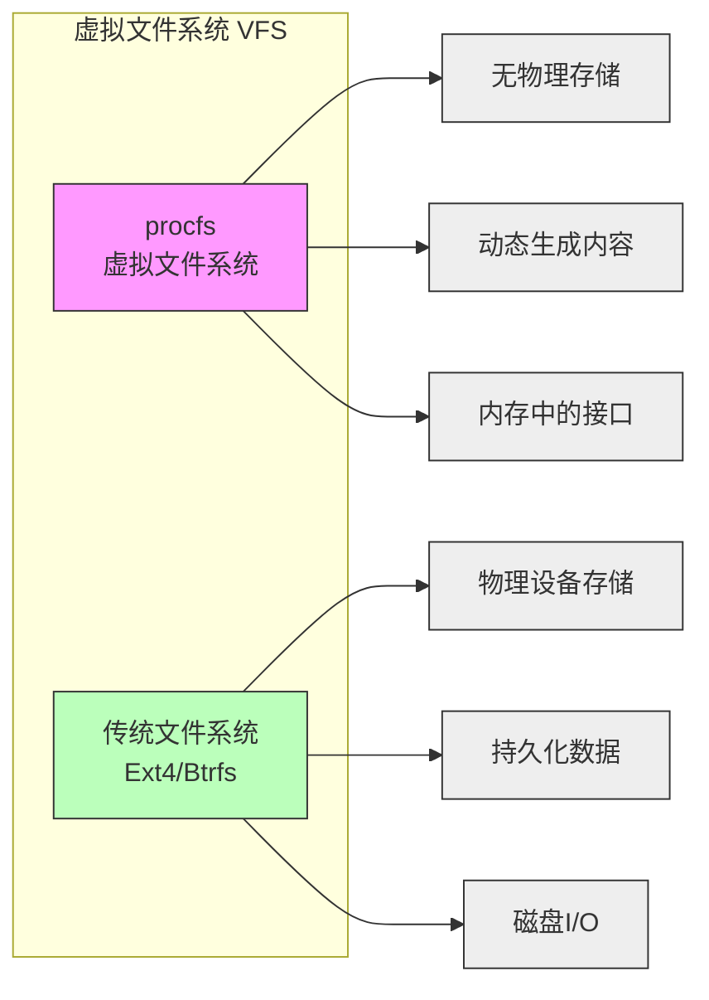
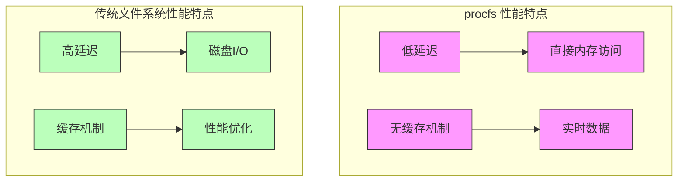

# 文件系统对比：proc vs 传统文件系统

## 基本特性对比



## 主要区别

### 1. 存储机制
| 特性 | procfs | Ext4/Btrfs |
|------|--------|------------|
| 存储位置 | 内存 | 磁盘 |
| 持久性 | 临时，重启消失 | 持久化存储 |
| 数据来源 | 内核数据结构 | 用户数据 |
| I/O 特性 | 无磁盘 I/O | 需要磁盘 I/O |

### 2. 用途
| 用途 | procfs | Ext4/Btrfs |
|------|--------|------------|
| 系统监控 | ✓ | ✗ |
| 进程管理 | ✓ | ✗ |
| 文件存储 | ✗ | ✓ |
| 数据库存储 | ✗ | ✓ |

### 3. 性能特点


## 文件系统特性

### 1. procfs
- **虚拟性**：不占用实际磁盘空间
- **动态性**：内容实时生成
- **接口性**：提供内核接口
- **临时性**：数据不持久化

### 2. Ext4/Btrfs
- **持久性**：数据持久保存
- **完整性**：支持日志和事务
- **扩展性**：支持大文件和目录
- **可靠性**：数据校验和恢复

## 使用场景

### 1. procfs 适用场景
1. **系统监控**
   - 进程状态监控
   - 资源使用监控
   - 系统参数查看

2. **调试诊断**
   - 性能分析
   - 问题排查
   - 系统调优

### 2. Ext4/Btrfs 适用场景
1. **数据存储**
   - 用户文件
   - 应用程序
   - 配置文件

2. **数据库系统**
   - 事务支持
   - 日志功能
   - 数据完整性

## 在容器环境中的应用

### 1. procfs
```go
// 只读挂载 proc
mount := &Mount{
    Source: "proc",
    Target: "/proc",
    FsType: "proc",
    Flags:  unix.MS_NOSUID | unix.MS_NODEV | unix.MS_NOEXEC | unix.MS_RDONLY,
}
```

### 2. 传统文件系统
```go
// 绑定挂载应用目录
mount := &Mount{
    Source: "/app",
    Target: "/container/app",
    Flags:  unix.MS_BIND | unix.MS_RDONLY,
}
```

## 性能考虑

### 1. procfs
- **优点**：
  - 零磁盘 I/O
  - 实时数据
  - 低内存开销

- **限制**：
  - 不支持持久化
  - 频繁访问可能影响性能
  - 数据量受限于内存

### 2. 传统文件系统
- **优点**：
  - 数据持久化
  - 大容量存储
  - 完整的文件系统功能

- **限制**：
  - 磁盘 I/O 开销
  - 需要缓存管理
  - 存在文件系统碎片

## 最佳实践

1. **合理选择**
   - 系统监控用 procfs
   - 数据存储用传统文件系统

2. **性能优化**
   - 避免频繁读取 procfs
   - 利用传统文件系统的缓存

3. **安全考虑**
   - procfs 通常只读挂载
   - 传统文件系统需要权限控制
