# Mount 命名空间与沙箱系统

## 概述

Mount 命名空间是 Linux 容器化技术的核心组件之一，它允许不同的进程拥有独立的挂载点视图。在沙箱系统中，mount 命名空间用于创建隔离的文件系统环境，确保沙箱进程只能访问受限的文件系统资源。

## 系统架构

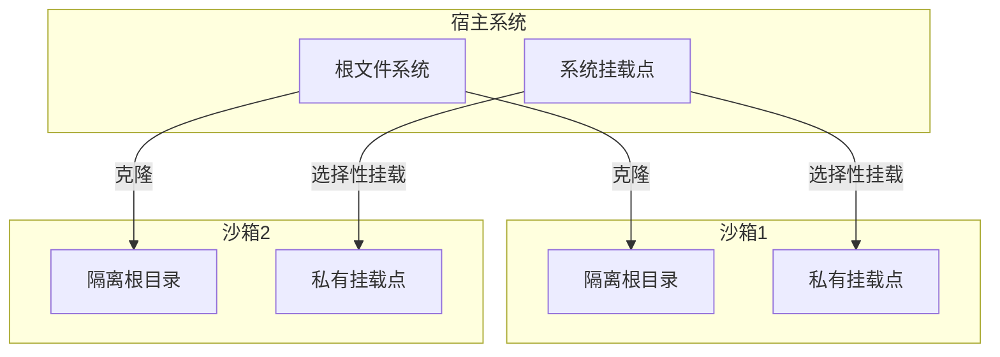

## 工作机制

### 1. 命名空间创建

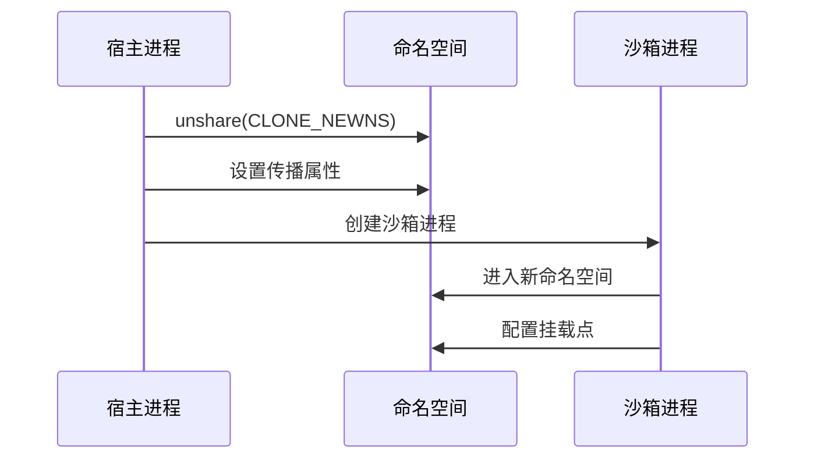

### 2. 挂载点隔离

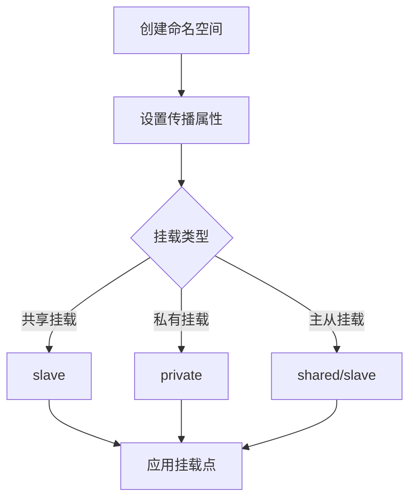

## 沙箱集成

### 1. 基本结构

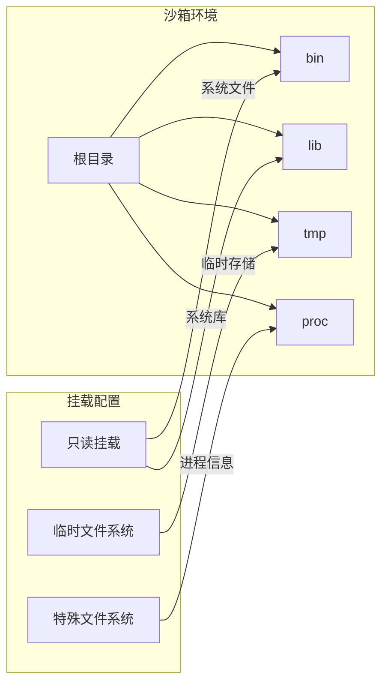

### 2. 安全策略

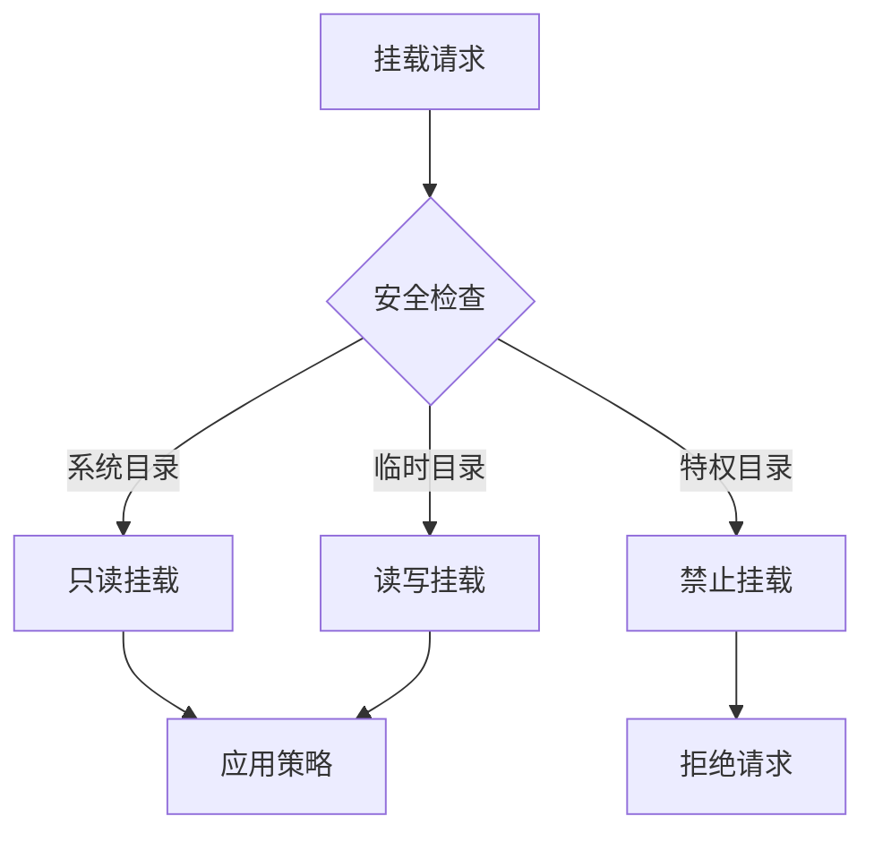

## 实现机制

### 1. 根目录切换

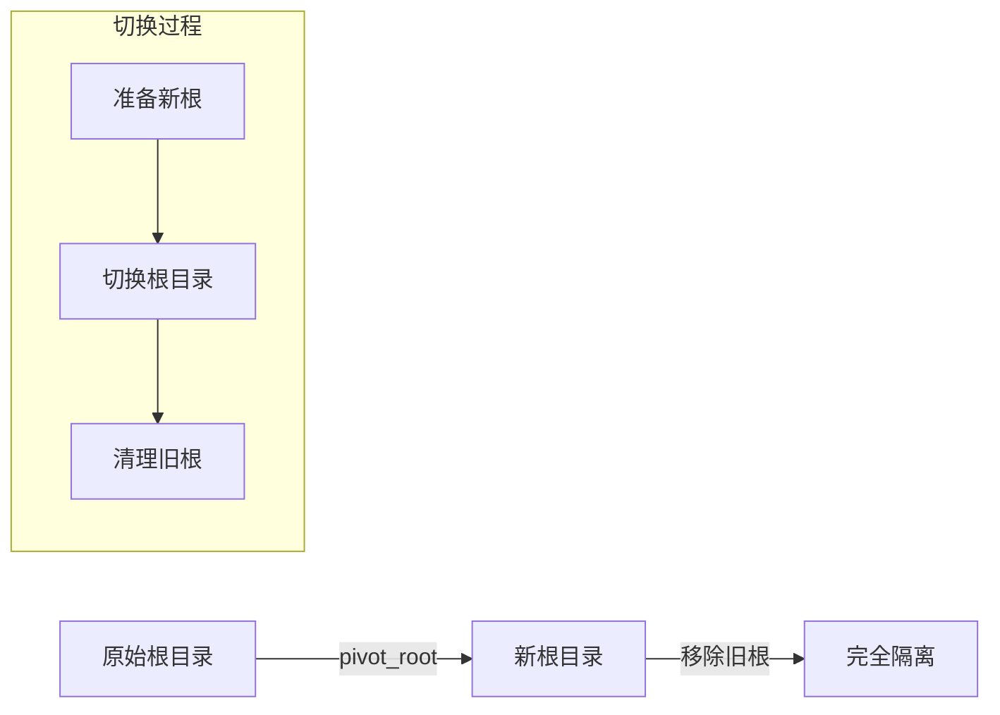

### 2. 挂载点管理

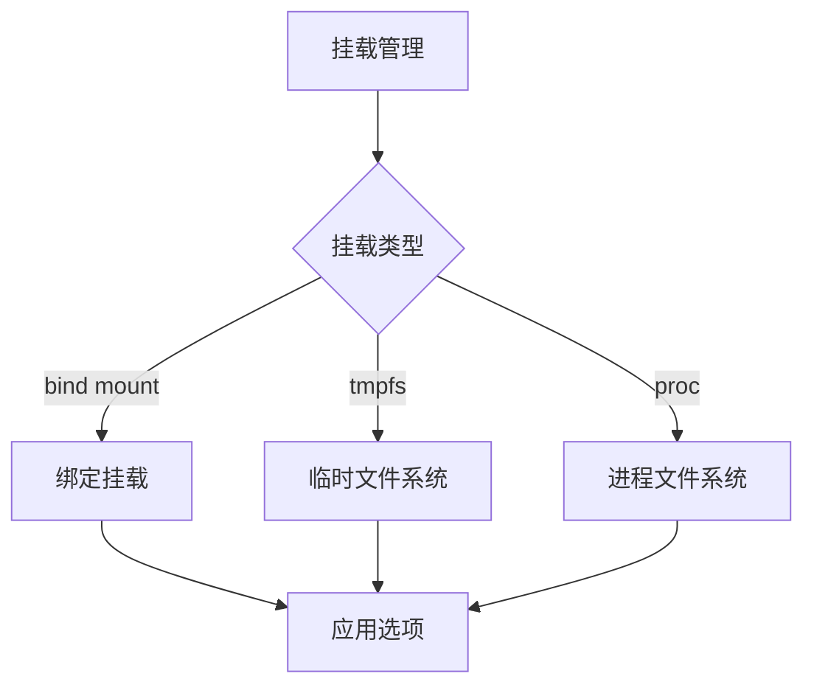

## 性能考虑

### 1. 资源开销

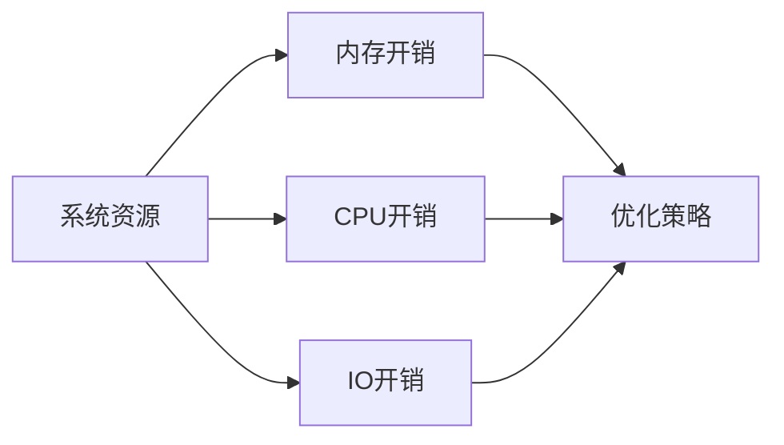

### 2. 优化策略

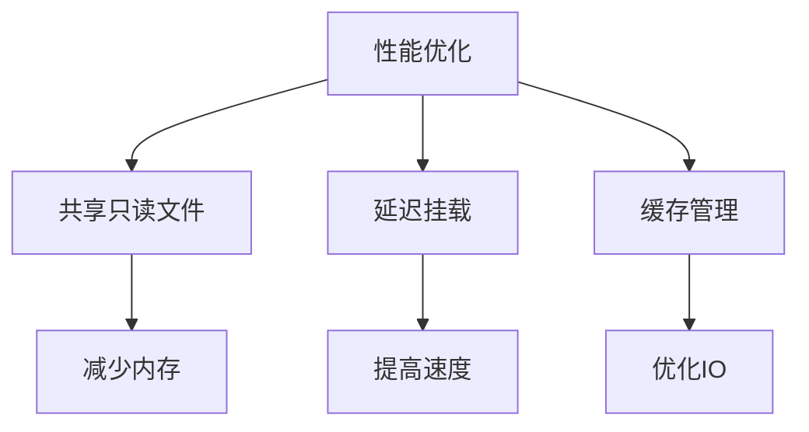

## 实现示例

### 1. 基本挂载

```go
// 创建新的 mount 命名空间
if err := syscall.Unshare(syscall.CLONE_NEWNS); err != nil {
    return err
}

// 设置根挂载点为私有
if err := syscall.Mount("none", "/", "", syscall.MS_REC|syscall.MS_PRIVATE, ""); err != nil {
    return err
}

// 挂载 proc 文件系统
if err := syscall.Mount("proc", "/proc", "proc", 0, ""); err != nil {
    return err
}
```

### 2. 高级配置

```go
// 创建临时文件系统
if err := syscall.Mount("tmpfs", "/tmp", "tmpfs", 0, "size=64m"); err != nil {
    return err
}

// 只读绑定挂载
if err := syscall.Mount("/usr/bin", "/bin", "", syscall.MS_BIND|syscall.MS_RDONLY, ""); err != nil {
    return err
}
```

## 调试技巧

### 1. 问题诊断

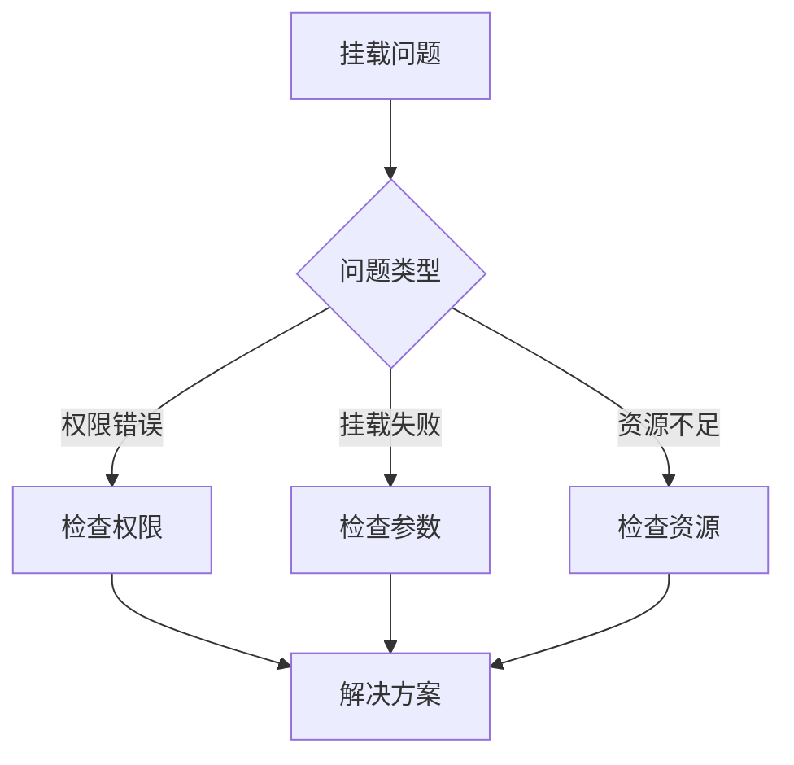

### 2. 常见问题

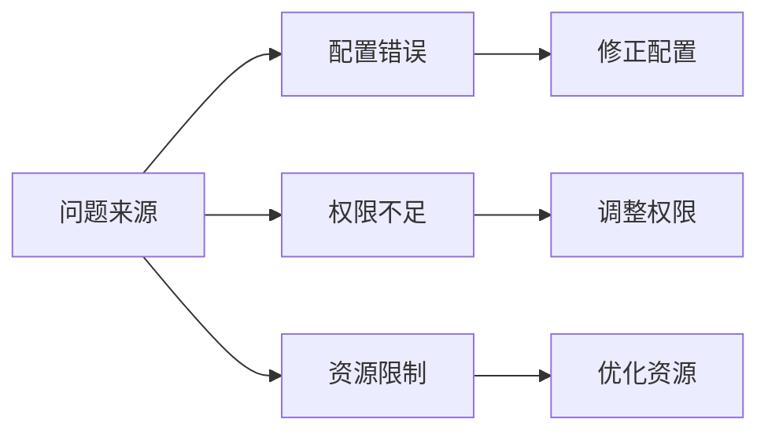

## 最佳实践

### 1. 安全配置

- 最小权限原则
- 只读挂载系统目录
- 严格的访问控制

### 2. 性能优化

- 合理使用共享挂载
- 优化挂载顺序
- 控制挂载数量

### 3. 可维护性

- 清晰的挂载结构
- 完整的错误处理
- 详细的日志记录

## 注意事项

### 1. 安全风险

- 特权挂载点泄露
- 挂载点遍历
- 资源耗尽攻击

### 2. 兼容性

- 内核版本要求
- 文件系统支持
- 特性依赖关系

### 3. 限制条件

- 命名空间嵌套
- 资源限制
- 性能开销
