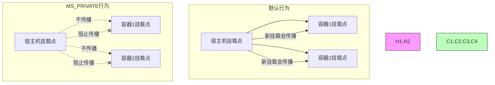
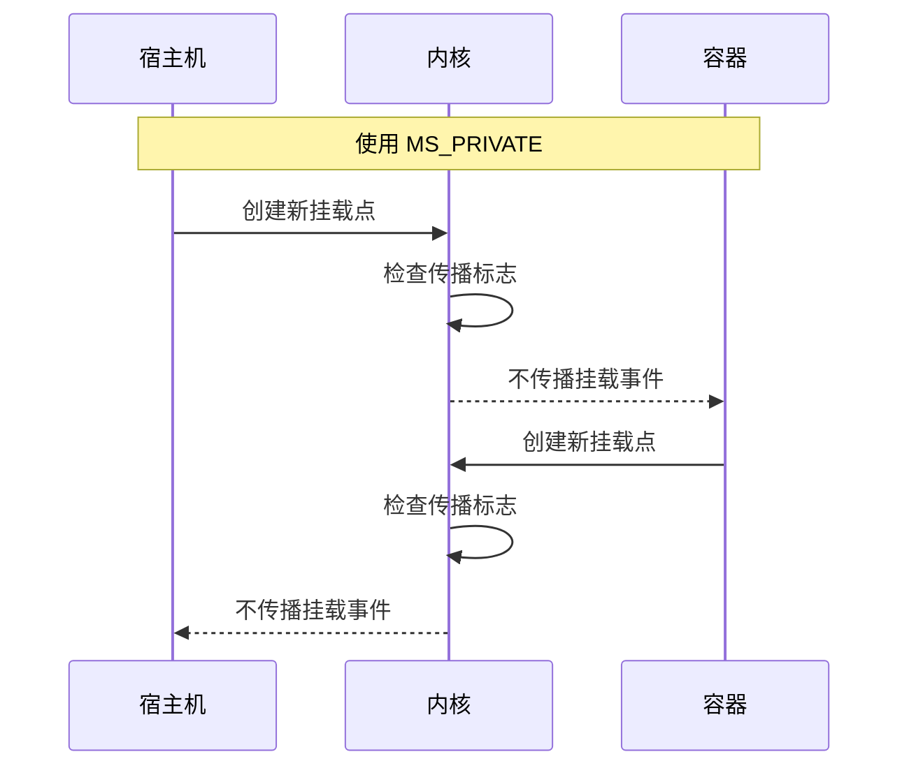
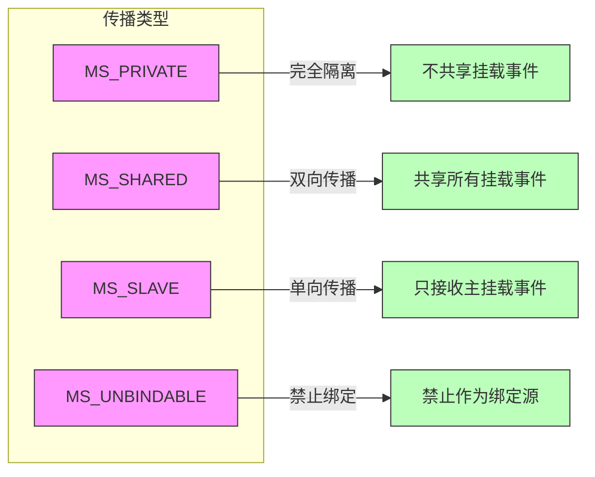
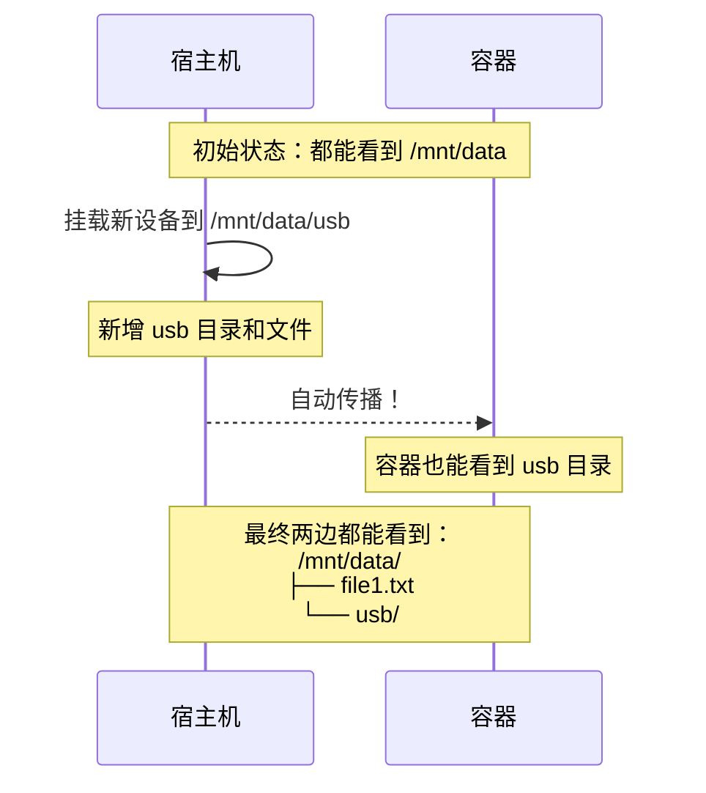
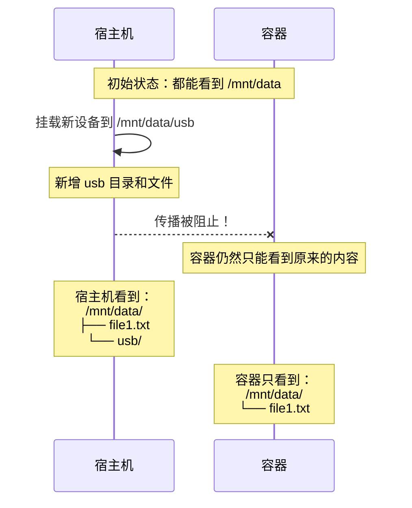
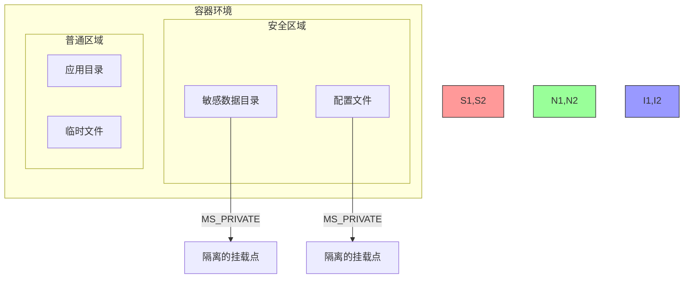
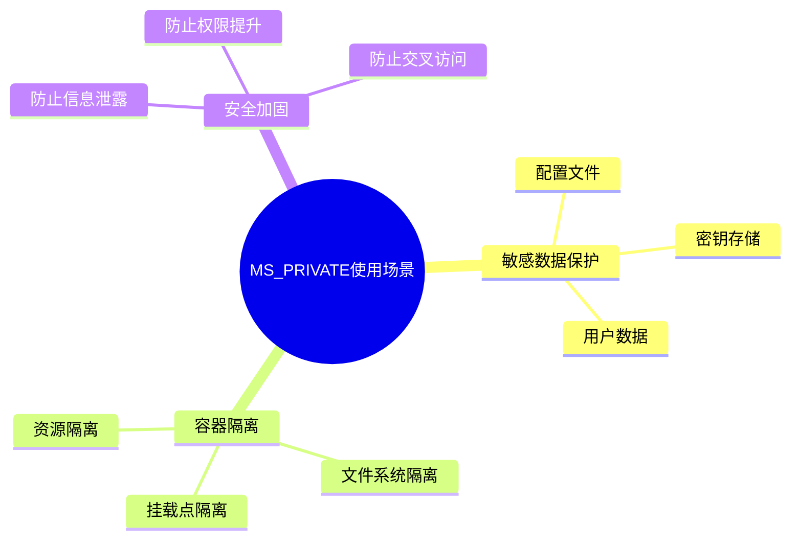
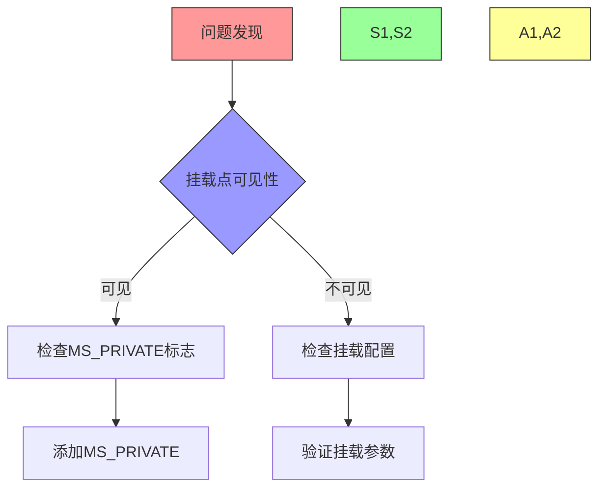

# MS_PRIVATE 挂载标志详解

## 挂载传播机制



## 工作原理



## 四种挂载传播类型对比



## 新挂载传播示例

假设我们有以下场景：
```bash
# 宿主机上的目录结构
/mnt/
    └── data/           # 初始挂载点
        └── file1.txt

# 容器中的目录结构（通过绑定挂载）
/container/mnt/
    └── data/          # 从宿主机挂载过来的
        └── file1.txt
```

### 1. 默认情况（没有 MS_PRIVATE）


### 2. 使用 MS_PRIVATE


### 具体示例代码
```go
// 1. 默认情况（挂载会传播）
mount := &Mount{
    Source: "/mnt/data",
    Target: "/container/mnt/data",
    Flags:  unix.MS_BIND,
}
// 如果宿主机在 /mnt/data 下挂载了新设备
// 容器内的 /container/mnt/data 也会看到新设备

// 2. 使用 MS_PRIVATE（阻止传播）
mount := &Mount{
    Source: "/mnt/data",
    Target: "/container/mnt/data",
    Flags:  unix.MS_BIND | unix.MS_PRIVATE,
}
// 即使宿主机在 /mnt/data 下挂载了新设备
// 容器内的 /container/mnt/data 也不会看到变化
```

### 实际影响
1. **没有 MS_PRIVATE 时**：
   - 宿主机挂载 USB 设备：容器也能看到
   - 宿主机挂载新分区：容器也能看到
   - 宿主机挂载临时文件系统：容器也能看到

2. **使用 MS_PRIVATE 时**：
   - 宿主机的新挂载操作不会影响容器
   - 容器只能看到最初挂载时的内容
   - 提供了更好的隔离性和安全性

### 安全隐患
如果不使用 MS_PRIVATE：
1. 宿主机挂载敏感数据，容器可能意外看到
2. 宿主机的挂载操作可能影响容器运行
3. 容器间可能通过挂载点互相影响

## 实际应用示例

### 1. 基本使用
```go
// 创建私有挂载点
mount := &Mount{
    Source: "/source",
    Target: "/target",
    Flags:  unix.MS_BIND | unix.MS_PRIVATE,
}

// 在容器中使用
builder := mount.NewDefaultBuilder().
    WithMount(mount).
    WithPrivateOption()  // 确保所有挂载点都是私有的
```

### 2. 安全隔离场景



## 使用场景

### 1. 容器隔离


### 2. 具体示例
```go
// 敏感数据目录
mount := &Mount{
    Source: "/secrets",
    Target: "/container/secrets",
    Flags:  unix.MS_BIND | unix.MS_PRIVATE | unix.MS_RDONLY,
}

// 配置文件
mount := &Mount{
    Source: "/configs",
    Target: "/container/configs",
    Flags:  unix.MS_BIND | unix.MS_PRIVATE | unix.MS_RDONLY,
}
```

## 调试和验证

### 1. 检查挂载属性
```bash
# 查看挂载点属性
findmnt -o TARGET,PROPAGATION /path/to/mount

# 详细挂载信息
cat /proc/self/mountinfo | grep private
```

### 2. 验证隔离效果
```bash
# 在容器内
mount | grep "private"

# 在宿主机检查
nsenter -t <container_pid> -m -- findmnt
```

## 最佳实践

### 1. 安全建议
- 总是对敏感挂载点使用 MS_PRIVATE
- 组合使用 MS_RDONLY 提供额外保护
- 定期审计挂载点配置

### 2. 性能考虑
- MS_PRIVATE 不会带来明显性能开销
- 可以减少不必要的挂载事件传播
- 简化挂载点管理

### 3. 故障排除

