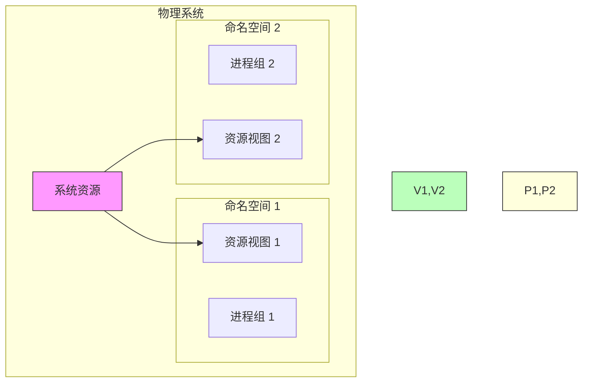
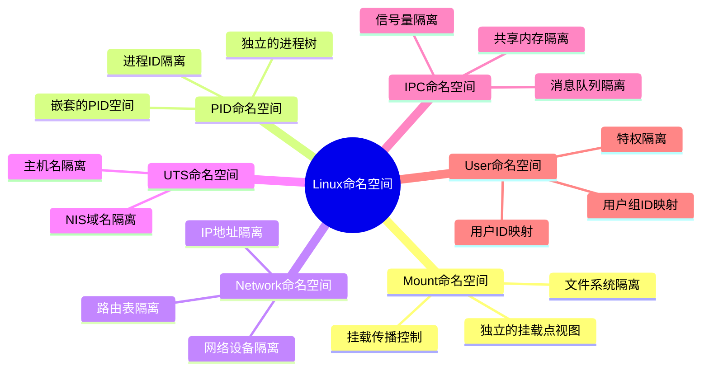
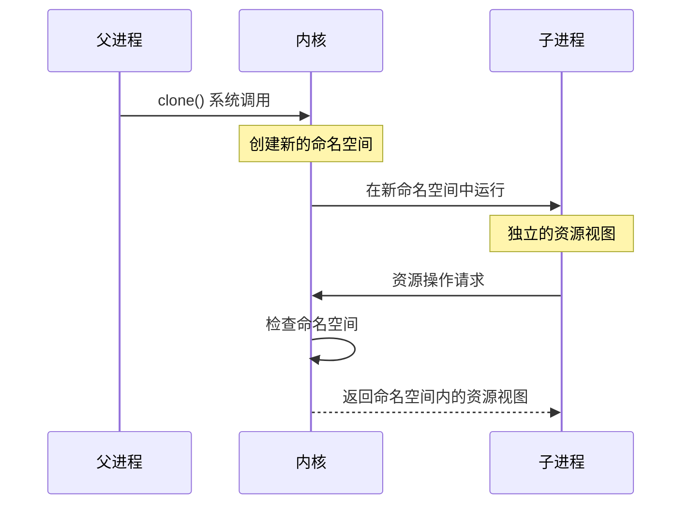
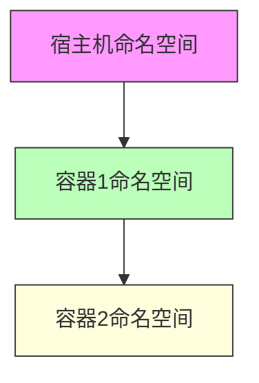
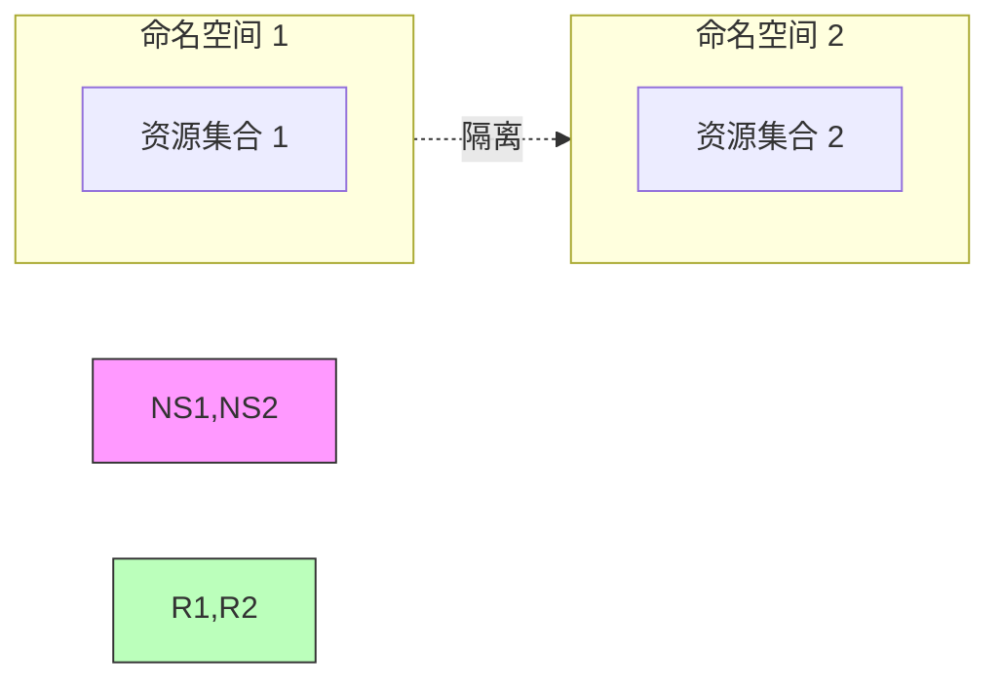
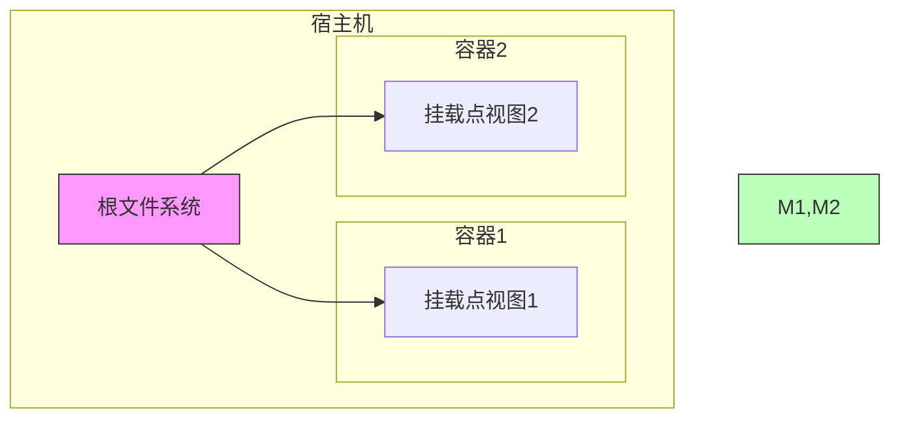
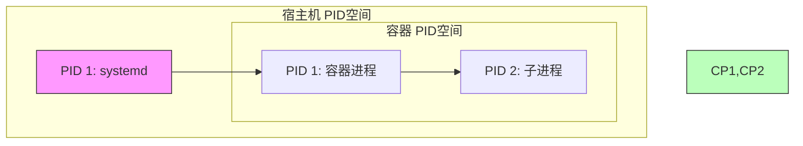
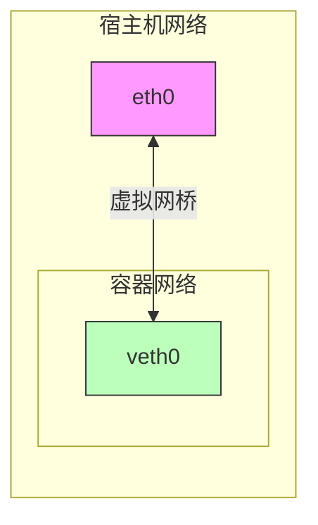

# Linux 命名空间详解

## 什么是命名空间？

命名空间是 Linux 内核提供的一种资源隔离机制，它可以让一组进程看到一个资源集合，而另一组进程看到另一个资源集合。



## 命名空间类型



## 命名空间的工作原理



## 命名空间的特性

### 1. 嵌套性


### 2. 独立性


## 实际应用示例

### 1. 创建新的命名空间
```go
// 创建一个新的命名空间
cmd := exec.Command("bash")
cmd.SysProcAttr = &syscall.SysProcAttr{
    Cloneflags: syscall.CLONE_NEWNS |  // 新的挂载命名空间
               syscall.CLONE_NEWUTS |   // 新的UTS命名空间
               syscall.CLONE_NEWPID |   // 新的PID命名空间
               syscall.CLONE_NEWNET,    // 新的网络命名空间
}
```

### 2. 命名空间操作
```go
// 进入已存在的命名空间
cmd := exec.Command("nsenter", 
    "-t", pid,           // 目标进程
    "-m",               // 进入挂载命名空间
    "-u",               // 进入UTS命名空间
    "-p",               // 进入PID命名空间
    "-n",               // 进入网络命名空间
    "command")          // 要执行的命令
```

## 各类命名空间详解

### 1. Mount 命名空间
- 隔离文件系统挂载点
- 控制挂载点可见性
- 管理挂载传播



### 2. PID 命名空间
- 进程ID独立编号
- 父子关系隔离
- 信号处理隔离



### 3. Network 命名空间
- 网络设备隔离
- 地址空间隔离
- 路由规则隔离



## 命名空间的应用场景

### 1. 容器化
- Docker/Podman
- LXC/LXD
- Kubernetes

### 2. 安全隔离
- 资源访问控制
- 权限分离
- 攻击面减少

### 3. 资源管理
- 资源限制
- 资源监控
- 资源分配

## 最佳实践

### 1. 安全考虑
- 最小权限原则
- 资源限制
- 监控和审计

### 2. 性能优化
- 合理使用共享
- 避免过度隔离
- 资源效率

### 3. 调试技巧
```bash
# 查看进程的命名空间
ls -l /proc/<pid>/ns/

# 查看挂载信息
cat /proc/<pid>/mountinfo

# 查看网络命名空间
ip netns list
```
