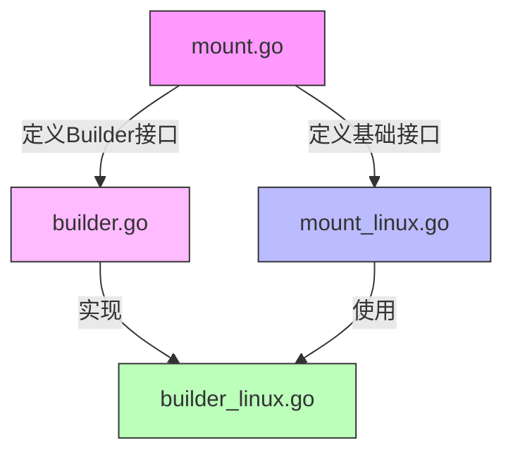
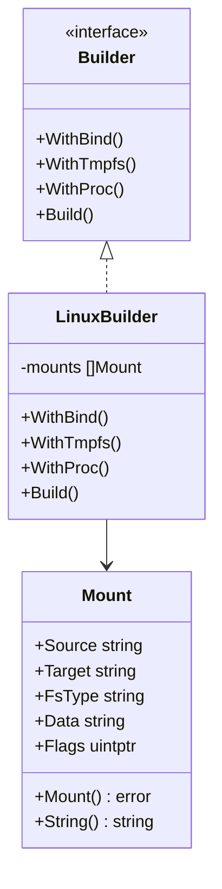
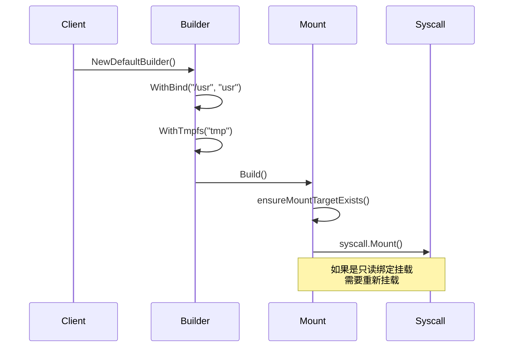
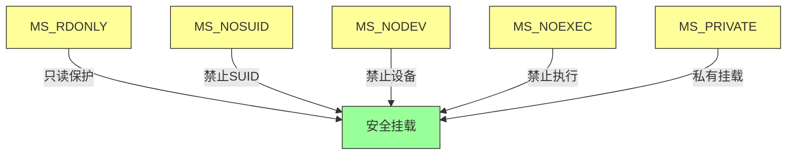
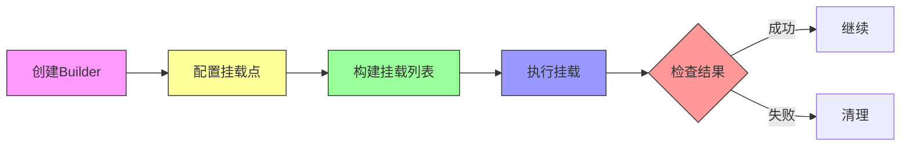

## 结构总览



### 核心组件关系


### 挂载流程


### 安全特性组合


## 概述
mount 包提供了在 Linux 系统中管理挂载点的功能，特别适用于创建安全的沙箱环境。通过该包，可以实现文件系统的隔离、权限控制和资源限制。

## 核心组件

### 1. 基础结构 (`mount.go`)
- **Mount 结构体**: 定义挂载点的基本属性
  - Source: 挂载源（设备、目录或特殊文件系统）
  - Target: 挂载目标路径
  - FsType: 文件系统类型
  - Data: 挂载选项
  - Flags: 挂载标志

- **SyscallParams**: 系统调用参数转换
  - 将字符串转换为 C 风格指针
  - 处理路径前缀
  - 支持设备节点创建

### 2. Builder 模式实现 (`builder.go`, `builder_linux.go`)
- **Builder 结构体**: 提供流式 API 构建挂载配置
- **默认配置**: 提供常用目录的默认挂载
  ```go
  builder := NewDefaultBuilder().
      WithBind("/usr", "usr", true).
      WithTmpfs("tmp", "size=64m").
      WithProc()
  ```

### 3. 平台特定实现 (`mount_linux.go`)
- **Mount 方法**: 执行实际的挂载操作
- **辅助方法**:
  - IsBindMount(): 检查是否为绑定挂载
  - IsReadOnly(): 检查是否为只读挂载
  - IsTmpFs(): 检查是否为临时文件系统

## 安全特性

### 1. 挂载标志 (Flags)
```go
const (
    MS_RDONLY      // 只读挂载
    MS_NOSUID      // 禁止 SUID
    MS_NODEV       // 禁止设备文件
    MS_NOEXEC      // 禁止执行
    MS_PRIVATE     // 私有挂载
)
```

### 2. 挂载选项 (Data)
- 大小限制: `size=64m`
- 权限控制: `mode=755`
- Inode 限制: `nr_inodes=1000`

## 使用示例

### 1. 基本挂载
```go
mount := &Mount{
    Source: "/source",
    Target: "/target",
    Flags:  unix.MS_BIND | unix.MS_RDONLY,
}
err := mount.Mount()
```

### 2. 使用 Builder
```go
mounts, err := NewDefaultBuilder().
    WithBind("/usr", "usr", true).
    WithTmpfs("tmp", "size=64m").
    WithProc().
    Build()
```

### 3. 临时文件系统
```go
mount := &Mount{
    Source: "tmpfs",
    Target: "/sandbox/tmp",
    FsType: "tmpfs",
    Data:   "size=64m,mode=755",
    Flags:  MS_NOSUID | MS_NODEV,
}
```

## 文件结构
```
mount/
├── builder.go          # Builder 接口定义
├── builder_linux.go    # Linux 平台的 Builder 实现
├── doc.go             # 包文档
├── mount.go           # 核心数据结构
└── mount_linux.go     # Linux 平台的挂载实现
```

## 最佳实践

1. **安全性考虑**
   - 总是使用最小权限原则
   - 对敏感目录使用只读挂载
   - 禁用不必要的特殊权限

2. **资源限制**
   - 为临时文件系统设置合理的大小限制
   - 控制 inode 数量防止资源耗尽
   - 使用私有挂载防止影响主机系统

3. **错误处理**
   - 检查所有挂载操作的返回值
   - 确保清理失败的挂载点
   - 处理权限和资源相关的错误

## 使用流程示例


## 错误处理流程
```mermaid
flowchart TD
    A[挂载操作] --> B{权限检查}
    B -->|失败| C[权限错误]
    B -->|成功| D{资源检查}
    D -->|失败| E[资源错误]
    D -->|成功| F{挂载操作}
    F -->|失败| G[挂载错误]
    F -->|成功| H[完成]
    
    C --> Z[错误处理]
    E --> Z
    G --> Z
    
    classDef op fill:#f9f,stroke:#333
    classDef check fill:#ff9,stroke:#333
    classDef err fill:#f99,stroke:#333
    classDef done fill:#9f9,stroke:#333
    classDef handle fill:#99f,stroke:#333
    
    class A op
    class B,D,F check
    class C,E,G err
    class H done
    class Z handle
