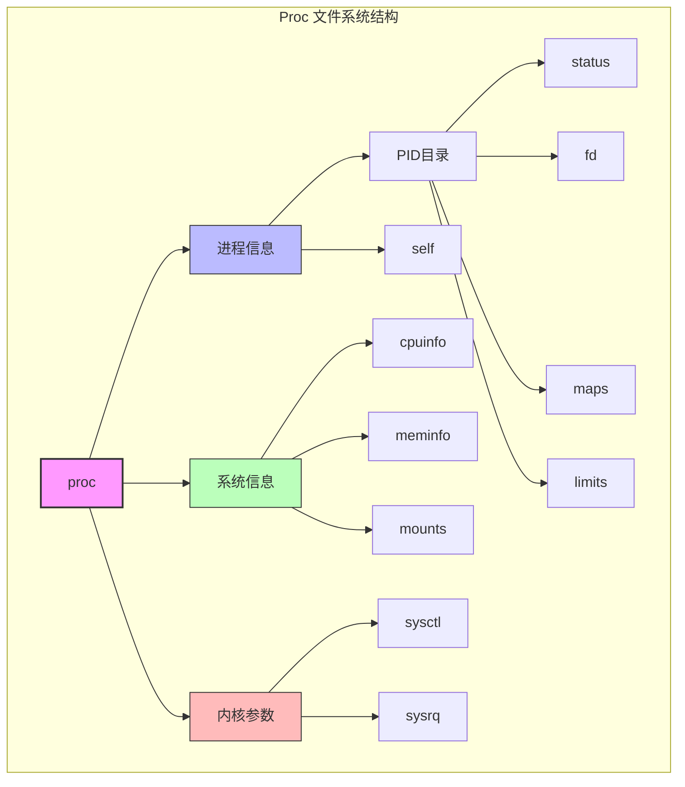
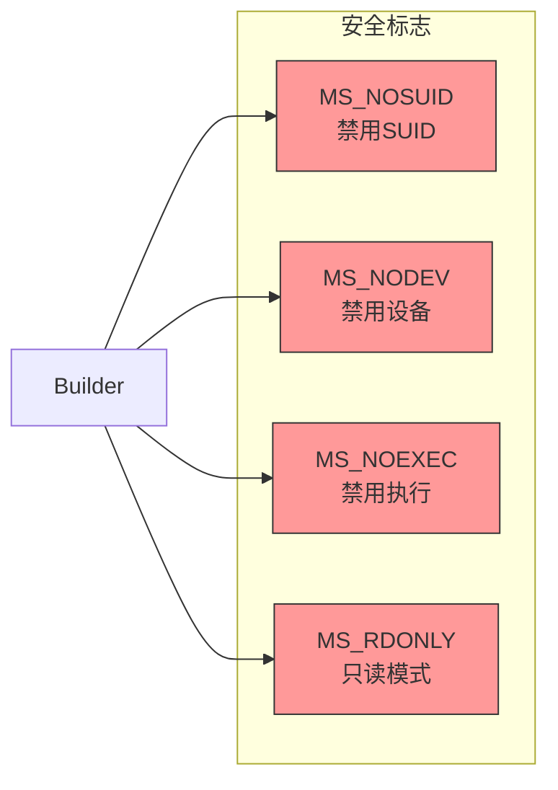
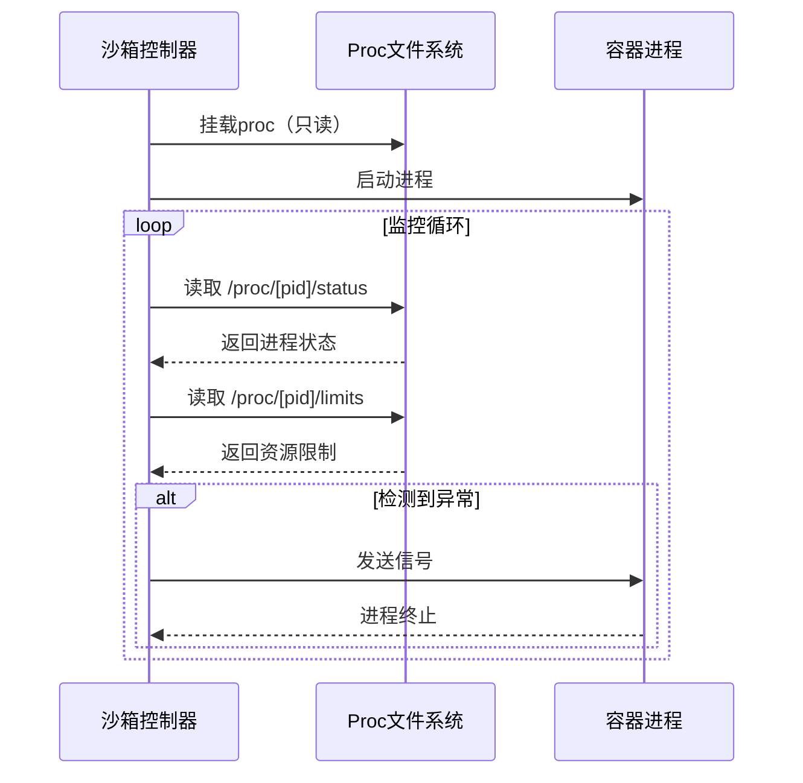

# Proc 文件系统

## 概述

proc 是一个虚拟文件系统，提供了访问内核数据结构、进程信息和其他系统信息的接口。在沙箱环境中，proc 文件系统对于进程监控和资源管理至关重要。

## 架构设计



## 在沙箱中的应用

### 1. 挂载配置
```go
// 只读挂载
builder.WithProc()

// 可写挂载（谨慎使用）
builder.WithProcRW(true)
```

### 2. 安全限制


## 关键文件和目录

### 1. 进程相关
| 路径 | 描述 | 安全考虑 |
|------|------|----------|
| /proc/[pid]/status | 进程状态信息 | 只读访问 |
| /proc/[pid]/fd | 文件描述符 | 限制访问 |
| /proc/[pid]/maps | 内存映射 | 可能泄露信息 |
| /proc/[pid]/limits | 资源限制 | 只读访问 |

### 2. 系统信息
| 路径 | 描述 | 沙箱中的处理 |
|------|------|--------------|
| /proc/cpuinfo | CPU信息 | 可访问 |
| /proc/meminfo | 内存信息 | 可访问 |
| /proc/mounts | 挂载信息 | 需过滤敏感信息 |

## 性能监控



## 最佳实践

### 1. 安全配置
- 默认使用只读挂载
- 启用所有限制性标志
- 过滤敏感信息

### 2. 资源监控
- 定期检查进程状态
- 监控资源使用
- 设置合理的限制

### 3. 错误处理
- 处理挂载失败
- 监控异常状态
- 实现优雅降级

## 故障排除

### 1. 常见问题
1. **挂载失败**
   - 检查权限
   - 验证内核支持
   - 确认标志位组合

2. **权限问题**
   - 验证 UID/GID 映射
   - 检查安全标志
   - 确认访问权限

3. **性能问题**
   - 减少读取频率
   - 优化监控逻辑
   - 使用缓存机制

### 2. 调试技巧
```bash
# 检查挂载状态
mount | grep proc

# 查看进程信息
cat /proc/[pid]/status

# 检查资源限制
cat /proc/[pid]/limits
```

## 安全注意事项

### 1. 信息泄露
- 过滤敏感的内存映射
- 限制文件描述符访问
- 控制系统信息可见性

### 2. 权限控制
- 禁用特权操作
- 限制写入操作
- 实施访问控制

### 3. 资源保护
- 设置资源限制
- 监控资源使用
- 实现自动清理
