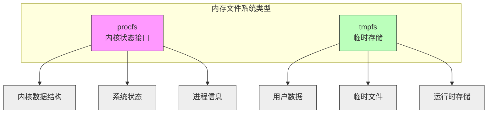
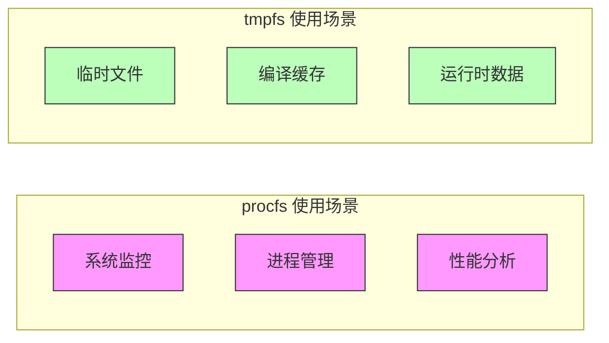
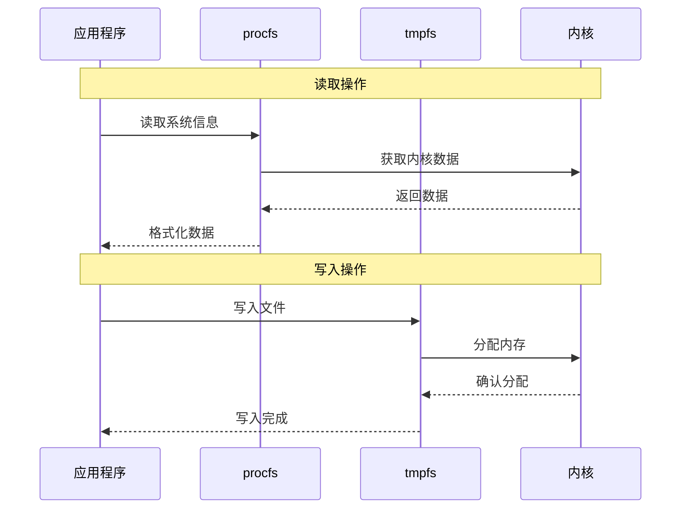

# procfs vs tmpfs

## 概述

procfs 是内核提供的状态访问接口，通过文件系统形式呈现内核数据结构和状态。而 tmpfs 是一个内存中的临时文件系统，用于存储用户数据。



## 本质区别

### 1. 基本特性
| 特性 | procfs | tmpfs |
|------|--------|-------|
| 本质 | 内核状态访问接口 | 内存文件系统 |
| 数据来源 | 内核数据结构映射 | 用户程序写入 |
| 访问方式 | 文件接口读取内核状态 | 标准文件系统操作 |
| 更新机制 | 内核实时更新 | 用户显式写入 |
| 内存使用 | 映射内核数据，无额外存储 | 实际占用物理内存 |

## 主要区别

### 1. 基本特性
| 特性 | procfs | tmpfs |
|------|--------|-------|
| 数据来源 | 内核数据结构 | 用户数据 |
| 读写支持 | 主要只读 | 完全读写 |
| 生命周期 | 系统运行期间 | 挂载期间 |
| 大小限制 | 由内核数据决定 | 可配置 |
| 用户交互 | 通过文件接口 | 直接读写 |

### 2. 使用场景


## 功能对比

### 1. procfs 特点
- **接口性质**：是内核暴露系统状态的标准接口
- **数据映射**：直接映射内核数据结构
- **实时性**：反映当前系统状态
- **只读性**：大部分文件只提供读取功能
- **标准化**：提供统一的内核信息访问方式

### 2. tmpfs 特点
- **存储性质**：实际的文件系统实现
- **数据独立**：存储用户数据
- **读写支持**：完整的文件系统操作
- **资源占用**：占用实际物理内存
- **临时性**：重启后数据丢失

## 在沙箱中的应用

### 1. procfs 应用
```go
// procfs 作为内核状态访问接口
mount := &Mount{
    Source: "proc",
    Target: "/proc",
    FsType: "proc",
    Flags:  unix.MS_NOSUID | unix.MS_NODEV | unix.MS_NOEXEC | unix.MS_RDONLY,
}

// 使用示例
// 读取进程状态
status, _ := ioutil.ReadFile("/proc/self/status")
// 获取系统信息
meminfo, _ := ioutil.ReadFile("/proc/meminfo")
// 查看内核参数
sysctl, _ := ioutil.ReadFile("/proc/sys/kernel/hostname")
```

### 2. tmpfs 应用
```go
// tmpfs 作为临时存储
mount := &Mount{
    Source: "tmpfs",
    Target: "/tmp",
    FsType: "tmpfs",
    Data:   "size=64m,mode=755",
    Flags:  unix.MS_NOSUID | unix.MS_NODEV,
}

// 使用示例
// 创建临时文件
f, _ := os.Create("/tmp/temp.txt")
// 写入数据
f.Write([]byte("data"))
// 读取数据
data, _ := ioutil.ReadFile("/tmp/temp.txt")
```

## 组合使用

在沙箱环境中，通常同时使用两种文件系统：
```go
builder := mount.NewDefaultBuilder().
    WithProc().                         // 只读的 procfs
    WithTmpfs("tmp", "size=64m").      // 可写的 tmpfs
    WithBind("/usr", "usr", true)      // 只读的系统目录
```

### 使用场景
1. **procfs**：
   - 监控容器进程
   - 获取资源使用情况
   - 系统参数查询

2. **tmpfs**：
   - 编译临时文件
   - 运行时数据存储
   - 日志和缓存

## 性能特征



## 最佳实践

### 1. procfs 使用建议
- 用于系统监控和诊断
- 避免频繁读取
- 注意权限控制
- 处理数据格式变化

### 2. tmpfs 使用建议
- 设置合理的大小限制
- 及时清理临时文件
- 注意内存使用
- 实现故障恢复

## 安全考虑

### 1. procfs 安全
- 限制敏感信息访问
- 使用只读挂载
- 过滤系统信息

### 2. tmpfs 安全
- 设置大小限制
- 控制执行权限
- 隔离用户数据
