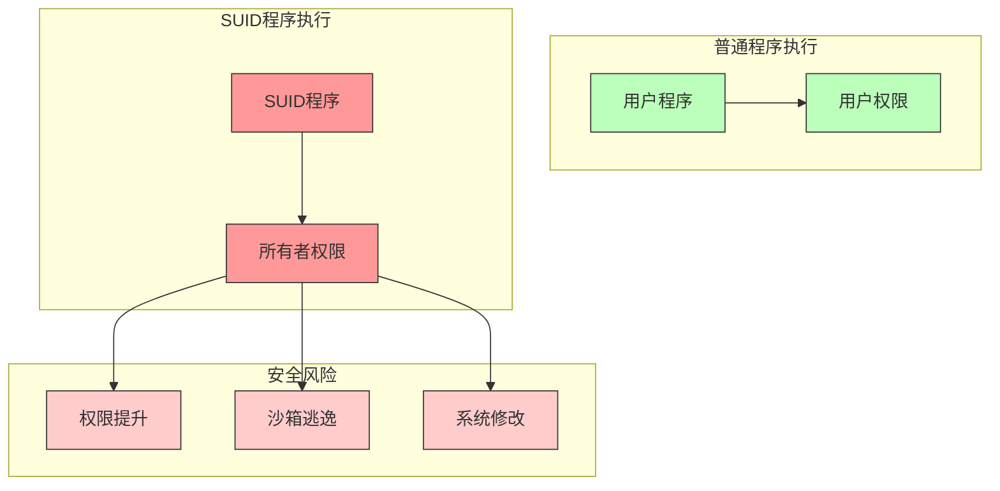
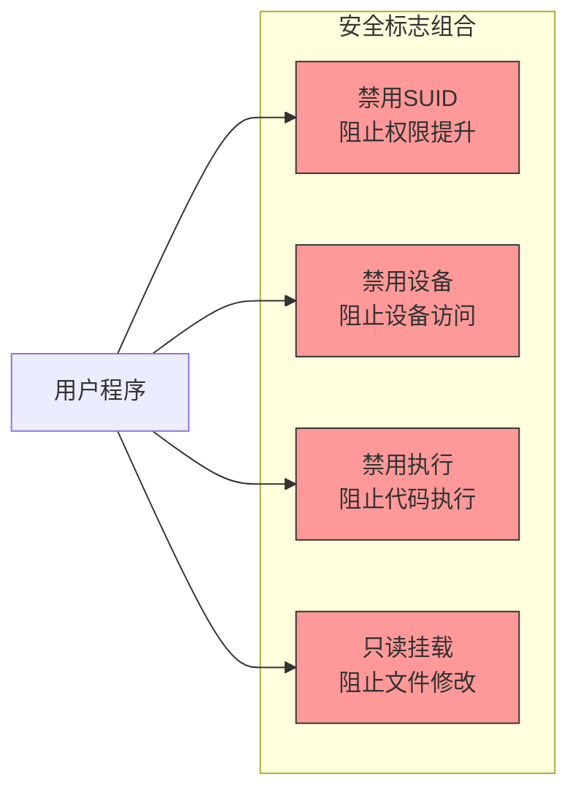

# 挂载安全标志

## SUID/SGID 禁用说明

### 基本概念



SUID (Set User ID) 和 SGID (Set Group ID) 是 Linux 系统中的特殊权限位，允许程序以文件所有者或所属组的权限执行，而不是以执行者的权限运行。

### 权限位示例

```bash
# SUID 程序示例（s 位在所有者权限位）
$ ls -l /usr/bin/ping
-rwsr-xr-x 1 root root 64424 Mar 9  2020 /usr/bin/ping
    ↑
    SUID 位

# SGID 程序示例（s 位在组权限位）
$ ls -l /usr/bin/write
-rwxr-sr-x 1 root tty 20144 May 3  2020 /usr/bin/write
       ↑
       SGID 位
```

### 安全风险

在沙箱环境中，SUID/SGID 程序可能导致：

1. **权限提升**
   - 获得 root 权限
   - 访问受限资源
   - 执行特权操作

2. **沙箱逃逸**
   - 突破容器限制
   - 访问宿主机资源
   - 影响其他容器

3. **系统修改**
   - 修改系统文件
   - 安装未授权软件
   - 更改系统配置

## 安全措施

### 1. 挂载标志

```go
const (
    // 基本安全标志组合
    secureFlags = unix.MS_NOSUID |  // 禁用 SUID/SGID
                 unix.MS_NODEV |    // 禁用设备文件
                 unix.MS_NOEXEC     // 禁用可执行权限
)
```

### 2. 安全配置示例

```go
// 安全的挂载配置
mount := &Mount{
    Source: "/bin",
    Target: "/sandbox/bin",
    Flags:  unix.MS_BIND | unix.MS_NOSUID | unix.MS_RDONLY,
}

// 使用构建器
builder := mount.NewDefaultBuilder().
    WithBind("/usr", "usr", true).      // 只读且禁用 SUID
    WithTmpfs("tmp", "size=64m")        // 临时文件系统也禁用 SUID
```

### 3. 多层次防护



## 最佳实践

### 1. 挂载配置
- 始终启用 `MS_NOSUID` 标志
- 组合使用多个安全标志
- 优先使用只读挂载

### 2. 权限控制
- 遵循最小权限原则
- 限制可执行文件范围
- 禁用不必要的特权

### 3. 监控和审计
- 记录权限相关操作
- 监控异常行为
- 定期安全审查

## 安全检查清单

1. **挂载点检查**
   - [ ] 所有挂载点都禁用了 SUID
   - [ ] 系统目录使用只读挂载
   - [ ] 临时文件系统设置了大小限制

2. **权限检查**
   - [ ] 验证进程权限
   - [ ] 检查文件权限
   - [ ] 确认资源访问限制

3. **运行时检查**
   - [ ] 监控进程行为
   - [ ] 检测权限提升尝试
   - [ ] 记录异常操作
