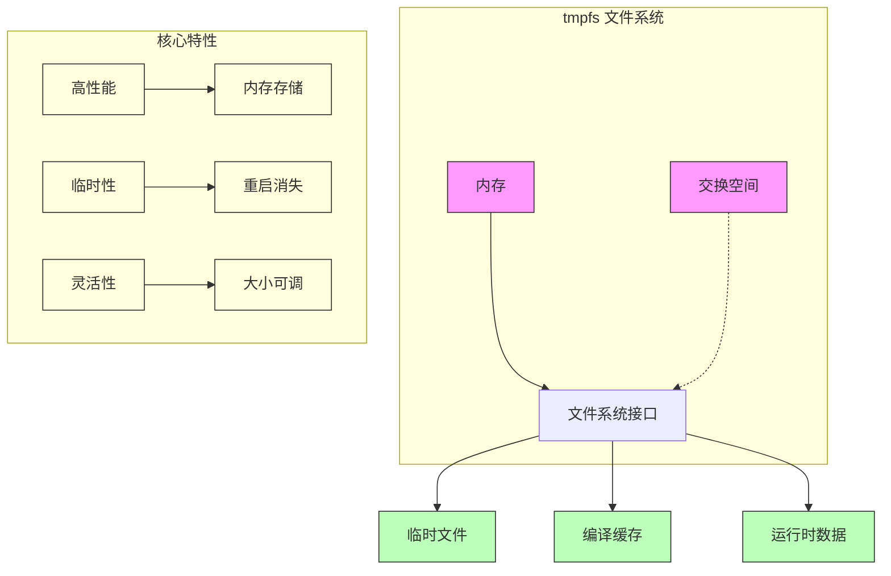
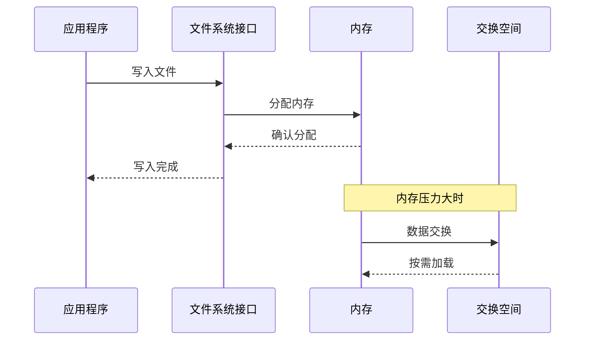
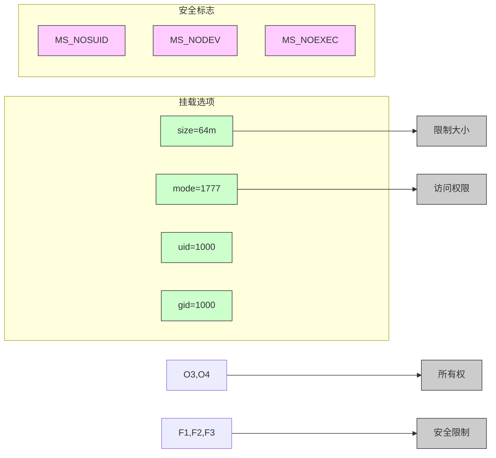
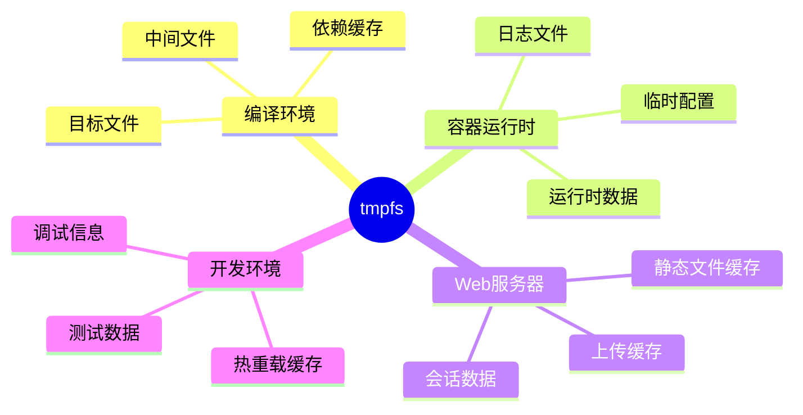
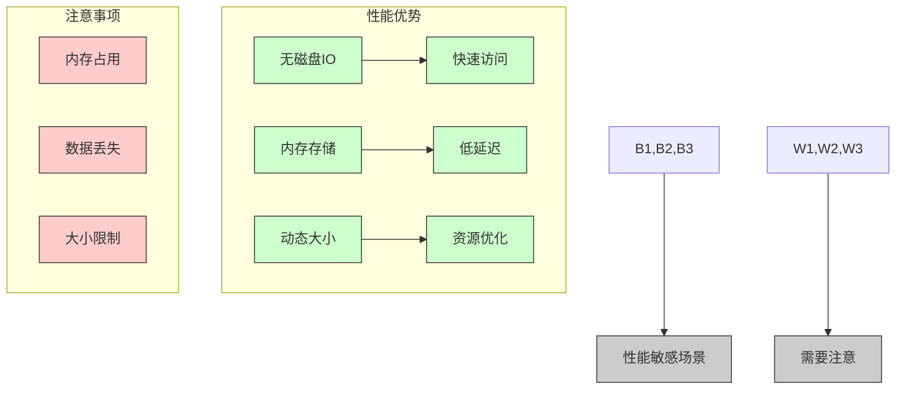
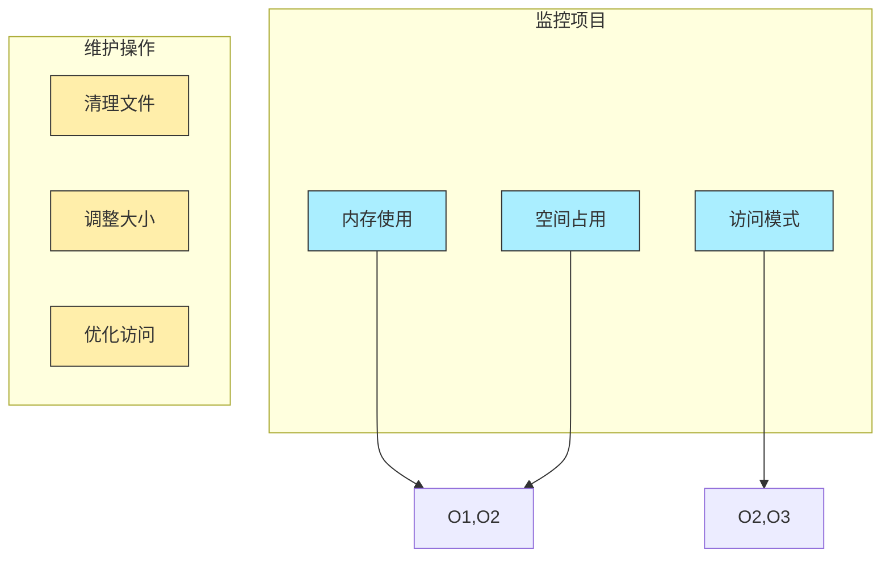

# tmpfs 文件系统

## 概述

tmpfs 是一个基于内存的虚拟文件系统，在沙箱环境中用于提供高性能、隔离的临时存储空间。所有数据都存储在内存中，系统重启后会自动清除。



## 工作原理



## 特性

### 1. 性能优势
- 直接在内存中读写，无磁盘 I/O
- 适合频繁的小文件操作
- 支持 swap 空间作为后备存储

### 2. 资源管理
- 支持动态大小调整
- 可限制最大内存使用
- 可控制文件数量（inode）

### 3. 安全特性
- 进程间完全隔离
- 支持权限控制
- 自动清理机制

## 配置选项

### 1. 基本配置
```go
mount := &Mount{
    Source: "tmpfs",
    Target: "/sandbox/tmp",
    FsType: "tmpfs",
    Data:   "size=64m,mode=755",
    Flags:  MS_NOSUID | MS_NODEV,
}
```

### 2. 挂载选项 (Data)
| 选项 | 说明 | 示例 |
|------|------|------|
| size | 最大大小限制 | size=64m |
| nr_inodes | inode 数量限制 | nr_inodes=10k |
| mode | 访问权限 | mode=755 |
| uid | 所有者用户ID | uid=1000 |
| gid | 所有者组ID | gid=1000 |

### 3. 挂载标志 (Flags)
| 标志 | 说明 |
|------|------|
| MS_NOSUID | 禁用 SUID 和 SGID 位 |
| MS_NODEV | 禁止访问设备文件 |
| MS_NOEXEC | 禁止执行二进制文件 |
| MS_SYNCHRONOUS | 同步写入 |

## 配置选项



## 在沙箱中的应用

### 1. 使用 Builder 创建
```go
builder := mount.NewDefaultBuilder().
    WithTmpfs("tmp", "size=64m,mode=755")
```

### 2. 常见用途
1. **编译环境**
   - 存储临时编译文件
   - 中间目标文件
   - 依赖缓存

2. **运行时存储**
   - 程序输出文件
   - 临时数据存储
   - 日志文件

3. **安全隔离**
   - 隔离文件操作
   - 限制资源使用
   - 防止信息泄露

## 使用场景



## 代码示例

### 基本挂载
```go
mount := &Mount{
    Source: "tmpfs",
    Target: "/tmp",
    FsType: "tmpfs",
    Data:   "size=64m,mode=1777",
    Flags:  unix.MS_NOSUID | unix.MS_NODEV,
}
```

### 构建器模式
```go
builder := mount.NewDefaultBuilder().
    WithTmpfs("tmp", "size=64m").
    WithTmpfs("run", "size=32m,mode=755")
```

## 性能特征



## 性能考虑

### 1. 优点
- 极高的 I/O 性能
- 低延迟
- 自动内存回收
- 无碎片化问题

### 2. 限制
- 受限于可用内存
- 数据不持久化
- 重启后数据丢失

### 3. 最佳实践
1. **合理设置大小限制**
   - 预留足够的系统内存
   - 考虑程序实际需求
   - 防止内存耗尽

2. **权限控制**
   - 最小权限原则
   - 禁用不必要的特性
   - 正确设置所有者

3. **监控和清理**
   - 定期检查使用情况
   - 及时清理无用数据
   - 处理异常情况

## 监控和维护



## 故障排除

### 1. 常见问题
1. **内存不足**
   - 症状：写入失败
   - 解决：调整 size 限制
   - 预防：监控内存使用

2. **权限问题**
   - 症状：访问被拒绝
   - 解决：检查 mode/uid/gid
   - 预防：正确设置权限

3. **文件数量限制**
   - 症状：创建文件失败
   - 解决：调整 nr_inodes
   - 预防：合理设置限制

### 2. 调试技巧
1. 检查挂载状态：`mount | grep tmpfs`
2. 查看内存使用：`df -h`
3. 检查权限：`ls -la /path/to/tmpfs`
