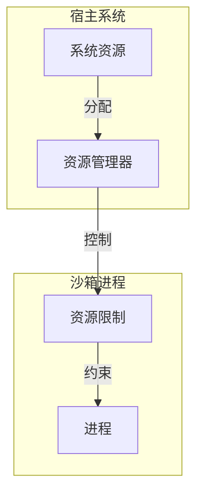
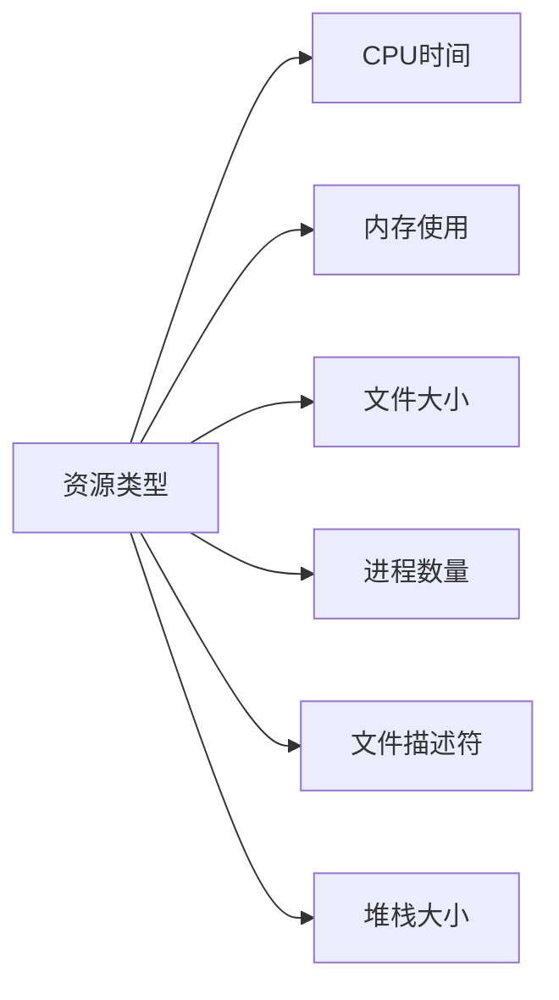
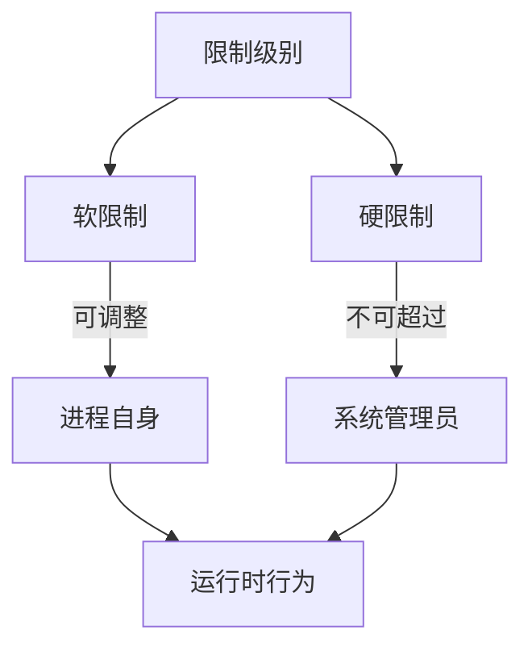
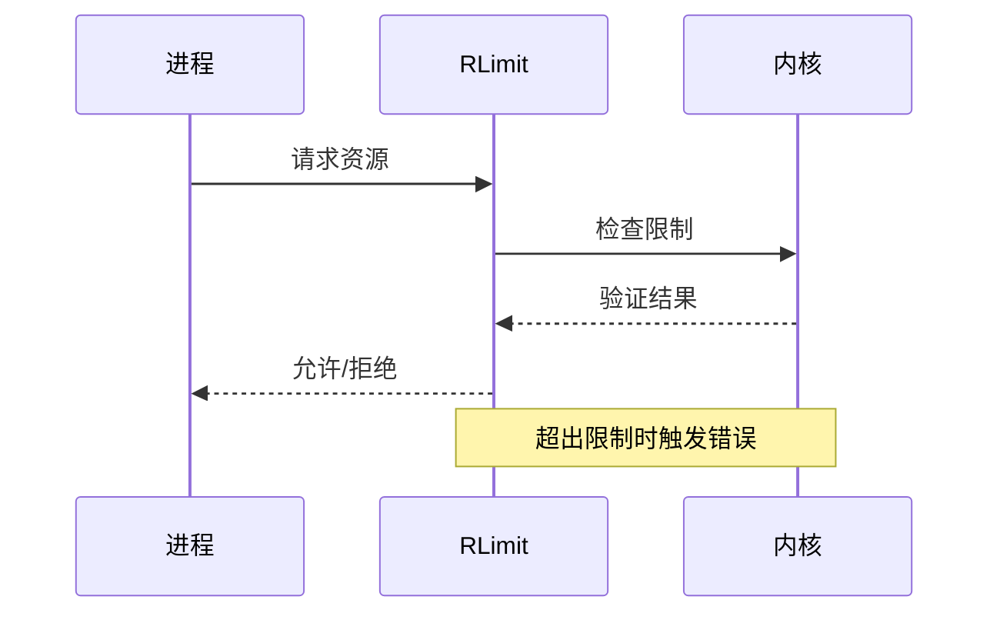
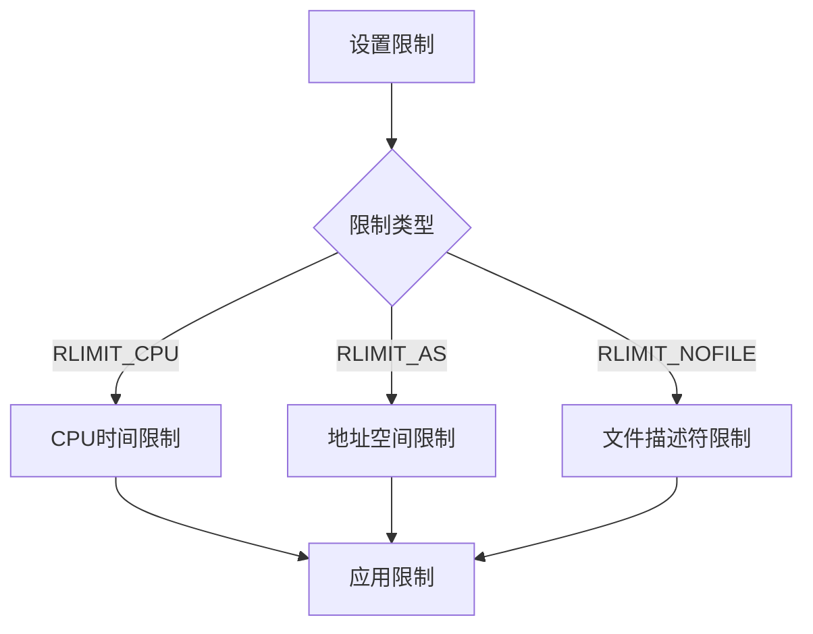
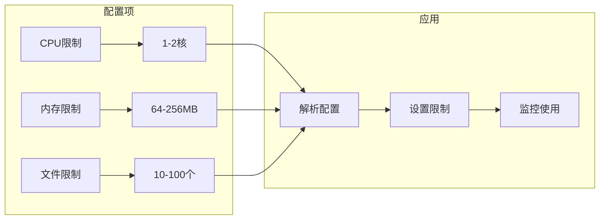
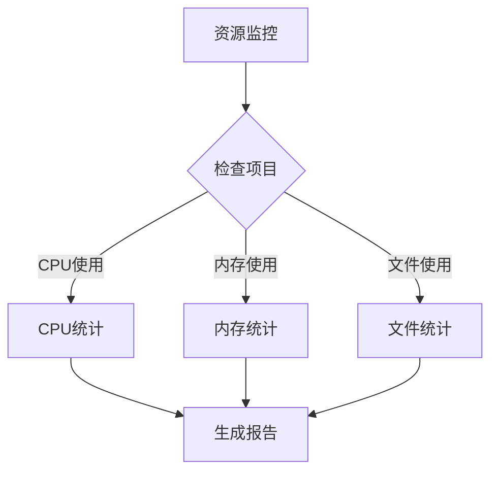
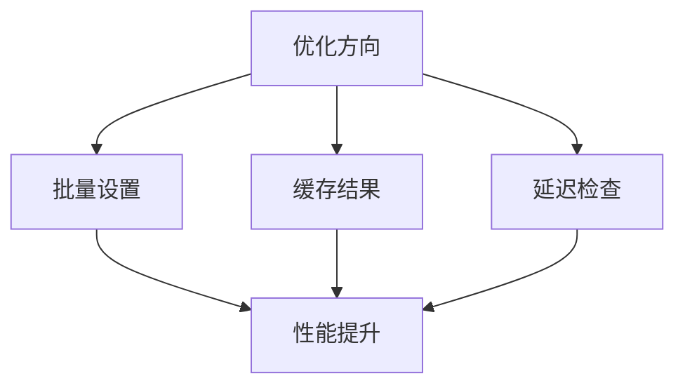
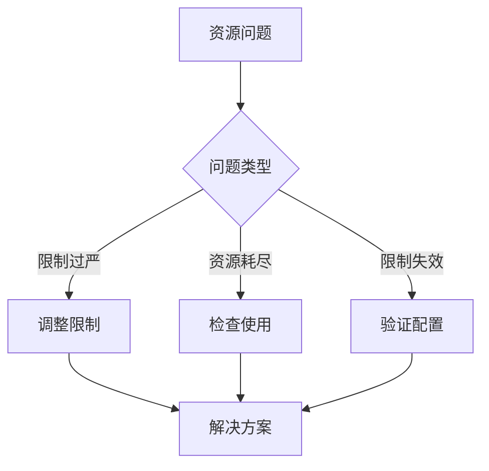
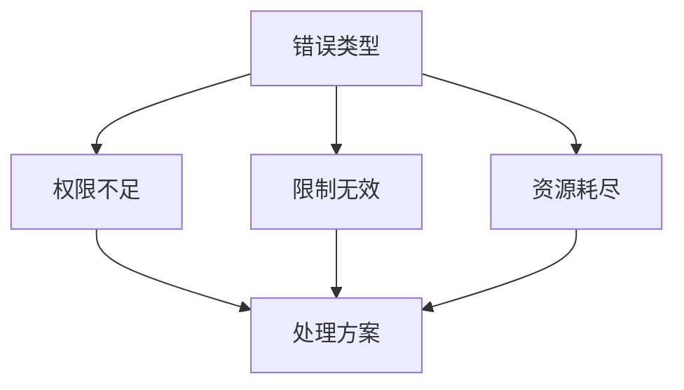

# 资源限制（RLimit）与沙箱系统

## 概述

资源限制（Resource Limits，RLimit）是 Linux 系统提供的进程资源控制机制。在沙箱系统中，它用于限制进程可以使用的系统资源，防止恶意程序耗尽系统资源或发起拒绝服务攻击。

## 系统架构



## 限制类型

### 1. 基本资源限制



### 2. 限制层级



## 实现机制

### 1. 资源控制流程



### 2. 限制应用



## 沙箱集成

### 1. 资源配置



### 2. 监控机制



## 实现示例

### 1. 基本限制设置

```go
// 设置基本资源限制
limits := &rlimit.RLimits{
    CPU:         1,              // 1秒CPU时间
    Memory:      64 * 1024 * 1024, // 64MB内存
    FileSize:    10 * 1024 * 1024, // 10MB文件大小
    OpenFiles:   20,             // 20个文件描述符
    Processes:   10,             // 10个进程
    StackSize:   8 * 1024 * 1024,  // 8MB栈大小
}

// 应用限制
if err := limits.Apply(); err != nil {
    return err
}
```

### 2. 高级配置

```go
// 创建自定义限制
customLimits := []syscall.Rlimit{
    {
        Cur: 100,  // 软限制
        Max: 200,  // 硬限制
    },
}

// 应用到特定资源
if err := syscall.Setrlimit(syscall.RLIMIT_NOFILE, &customLimits[0]); err != nil {
    return err
}
```

## 性能影响

### 1. 资源开销


### 2. 优化策略



## 调试技巧

### 1. 问题诊断



### 2. 监控分析


## 最佳实践

### 1. 安全配置

- 合理的限制值
- 分级的限制策略
- 完整的错误处理

### 2. 性能优化

- 批量设置限制
- 优化检查频率
- 资源使用预测

### 3. 可维护性

- 清晰的配置结构
- 完整的日志记录
- 灵活的调整机制

## 注意事项

### 1. 系统限制

- 内核版本要求
- 系统配置依赖
- 权限要求

### 2. 应用影响

- 程序行为改变
- 性能影响
- 错误处理

### 3. 维护建议

- 定期检查配置
- 监控资源使用
- 及时调整限制

## 错误处理

### 1. 常见错误



### 2. 恢复策略


## 高级特性

### 1. 动态调整

- 运行时修改
- 自适应限制
- 紧急调整

### 2. 资源预测

- 使用趋势分析
- 负载预测
- 自动调整

### 3. 集成监控

- 资源使用统计
- 告警机制
- 报告生成
