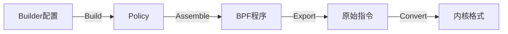

# Builder 和 ExportBPF 的关系

## 数据流转换过程



## 详细转换步骤

1. **Builder.Build()**：
   ```mermaid
   flowchart TD
       A[Builder] -->|1. 创建| B[Policy]
       B -->|2. 设置| C[DefaultAction]
       B -->|3. 添加| D[Allow规则]
       B -->|4. 添加| E[Trace规则]
   ```

2. **policy.Assemble()**：
   ```mermaid
   flowchart TD
       A[Policy] -->|1. 编译| B[BPF指令]
       B -->|2. 优化| C[优化指令]
       C -->|3. 验证| D[有效程序]
   ```

3. **ExportBPF()**：
   ```mermaid
   flowchart TD
       A[BPF指令] -->|1. 汇编| B[原始指令]
       B -->|2. 转换| C[SockFilter]
       C -->|3. 打包| D[Filter数组]
   ```

## 数据结构转换

```
Builder {
    Allow: []string
    Trace: []string
    Default: Action
}
↓
Policy {
    DefaultAction: Action
    Syscalls: []SyscallGroup
}
↓
[]bpf.Instruction
↓
[]bpf.RawInstruction
↓
[]syscall.SockFilter
```

## 类型设计

### Filter 类型设计
```go
// 在 seccomp 包中
type Filter []syscall.SockFilter
```

这种设计采用了类型别名的方式，具有以下优点：

1. **语义清晰**
   - 提供了更有意义的类型名称（Filter）
   - 明确表达了类型的用途和领域

2. **功能扩展**
   - 可以在 Filter 类型上添加自定义方法
   - 例如添加 SockFprog() 方法用于内核交互

3. **类型安全**
   - 与底层系统调用完全兼容
   - 无需额外的类型转换开销

4. **封装性**
   - 隐藏了底层实现细节
   - 提供了更高层次的抽象接口

这种设计模式在 Go 标准库中也经常使用，它在保持性能的同时提供了更好的代码组织和维护性。

## 代码示例

```go
// 1. 创建 Builder
builder := &Builder{
    Allow: []string{"read", "write"},
    Trace: []string{"open"},
    Default: ActionKill,
}

// 2. 构建过滤器（Build 内部）
policy := Policy{
    DefaultAction: ToSeccompAction(builder.Default),
    Syscalls: []SyscallGroup{...},
}

// 3. 编译为 BPF 程序
program, _ := policy.Assemble()

// 4. 转换为内核格式（ExportBPF 内部）
raw, _ := bpf.Assemble(program)
filter := sockFilter(raw)
```

## 关键点说明

1. **Build 函数职责**：
   - 创建策略配置
   - 设置默认动作
   - 配置系统调用规则
   - 调用 ExportBPF 转换格式

2. **ExportBPF 函数职责**：
   - 汇编 BPF 指令
   - 生成原始指令
   - 转换为内核格式
   - 确保格式兼容性

3. **转换过程保证**：
   - 类型安全
   - 格式正确
   - 性能优化
   - 内核兼容
