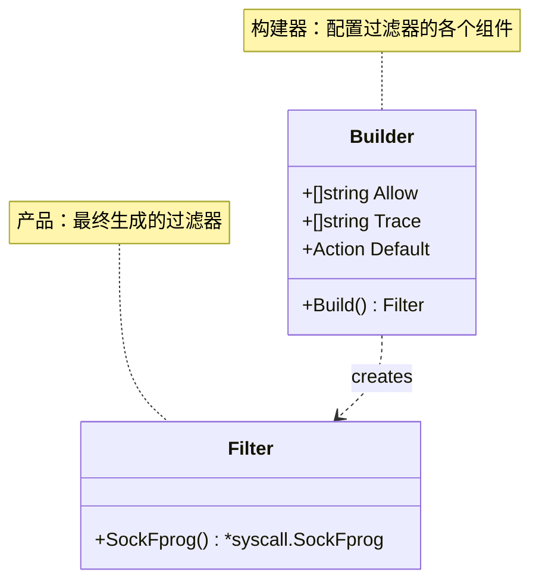
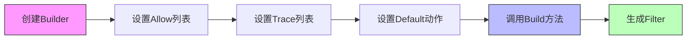
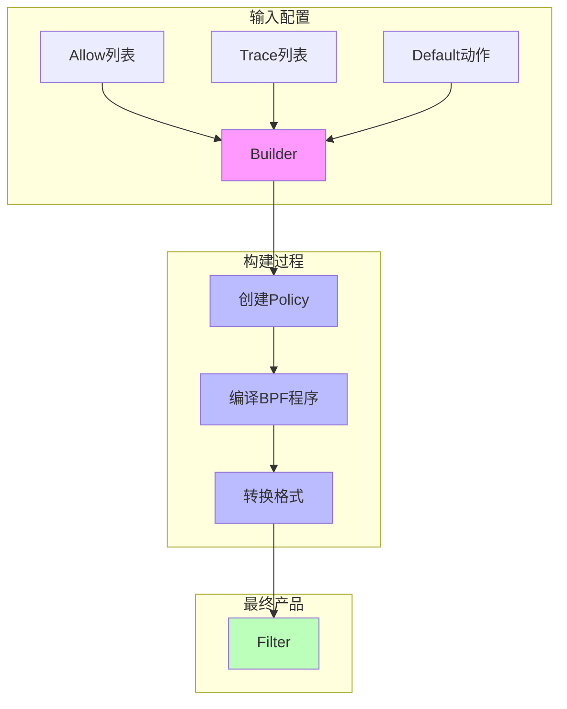
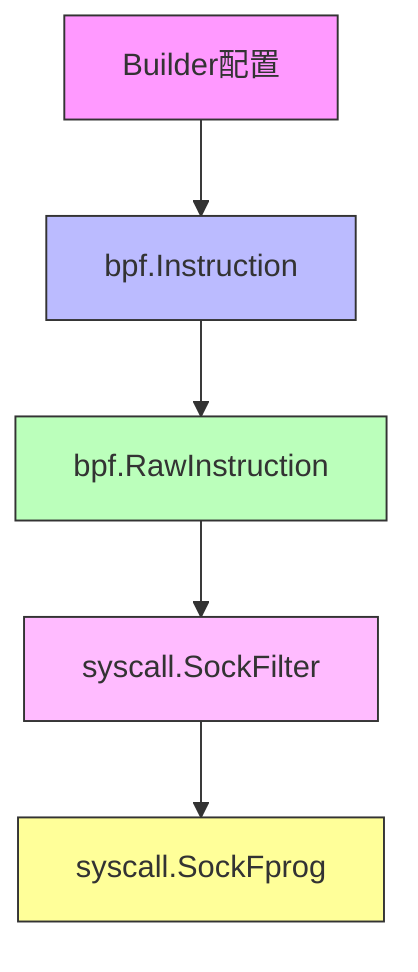

# Builder Pattern in libseccomp

## 图解构建器模式

### 1. 整体结构


### 2. 构建过程


### 3. 数据流转换


## 什么是构建器模式？

构建器模式（Builder Pattern）是一种创建型设计模式，它允许你分步骤创建复杂对象。在 libseccomp 包中，我们使用构建器模式来创建 seccomp 过滤器，这是因为：

1. 过滤器配置复杂，包含多个组件（系统调用列表、动作等）
2. 配置过程需要分步进行
3. 最终产品（过滤器）的构建过程应该独立于其表示

## libseccomp 中的实现

### 1. Builder 结构体

```go
type Builder struct {
    Allow []string   // 允许执行的系统调用列表
    Trace []string   // 需要跟踪的系统调用列表
    Default Action   // 默认动作
}
```

这个结构体封装了创建过滤器所需的所有配置项：
- 每个字段代表过滤器的一个组成部分
- 字段可以独立设置，顺序不重要
- 提供了良好的默认值

### 2. 构建过程

```go
func (b *Builder) Build() (seccomp.Filter, error) {
    // 1. 创建策略
    policy := libseccomp.Policy{
        DefaultAction: ToSeccompAction(b.Default),
        Syscalls: []libseccomp.SyscallGroup{
            {
                Action: libseccomp.ActionAllow,
                Names:  b.Allow,
            },
            {
                Action: actTrace,
                Names:  b.Trace,
            },
        },
    }

    // 2. 编译为 BPF 程序
    program, err := policy.Assemble()
    if err != nil {
        return nil, err
    }

    // 3. 转换为内核格式
    return ExportBPF(program)
}
```

构建过程分为清晰的步骤：
1. 创建策略：将配置转换为 libseccomp 策略
2. 编译程序：将策略转换为 BPF 指令
3. 导出格式：将 BPF 指令转换为内核可用格式

## BPF 转换过程

在构建器模式中，从配置到最终的内核过滤器需要经过多个转换步骤。这个过程类似于从高级语言到机器码的编译过程：

### 转换步骤



### 每一步的作用

1. **bpf.Instruction**：
   - 高级的 BPF 指令表示
   - 包含人类可读的操作码和参数
   - 便于程序构建和修改

2. **bpf.RawInstruction**：
   - 汇编后的原始指令
   - 将高级指令转换为底层表示
   - 包含机器级别的操作码和参数

3. **syscall.SockFilter**：
   - 内核期望的过滤器格式
   - 包含具体的指令信息：
     - Code: 操作码
     - Jt/Jf: 跳转目标
     - K: 立即数/地址

4. **syscall.SockFprog**：
   - 最终传递给内核的程序结构
   - 包含完整的过滤器程序信息：
     - Len: 程序长度
     - Filter: 指向指令数组的指针

### 代码示例

```go
// 1. Builder 配置
builder := Builder{
    Allow: []string{"read", "write"},
    Trace: []string{"open"},
    Default: ActionKill,
}

// 2. 生成 BPF 指令
program, _ := policy.Assemble()  // []bpf.Instruction

// 3. 转换为原始指令
raw, _ := bpf.Assemble(program)  // []bpf.RawInstruction

// 4. 转换为内核格式
filter := sockFilter(raw)  // []syscall.SockFilter

// 5. 创建程序结构
prog := filter.SockFprog()  // *syscall.SockFprog
```

这种多步转换确保了：
1. 代码的可维护性（使用高级抽象）
2. 与内核的兼容性（生成正确的格式）
3. 性能优化（最终生成高效的机器码）

## 使用示例

### 1. 基本使用

```go
builder := libseccomp.Builder{
    Allow: []string{"read", "write"},
    Trace: []string{"open"},
    Default: libseccomp.ActionKill,
}

filter, err := builder.Build()
```

### 2. 分步构建

```go
// 1. 创建构建器
builder := libseccomp.Builder{}

// 2. 设置允许的系统调用
builder.Allow = []string{
    "read",
    "write",
    "close",
}

// 3. 设置需要跟踪的系统调用
builder.Trace = []string{
    "open",
    "execve",
}

// 4. 设置默认动作
builder.Default = libseccomp.ActionKill

// 5. 构建过滤器
filter, err := builder.Build()
```

## 构建器模式的优势

1. **封装复杂性**：
   - 隐藏了过滤器创建的复杂细节
   - 提供了简单的接口来配置过滤器

2. **灵活性**：
   - 可以按任意顺序设置配置项
   - 支持默认值和可选配置

3. **可维护性**：
   - 配置逻辑集中在一个地方
   - 易于添加新的配置项

4. **参数验证**：
   - 在构建时进行参数验证
   - 提供清晰的错误信息

5. **不变性**：
   - 构建完成后的过滤器是不可变的
   - 确保了线程安全

## 最佳实践

1. **配置验证**：
   ```go
   func (b *Builder) validate() error {
       if len(b.Allow) == 0 && len(b.Trace) == 0 {
           return errors.New("at least one syscall must be specified")
       }
       return nil
   }
   ```

2. **链式调用**（可选扩展）：
   ```go
   func (b *Builder) WithAllowedSyscalls(syscalls ...string) *Builder {
       b.Allow = append(b.Allow, syscalls...)
       return b
   }
   ```

3. **默认配置**：
   ```go
   func NewDefaultBuilder() *Builder {
       return &Builder{
           Default: ActionKill,
           Allow: defaultSyscallAllows,
       }
   }
   ```

## 注意事项

1. Builder 实例可以重复使用，但要注意清理旧的配置
2. Build() 方法应该在所有配置完成后才调用
3. 错误处理应该在构建过程中进行，而不是在使用过滤器时
