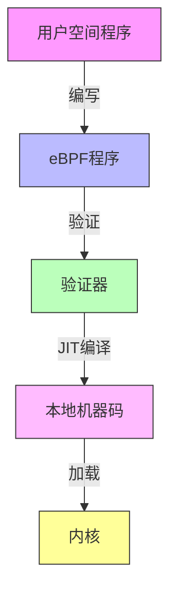
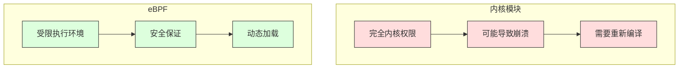

# eBPF 技术解析

## 1. eBPF 原理

### 1.1 核心概念

eBPF (extended Berkeley Packet Filter) 是 Linux 内核中的一个革命性特性，它允许在内核空间安全地运行用户定义的程序。本质上，它是一个在内核中运行的虚拟机。



### 1.2 工作原理

1. **程序编写**：
   - 使用受限制的 C 语言子集
   - 或使用高级语言（如 Go）的库
   - 定义事件触发条件和处理逻辑

2. **验证阶段**：
   ```c
   // 验证器检查项目
   - 程序终止性（无循环）
   - 内存访问安全性
   - 资源使用限制
   - 权限检查
   ```

3. **JIT 编译**：
   - 将 eBPF 字节码转换为本地机器码
   - 针对特定架构优化
   - 提供接近原生的性能

4. **运行时**：
   - 在内核上下文中执行
   - 直接访问内核数据结构
   - 零拷贝数据处理

## 2. 使用场景

### 2.1 网络


1. **XDP（eXpress Data Path）**：
   - 网卡驱动层的包处理
   - DDoS 防御
   - 负载均衡

2. **流量控制**：
   - 带宽管理
   - QoS 策略
   - 包转发和过滤

### 2.2 安全

1. **Seccomp**：
   - 系统调用过滤
   - 权限控制
   - 沙箱隔离

2. **LSM（Linux Security Module）**：
   - 访问控制
   - 完整性检查
   - 审计日志

### 2.3 观测和性能分析

1. **跟踪点**：
   - 函数入口/出口
   - 系统调用
   - 性能计数器

2. **性能分析**：
   - 延迟分析
   - 资源使用
   - 热点检测

## 3. 相比其他方案的优势

### 3.1 与传统内核模块比较



1. **安全性**：
   - eBPF：验证器确保安全
   - 内核模块：无安全保证

2. **部署**：
   - eBPF：动态加载，无需重启
   - 内核模块：需要重新编译和加载

3. **维护**：
   - eBPF：向后兼容性好
   - 内核模块：需要随内核更新

### 3.2 与用户空间解决方案比较

1. **性能优势**：
   - 直接在内核中执行
   - 避免上下文切换
   - 零拷贝数据访问

2. **功能优势**：
   - 直接访问内核数据
   - 原子操作支持
   - 更细粒度的控制

3. **资源效率**：
   - 更低的 CPU 使用率
   - 更少的内存开销
   - 更低的延迟

### 3.3 在 Seccomp 中的特殊优势

1. **精细控制**：
   ```go
   // 传统 seccomp 规则
   seccomp.SCMP_ACT_ALLOW
   
   // eBPF 增强的规则
   if (syscall == SYS_open) {
       if (args[0] == "/sensitive/path") {
           return SECCOMP_RET_KILL;
       }
   }
   ```

2. **上下文感知**：
   - 可以访问系统调用参数
   - 可以检查调用上下文
   - 可以实现复杂的策略

3. **性能开销**：
   - JIT 编译保证高性能
   - 最小化过滤开销
   - 可预测的延迟

## 4. 实际应用示例

### 4.1 网络过滤器

```go
// XDP 程序示例
struct xdp_md {
    __u32 data;
    __u32 data_end;
};

SEC("xdp")
int xdp_filter(struct xdp_md *ctx) {
    void *data_end = (void *)(long)ctx->data_end;
    void *data = (void *)(long)ctx->data;
    
    struct ethhdr *eth = data;
    if (eth + 1 > data_end)
        return XDP_PASS;
        
    if (eth->h_proto == htons(ETH_P_IP))
        return XDP_DROP;
        
    return XDP_PASS;
}
```

### 4.2 系统调用过滤器

```go
// Seccomp 过滤器示例
filters := []syscall.SockFilter{
    {
        Code: BPF_LD | BPF_W | BPF_ABS,
        K:    offsetof(seccomp_data, nr),
    },
    {
        Code: BPF_JMP | BPF_JEQ | BPF_K,
        K:    SYS_open,
        Jt:   0,
        Jf:   1,
    },
    {
        Code: BPF_RET | BPF_K,
        K:    SECCOMP_RET_KILL,
    },
}
```

## 5. 最佳实践和注意事项

1. **性能优化**：
   - 最小化程序复杂度
   - 利用 map 缓存数据
   - 避免不必要的计算

2. **安全考虑**：
   - 始终验证输入
   - 实现最小权限原则
   - 定期更新和审计

3. **可维护性**：
   - 清晰的文档
   - 完整的测试覆盖
   - 监控和日志
