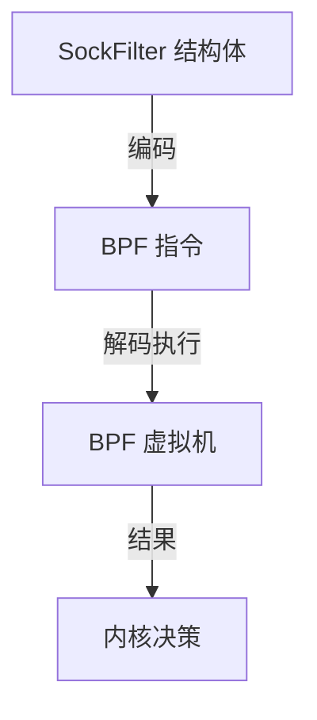
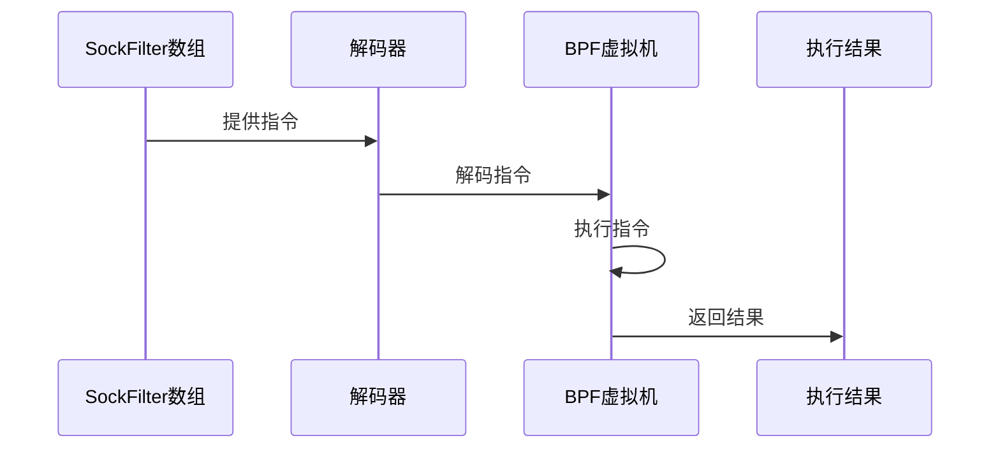
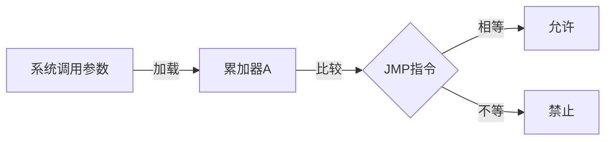
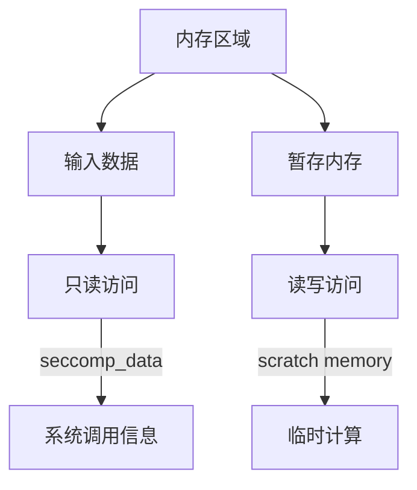
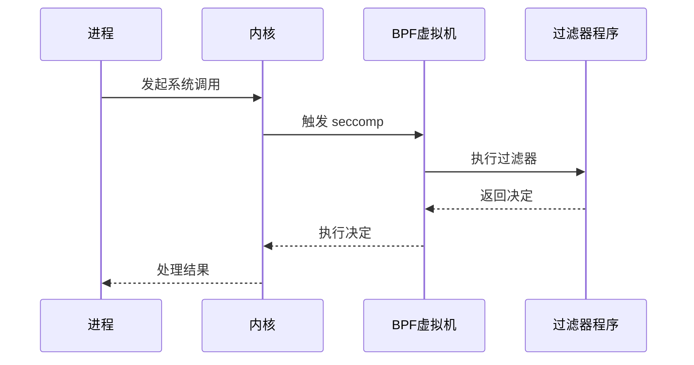
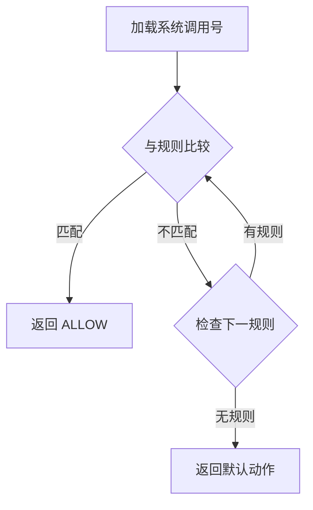
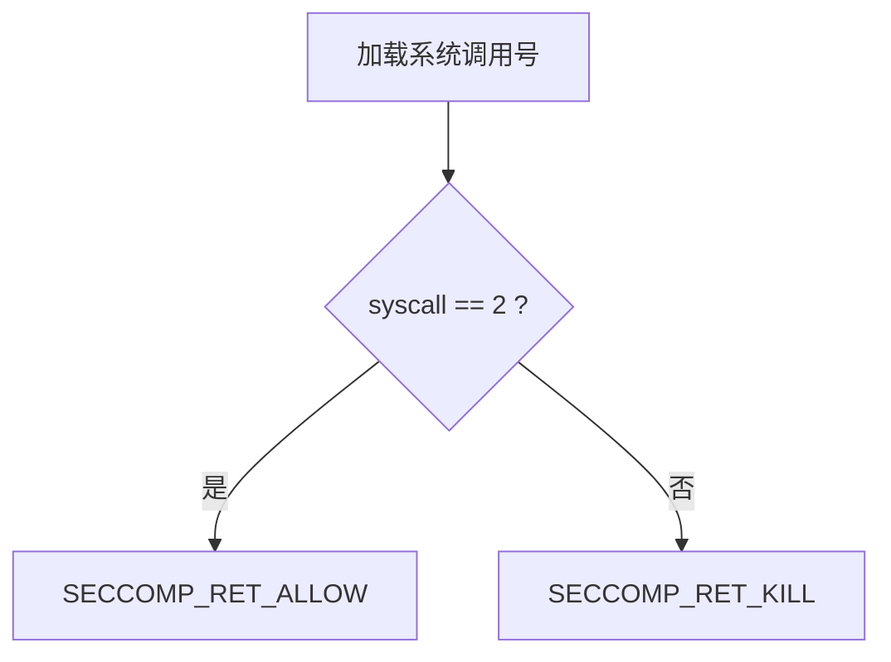
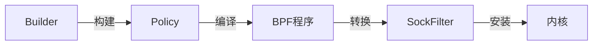
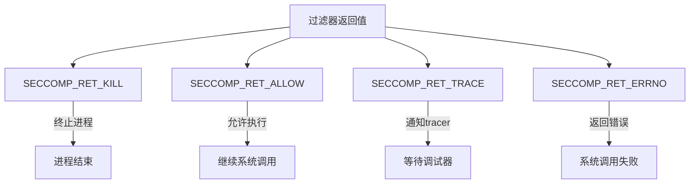

# Seccomp 过滤器实现原理

## 概述

Seccomp (secure computing mode) 是 Linux 内核提供的安全机制，用于限制进程可以使用的系统调用。它使用 BPF (Berkeley Packet Filter) 虚拟机来实现高效的系统调用过滤。

## BPF 指令结构

每个 BPF 指令由四个字段组成：

```go
type SockFilter struct {
    Code uint16  // 操作码
    Jt   uint8   // 条件为真时的跳转偏移
    Jf   uint8   // 条件为假时的跳转偏移
    K    uint32  // 通用字段（立即数/内存地址）
}
```

### 操作码组成

操作码由三部分组成：
```
Code = 操作类型 | 数据大小 | 操作模式
```

1. 操作类型：
   - `BPF_LD`: 加载数据
   - `BPF_JMP`: 跳转
   - `BPF_RET`: 返回

2. 数据大小：
   - `BPF_W`: 32位
   - `BPF_H`: 16位
   - `BPF_B`: 8位

3. 操作模式：
   - `BPF_ABS`: 绝对寻址
   - `BPF_K`: 立即数
   - `BPF_JEQ`: 相等比较

## BPF 虚拟机详解

BPF (Berkeley Packet Filter) 虚拟机是一个在 Linux 内核中运行的轻量级虚拟机，最初设计用于网络数据包过滤。它具有以下特点：

1. **架构特点**：
   - 简单的 RISC 指令集
   - 有限的内存访问
   - 无循环（保证终止）
   - 运行在内核空间

2. **寄存器**：
   ```
   累加器 (A): 主要的工作寄存器
   索引寄存器 (X): 用于间接寻址
   程序计数器 (PC): 指向当前执行的指令
   ```

3. **指令类型**：
   ```
   加载指令：LD, LDX      // 加载数据到寄存器
   存储指令：ST, STX      // 存储数据到内存
   算术指令：ADD, SUB     // 基本运算
   跳转指令：JMP, JEQ     // 条件和无条件跳转
   返回指令：RET         // 结束程序并返回值
   ```

## SockFilter 与 BPF 的关系



### 1. SockFilter 作为指令编码

```go
type SockFilter struct {
    Code uint16  // 操作码：指定 BPF 虚拟机要执行的操作
    Jt   uint8   // 真跳转：条件为真时跳转的偏移量
    Jf   uint8   // 假跳转：条件为假时跳转的偏移量
    K    uint32  // 操作数：立即数或内存地址
}
```

### 2. 指令执行流程



### 3. 示例：系统调用过滤



对应的 SockFilter 序列：
```go
[]SockFilter{
    // 加载系统调用号到累加器
    {
        Code: BPF_LD | BPF_W | BPF_ABS,
        K: offsetof(struct seccomp_data, nr),
    },
    
    // 比较累加器值
    {
        Code: BPF_JMP | BPF_JEQ | BPF_K,
        Jt: 0,    // 如果相等，执行下一条指令
        Jf: 1,    // 如果不等，跳过一条指令
        K: SYS_open,
    },
    
    // 允许系统调用
    {
        Code: BPF_RET | BPF_K,
        K: SECCOMP_RET_ALLOW,
    },
    
    // 禁止系统调用
    {
        Code: BPF_RET | BPF_K,
        K: SECCOMP_RET_KILL,
    },
}
```

### 4. 内存访问

BPF 虚拟机的内存访问是受限的：



### 5. 安全保证

1. **静态验证**：
   - 指令序列必须有效
   - 内存访问必须安全
   - 程序必须终止

2. **运行时保护**：
   - 隔离的执行环境
   - 有限的指令集
   - 受控的内存访问

## 工作流程



## 过滤器执行流程



## 示例：过滤 open 系统调用

下面是一个允许 open 系统调用但禁止其他调用的 BPF 程序示例：



对应的 BPF 指令序列：

```go
[]SockFilter{
    // 1. 加载系统调用号
    {Code: BPF_LD|BPF_W|BPF_ABS, K: 0},
    
    // 2. 比较是否为 open
    {Code: BPF_JMP|BPF_JEQ|BPF_K, K: 2, Jt: 0, Jf: 1},
    
    // 3. 允许执行
    {Code: BPF_RET|BPF_K, K: SECCOMP_RET_ALLOW},
    
    // 4. 终止进程
    {Code: BPF_RET|BPF_K, K: SECCOMP_RET_KILL},
}
```

## 在代码中的实现



1. **Builder 接口**：
   ```go
   type Builder struct {
       Allow   []string  // 允许的系统调用
       Trace   []string  // 需要追踪的系统调用
       Default Action    // 默认动作
   }
   ```

2. **过滤器生成**：
   ```go
   func (b *Builder) Build() (Filter, error) {
       policy := Policy{...}      // 创建策略
       program := Assemble(...)   // 编译为BPF
       return ExportBPF(...)      // 转换格式
   }
   ```

## 返回值类型

seccomp 过滤器可以返回以下动作：



## 安全考虑

1. 过滤器一旦安装无法修改
2. 在内核空间执行，性能高效
3. 可以与 ptrace 结合使用
4. 支持细粒度的系统调用控制

## SockFilter 在 seccomp 中的应用

1. **配置转换**：
   ```go
   type Policy struct {
       DefaultAction Action
       Syscalls     []string
   }
   ```
   ↓ 转换 ↓
   ```go
   []SockFilter{...}  // BPF 指令序列
   ```

2. **内核安装**：
   ```go
   type SockFprog struct {
       Len    uint16      // 过滤器长度
       Filter *SockFilter // 指令数组
   }
   ```

3. **执行过程**：
   ```
   系统调用 → seccomp → BPF虚拟机 → 过滤决策
   ```

这种设计提供了：
1. 高性能的过滤机制
2. 安全的执行环境
3. 灵活的规则配置
4. 可靠的运行时保证