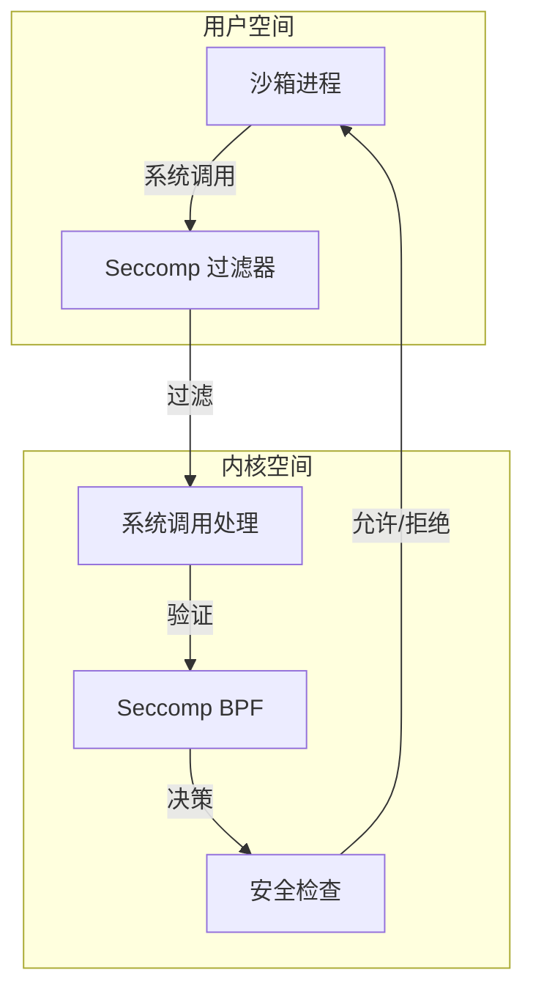
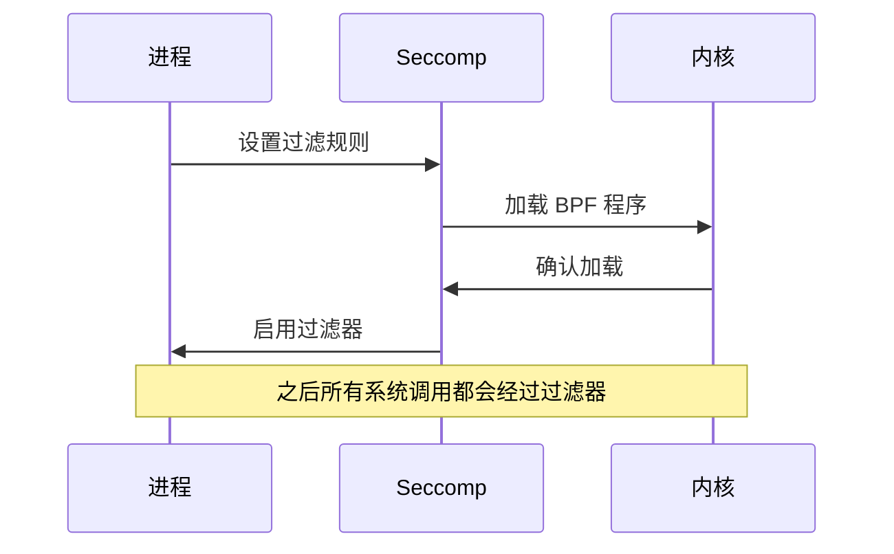
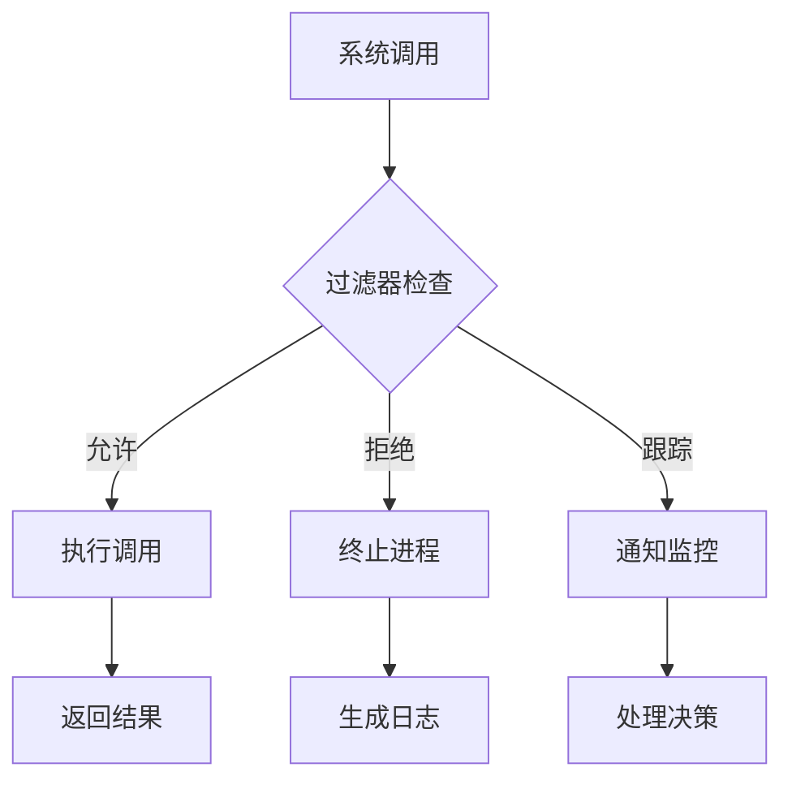
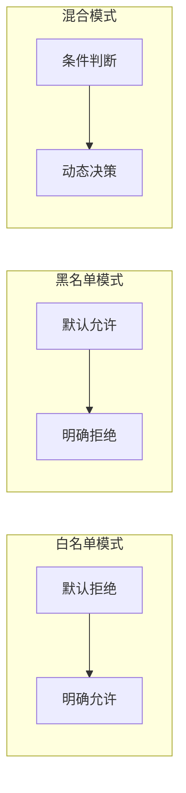
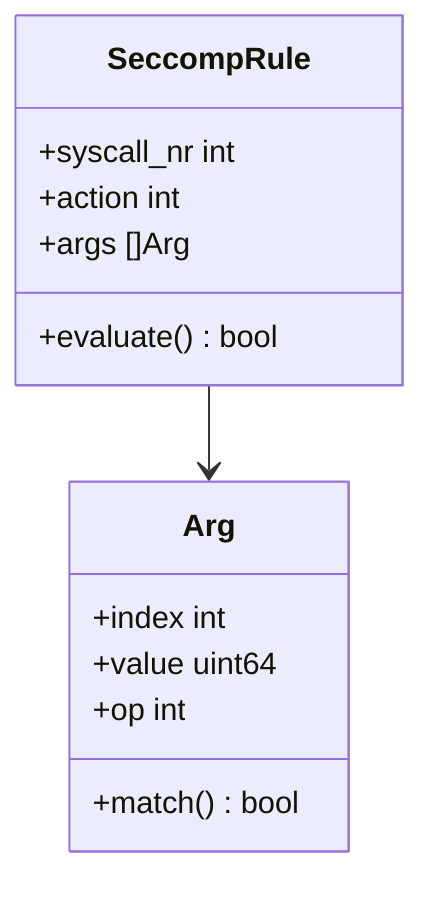
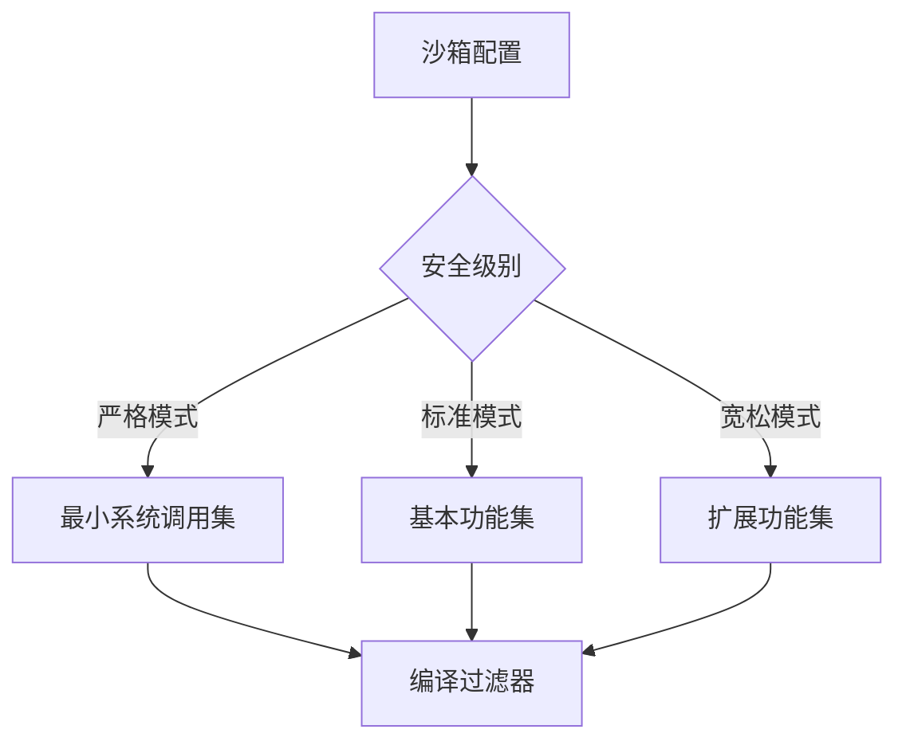
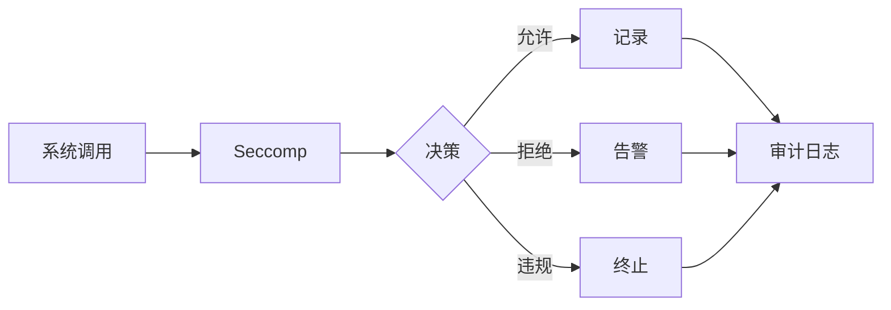
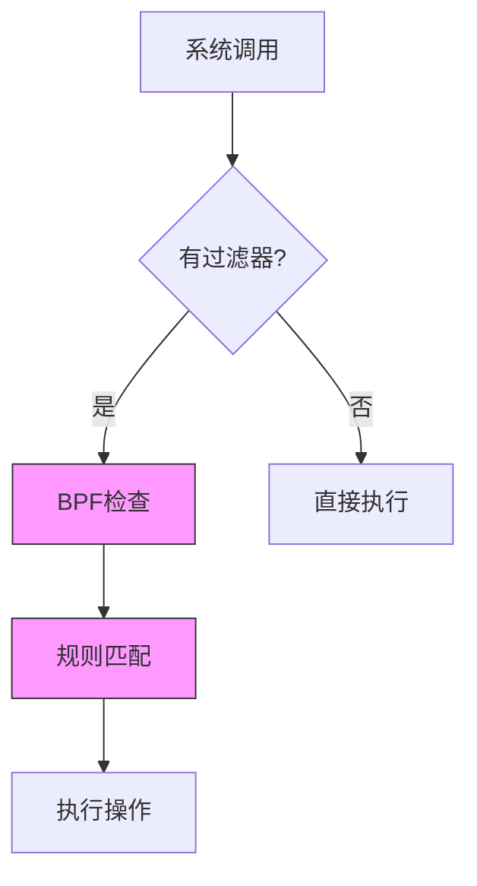
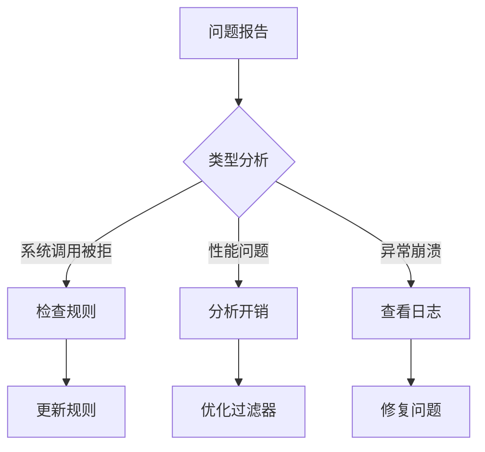
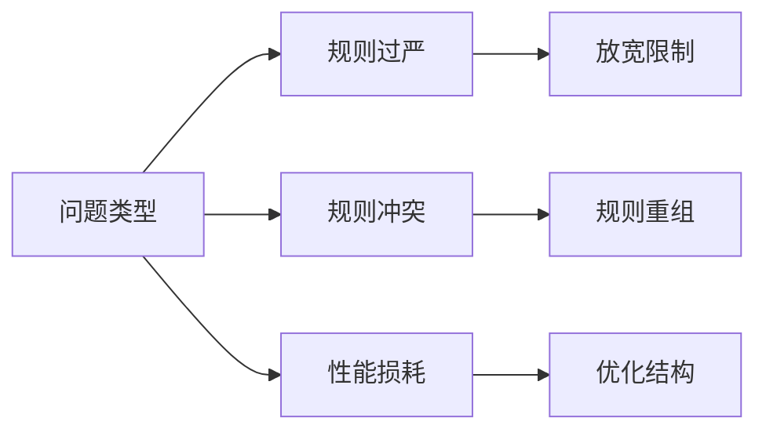

# Seccomp 与沙箱系统

## 概述

Seccomp (Secure Computing Mode) 是 Linux 内核的安全机制，用于限制进程可以使用的系统调用。在沙箱系统中，它是实现系统调用级别隔离的核心组件。

## 系统架构



## 工作机制

### 1. 过滤器初始化



### 2. 系统调用处理



## 安全策略

### 1. 基本策略模式



### 2. 规则结构



## 沙箱集成

### 1. 安全配置



### 2. 监控和审计



## 性能影响

### 1. 开销分析



### 2. 优化策略


## 实现示例

### 1. 基本过滤器

```go
// 创建基本的 seccomp 过滤器
filter := seccomp.NewFilter(seccomp.ActErrno)
filter.AddRule(syscall.SYS_READ, seccomp.ActAllow)
filter.AddRule(syscall.SYS_WRITE, seccomp.ActAllow)
filter.AddRule(syscall.SYS_EXIT, seccomp.ActAllow)

// 加载过滤器
if err := filter.Load(); err != nil {
    log.Fatal(err)
}
```

### 2. 高级规则

```go
// 创建带参数检查的规则
rule := seccomp.Rule{
    Name:   "open",
    Action: seccomp.ActAllow,
    Args: []seccomp.Arg{
        {
            Index: 1,
            Value: syscall.O_RDONLY,
            Op:    seccomp.OpEqualTo,
        },
    },
}
```

## 调试和故障排除

### 1. 调试流程



### 2. 常见问题



## 最佳实践

### 1. 规则设计

- 最小权限原则
- 明确的规则结构
- 完整的错误处理

### 2. 性能优化

- 优化规则顺序
- 减少规则复杂度
- 使用缓存机制

### 3. 安全加固

- 定期规则审计
- 完善的日志记录
- 及时的安全更新

## 注意事项

### 1. 兼容性

- 内核版本要求
- 系统调用 ABI
- 架构相关性

### 2. 限制条件

- 不可逆操作
- 子进程继承
- 性能开销

### 3. 维护建议

- 规则版本控制
- 定期安全审计
- 性能监控
