# IPC 性能对比测试结果

## 性能对比图

```mermaid
gantt
    title 各通信方式耗时对比 (纳秒)
    dateFormat X
    axisFormat %s

    section 基础实现
    基础 Unix Socket    :0, 667
    无缓冲 Channel      :0, 790
    单缓冲 Channel      :0, 754
    四缓冲 Channel      :0, 741

    section Goroutine
    空 Goroutine        :0, 261
    Goroutine 处理      :0, 1932

    section 内存分配
    无内存分配 (基础)    :0, 0
    128B (空 Goroutine) :0, 128
    160B (带处理)       :0, 160
```



## 测试目的

这组基准测试旨在比较不同的进程间通信（IPC）实现方式的性能：
1. 基础 Unix Socket 通信
2. 基于 Goroutine 的异步处理
3. 基于 Channel 的消息传递

## 测试环境

- **操作系统**: Linux
- **架构**: amd64
- **CPU**: 12th Gen Intel(R) Core(TM) i7-12700K
- **测试包**: github.com/zqzqsb/sandbox/pkg/unixsocket

## 测试场景

### 1. 基准场景 (Baseline)
```go
// 一个 goroutine 发送，主 goroutine 接收
go func() {
    for i := 0; i < b.N; i++ {
        s.SendMsg(msg, Msg{})
    }
}()
for i := 0; i < b.N; i++ {
    t.RecvMsg(m)
}
```

### 2. Goroutine 场景
```go
// 每次接收都创建新的 goroutine
for i := 0; i < b.N; i++ {
    c := make(chan struct{})
    go func() {
        defer close(c)
        t.RecvMsg(m)
    }()
    <-c
}
```

### 3. Channel 场景
```go
// 使用 channel 传递消息
c := make(chan []byte, size) // size: 0, 1, 4
go func() {
    for i := 0; i < b.N; i++ {
        t.RecvMsg(m)
        c <- m
    }
}()
for i := 0; i < b.N; i++ {
    <-c
}
```

## 测试结果

| 实现方式 | 每次操作耗时 (ns) | 内存分配 (B/op) | 分配次数 (allocs/op) |
|---------|-----------------|----------------|-------------------|
| 基础 Unix Socket | 667.2 | 0 | 0 |
| Goroutine 处理 | 1,932 | 160 | 2 |
| 无缓冲 Channel | 790.2 | 0 | 0 |
| 单缓冲 Channel | 753.9 | 0 | 0 |
| 四缓冲 Channel | 741.3 | 0 | 0 |
| 空 Goroutine | 261.1 | 128 | 2 |

## 性能分析

### 1. 基础 Unix Socket (667.2 ns)
- 最基本的实现方式
- 无额外的内存分配
- 性能最好，适合简单的同步通信

### 2. Goroutine 处理 (1,932 ns)
- 每次接收创建新的 goroutine
- 有额外的内存分配和调度开销
- 性能最差，不适合高频通信

### 3. Channel 实现
- 无缓冲：790.2 ns
- 单缓冲：753.9 ns
- 四缓冲：741.3 ns
- 随着缓冲区增加，性能略有提升
- 比基础实现慢约 10-20%

### 4. Goroutine 基础开销 (261.1 ns)
- 创建空 goroutine 的开销
- 显示了 goroutine 调度的基本成本
- 每次有 128 字节内存分配

## 结论与建议

### 1. 选择建议

1. **高性能场景**
   - 使用基础的 Unix Socket 实现
   - 避免不必要的 goroutine 创建
   - 适合请求-响应模式

2. **异步处理场景**
   - 使用带缓冲的 channel
   - 避免每次创建新的 goroutine
   - 考虑使用 goroutine 池

3. **长连接场景**
   - 可以使用单独的 goroutine 处理
   - 一次创建，长期使用
   - 避免频繁的 goroutine 创建和销毁

### 2. 优化方向

1. **减少 Goroutine 创建**
   - 使用 goroutine 池
   - 重用已有的 goroutine
   - 避免短期 goroutine

2. **Channel 优化**
   - 选择合适的缓冲区大小
   - 考虑使用 select 实现超时
   - 注意 channel 的关闭时机

3. **内存优化**
   - 重用消息缓冲区
   - 避免不必要的内存分配
   - 考虑使用对象池

### 3. 使用场景

1. **高性能要求**
   - 使用基础 Unix Socket
   - 同步处理模式
   - 最小化额外开销

2. **异步处理需求**
   - 使用带缓冲 channel
   - 控制 goroutine 数量
   - 平衡性能和灵活性

3. **复杂业务逻辑**
   - 可以使用 goroutine 处理
   - 注意资源管理
   - 实现合适的错误处理
