# Unix Socket 与沙箱系统

## 概述

Unix Domain Socket 是沙箱系统中进程间通信的核心机制，它提供了安全、高效的本地进程间通信能力，特别适合在隔离环境中使用。

## 系统架构

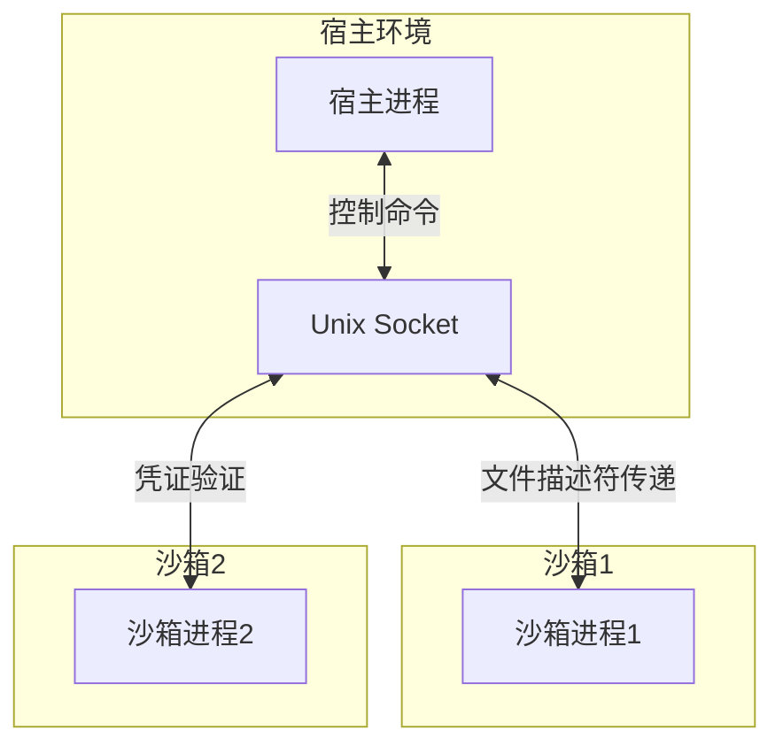

## 通信机制

### 1. 基本通信流程

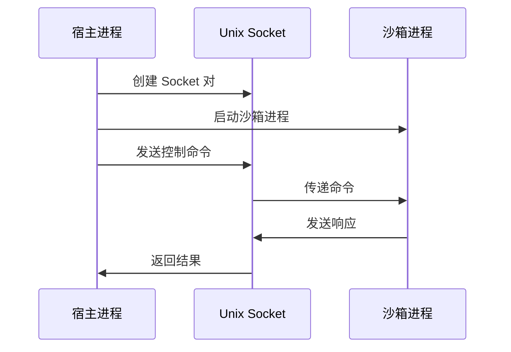

### 2. 文件描述符传递

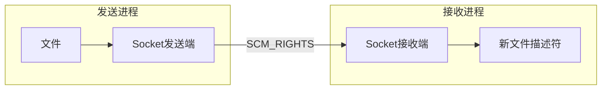

### 3. 凭证传递

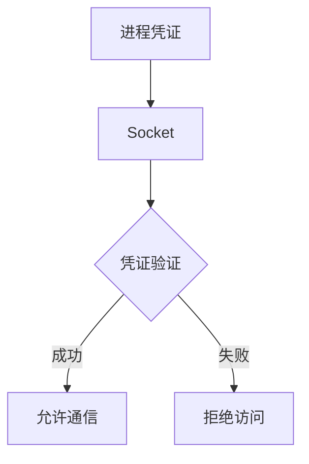

## 安全机制

### 1. 访问控制

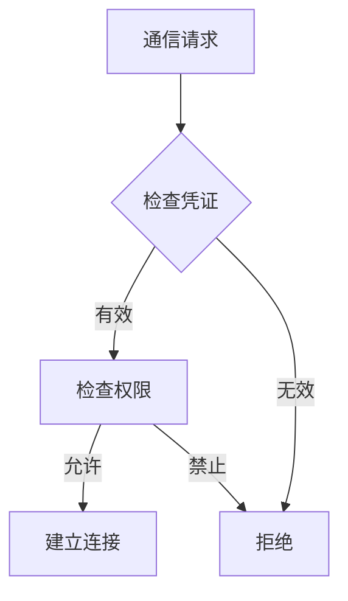

### 2. 隔离机制

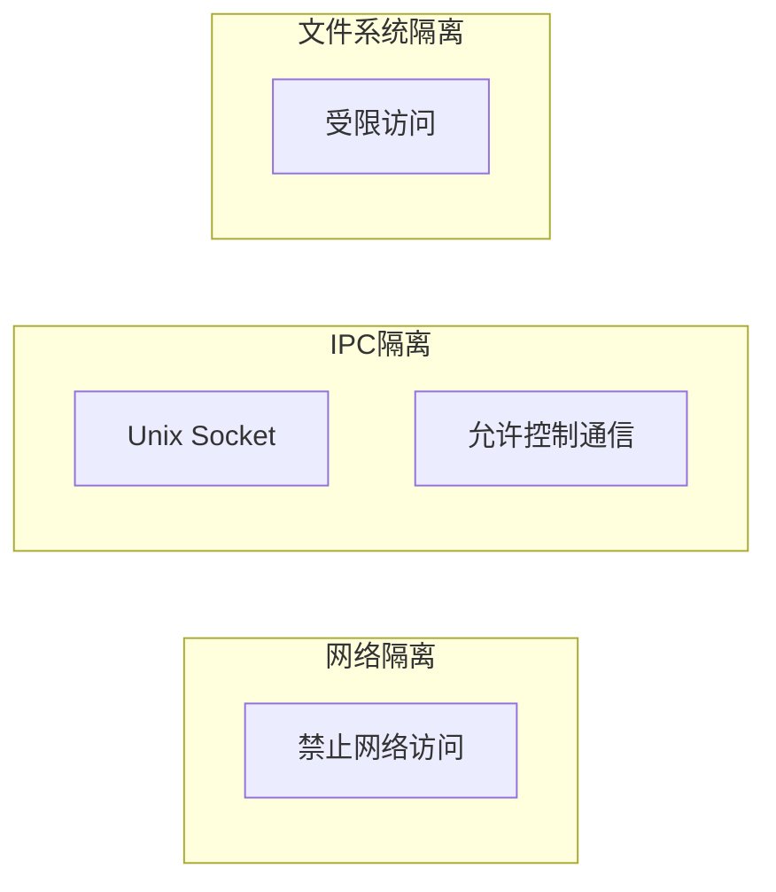

## 沙箱集成

### 1. 资源控制

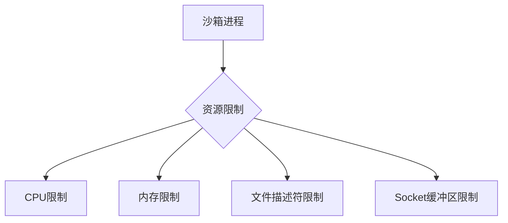

### 2. 生命周期管理

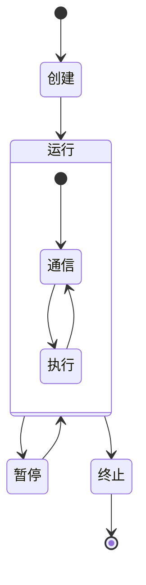

## 性能优化

### 1. 缓冲区管理


### 2. 消息批处理

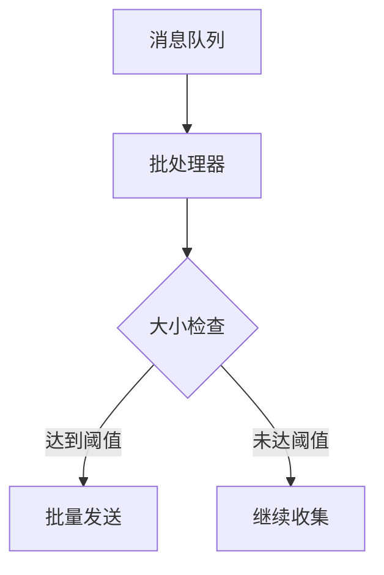

## 错误处理

### 1. 连接错误

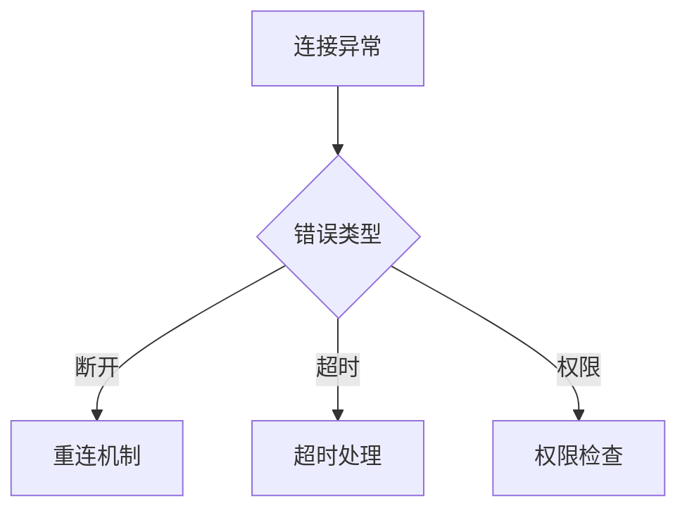

### 2. 数据错误

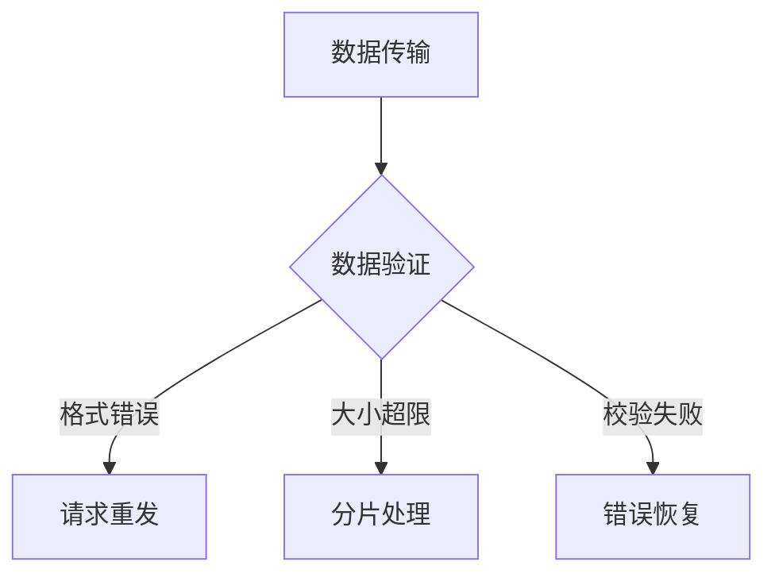

## 使用示例

### 1. 基本通信

```go
// 创建 Socket 对
sender, receiver, err := unixsocket.NewSocketPair()
if err != nil {
    log.Fatal(err)
}
defer sender.Close()
defer receiver.Close()

// 发送消息
msg := []byte("command")
if err := sender.SendMsg(msg, Msg{}); err != nil {
    log.Fatal(err)
}

// 接收消息
buf := make([]byte, 1024)
n, _, err := receiver.RecvMsg(buf)
if err != nil {
    log.Fatal(err)
}
```

### 2. 文件描述符传递

```go
// 发送文件描述符
file, err := os.Open("example.txt")
if err != nil {
    log.Fatal(err)
}
msg := Msg{
    Fds: []int{int(file.Fd())},
}
if err := sender.SendMsg([]byte("file"), msg); err != nil {
    log.Fatal(err)
}

// 接收文件描述符
buf := make([]byte, 1024)
n, msg, err := receiver.RecvMsg(buf)
if err != nil {
    log.Fatal(err)
}
newFile := os.NewFile(uintptr(msg.Fds[0]), "received")
```

## 最佳实践

### 1. 安全配置

- 严格的权限控制
- 最小权限原则
- 及时关闭未使用的连接

### 2. 性能调优

- 适当的缓冲区大小
- 批量处理消息
- 避免频繁的连接创建

### 3. 错误处理

- 完善的错误恢复机制
- 超时控制
- 资源清理

## 调试技巧

### 1. 日志记录

- 详细的错误信息
- 性能指标监控
- 通信状态追踪

### 2. 故障排除

- 连接状态检查
- 权限验证
- 资源使用监控
