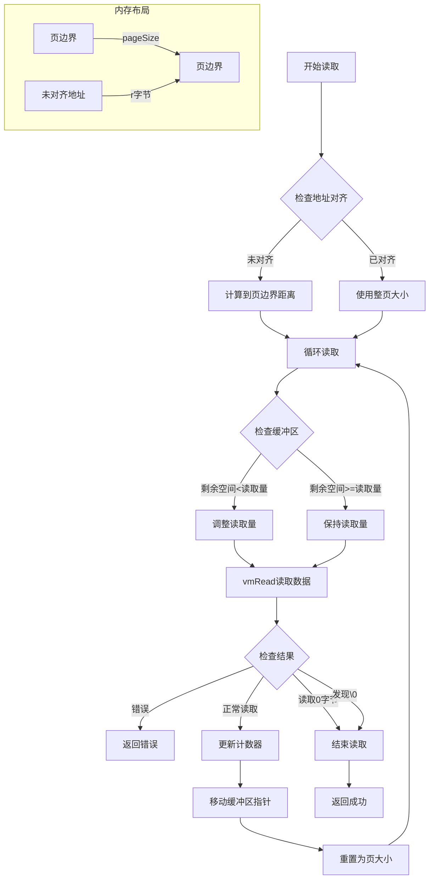

## 按页读取的好处

```bash
物理内存布局：
+-------------+-------------+-------------+
|   Page 1    |   Page 2    |   Page 3    |
|  4096 bytes |  4096 bytes |  4096 bytes |
+-------------+-------------+-------------+
```

**按页对齐的数据更容易命中缓存**

```bash
CPU Cache Line
+---------+---------+---------+
| Cache 1 | Cache 2 | Cache 3 |
+---------+---------+---------+
    ↓         ↓         ↓
```

**正确处理边界权限**

```bash
页面权限：
+-------------+-------------+
|   Page 1    |   Page 2    |
|   R/W/-     |   R/-/-     |
+-------------+-------------+
按页读取可以正确处理权限边界
```

**配合虚拟内存**

```bash
Virtual  ->  Physical
Page 1   ->  Frame 5
Page 2   ->  Frame 8
```
## 不按页读取的坏处

```bash
|----Page 1----|----Page 2----|
        |--读取范围--|
```
不按页读取，会导致

+ 页面错误，违规访问
+ 多次系统调用

## 未对齐处理

**首部**

```go
// 计算到页边界的距离
r := pageSize - int(addr%uintptr(pageSize))
// r = 4096 - 0x234 = 3532 字节

// 第一次读取：
// +-------------------+-------------------+
// |      Page 1       |      Page 2       |
// +-------------------+-------------------+
//      ↑         ↑
//    addr    page boundary
//      |---------|
//       r bytes
```

**尾部**

```go
// 检查剩余缓冲区大小
if l := len(buff); r < l {
    r = l  // 如果缓冲区比计划读取量小，就调整读取量
}

// 例如：
// buff = 100 bytes remaining
// r = 4096 bytes planned
// → adjust r = 100 bytes
```

## 完整读取流程

```bash
假设要读取跨页的字符串：

Page 1          Page 2          Page 3
+---------------+---------------+---------------+
|  ####[数据...]|[...数据...]  |[数据]####     |
+---------------+---------------+---------------+
     ↑                                  ↑
   开始                               结束

第一次读取：[r = 到页边界]
+---------------+
|  ####[数据...]|
+---------------+

第二次读取：[r = pageSize]
               +---------------+
               |[...数据...]  |
               +---------------+

第三次读取：[r = 剩余长度]
                              +---------------+
                              |[数据]####     |
                              +---------------+
```