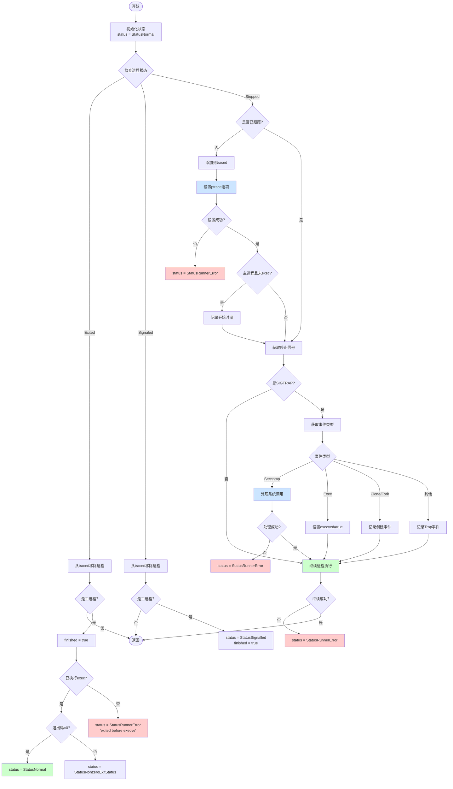

# handle 函数工作流程



## 关键节点说明

### 1. 状态检查分支
```
Exited：进程正常退出
- 检查是否是主进程
- 检查是否已执行 exec
- 设置相应的退出状态

Signaled：进程被信号终止
- 检查是否是主进程
- 设置信号终止状态

Stopped：进程停止
- 设置跟踪选项
- 处理各种事件
```

### 2. 事件处理
```
PTRACE_EVENT_SECCOMP：系统调用过滤
PTRACE_EVENT_EXEC：执行新程序
PTRACE_EVENT_CLONE/FORK：创建新进程
其他 TRAP 事件
```

### 3. 返回状态
```
StatusNormal：正常执行
StatusRunnerError：运行时错误
StatusNonzeroExitStatus：非零退出
StatusSignalled：信号终止
```

### 4. 错误处理点
```
1. ptrace 选项设置失败
2. exec 前进程退出
3. seccomp 处理失败
4. 进程继续执行失败
```

### 5. 重要标记
```
finished：是否完成
execved：是否执行了新程序
traced：进程是否被跟踪
```

## 关键流程

1. 进程生命周期：
```
fork -> traced添加 -> exec -> 执行 -> 退出
```

2. 事件处理：
```
停止 -> 获取事件 -> 处理 -> 继续执行
```

3. 错误处理：
```
检测错误 -> 设置状态 -> 返回错误信息
```
