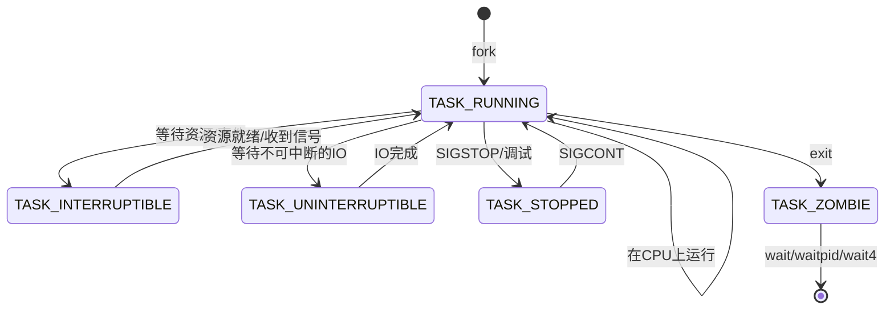

# Linux 进程状态机制

## 1. 进程状态转换图



## 2. 主要状态说明

### TASK_RUNNING (R)
```
- 进程正在运行或准备运行
- 位于运行队列中
- 等待CPU调度
```

### TASK_INTERRUPTIBLE (S)
```
- 可中断的睡眠状态
- 等待某个条件（如IO、信号、锁）
- 可以被信号唤醒
```

### TASK_UNINTERRUPTIBLE (D)
```
- 不可中断的睡眠状态
- 通常是在等待直接的IO操作
- 不响应信号，直到IO完成
- 常见于磁盘IO操作
```

### TASK_STOPPED (T)
```
- 进程被停止执行
- 通常由调试器触发
- 可通过 SIGCONT 恢复
```

### TASK_ZOMBIE (Z)
```
- 进程已终止但未被父进程回收
- 只保留最小的进程信息
- 等待父进程通过 wait 系列函数回收
```

## 3. 僵尸进程详解

### 3.1 形成原因
```
1. 子进程终止（调用 exit）
2. 内核释放大部分资源
3. 保留进程描述符和退出信息
4. 等待父进程获取信息
```

### 3.2 保留的信息
```c
struct task_struct {
    pid_t pid;           // 进程ID
    int exit_code;       // 退出码
    struct rusage rusage; // 资源使用统计
    // ...
}
```

### 3.3 问题及处理
```
1. 资源占用：
   - 每个僵尸进程占用一个进程表项
   - 进程表大小有限

2. 预防措施：
   - 父进程及时调用 wait
   - 使用 SIGCHLD 处理器
   - 双重 fork 技巧

3. 处理方法：
   if (fork() == 0) {
       if (fork() == 0) {
           // 孙子进程
           do_work();
           exit(0);
       }
       // 子进程立即退出
       exit(0);
   }
   // 父进程等待子进程
   wait(NULL);
```

### 3.4 双重 Fork 技巧详解

```c
// 第一次 fork
if (fork() == 0) {           // 父进程 P 创建子进程 C
    // 第二次 fork
    if (fork() == 0) {       // 子进程 C 创建孙进程 G
        // 孙进程 G
        do_work();           // 执行实际工作
        exit(0);
    }
    // 子进程 C 立即退出
    exit(0);
}
// 父进程 P 等待子进程 C
wait(NULL);

/*
进程关系演变：

1. 初始状态：
   P (父进程)

2. 第一次 fork 后：
   P (父进程)
   └── C (子进程)

3. 第二次 fork 后：
   P (父进程)
   └── C (子进程)
       └── G (孙进程)

4. 子进程退出后：
   P (父进程)
   [C] (子进程变为僵尸)
   └── G (孙进程被 init 收养)

5. 父进程 wait 后：
   P (父进程)
   └── G (孙进程，由 init 托管)

6. 最终状态：
   P (父进程继续执行)
   G (孙进程由 init 托管，退出时不会产生僵尸进程)
*/
```

#### 工作原理：

1. 进程创建：
```
- 父进程 P fork 创建子进程 C
- 子进程 C fork 创建孙进程 G
- 孙进程 G 执行实际工作
```

2. 进程退出：
```
- 子进程 C 立即退出
- 父进程 P 通过 wait 回收子进程 C
- 孙进程 G 被 init 进程收养
```

3. 僵尸进程预防：
```
- 子进程 C 的僵尸状态由父进程 P 处理
- 孙进程 G 的父进程变为 init
- init 进程会自动回收其子进程
- 因此孙进程 G 退出时不会产生僵尸进程
```

#### 使用场景：

1. 守护进程创建：
```c
void create_daemon() {
    if (fork() == 0) {
        if (fork() == 0) {
            // 守护进程代码
            setsid();  // 创建新会话
            do_daemon_work();
            exit(0);
        }
        exit(0);
    }
    wait(NULL);
}
```

2. 长期运行的后台任务：
```c
void run_background_task() {
    if (fork() == 0) {
        if (fork() == 0) {
            // 与终端分离
            setsid();
            // 长期运行的任务
            while (1) {
                do_background_work();
                sleep(interval);
            }
        }
        exit(0);
    }
    wait(NULL);
}
```

#### 优点：

1. 进程管理：
```
- 避免僵尸进程
- 实现进程独立
- 与父进程完全分离
```

2. 资源处理：
```
- 干净的资源释放
- 不依赖父进程的生命周期
- init 进程自动清理
```

## 4. 状态转换的关键系统调用

### 4.1 创建和终止
```c
fork()      // 创建新进程
exit()      // 终止进程
exec()      // 执行新程序
```

### 4.2 等待和控制
```c
wait4()     // 等待进程状态改变
ptrace()    // 跟踪进程执行
kill()      // 发送信号
```

### 4.3 调度相关
```c
sched_yield()   // 让出CPU
nice()          // 调整优先级
```

## 5. 在沙箱中的应用

### 5.1 进程状态监控
```go
func monitorProcessState(pid int) {
    for {
        var status unix.WaitStatus
        wpid, err := unix.Wait4(pid, &status, unix.WALL, nil)
        if err != nil {
            break
        }
        
        switch {
        case status.Exited():
            handleExit(wpid, status.ExitStatus())
        case status.Signaled():
            handleSignal(wpid, status.Signal())
        case status.Stopped():
            handleStop(wpid, status.StopSignal())
        case status.Continued():
            handleContinue(wpid)
        }
    }
}
```

### 5.2 资源清理
```go
func cleanupZombies(pgid int) {
    // 循环等待所有子进程
    for {
        _, err := unix.Wait4(-pgid, nil, unix.WNOHANG, nil)
        if err != nil {
            break
        }
    }
}
```

### 5.3 安全考虑
```
1. 僵尸进程防护：
   - 及时回收子进程
   - 使用进程组等待
   - 设置资源限制

2. 状态监控：
   - 跟踪进程状态变化
   - 处理异常状态
   - 记录状态转换
```