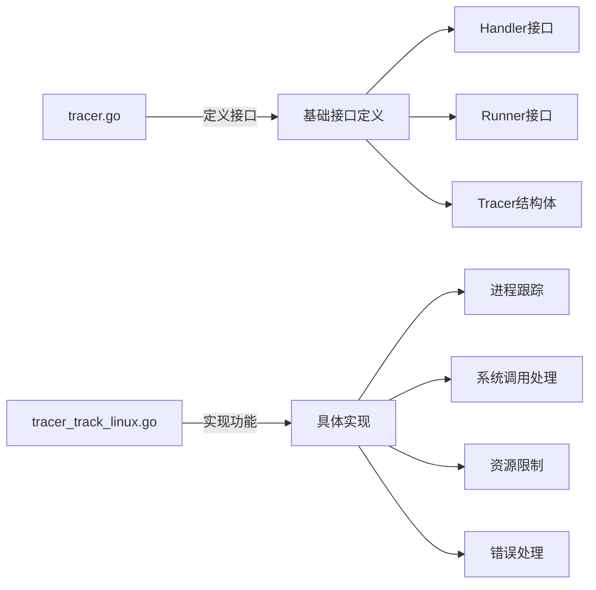

```mermaid
graph LR
    A[tracer.go] -->|定义接口| B[基础接口定义]
    B --> C[Handler接口]
    B --> D[Runner接口]
    B --> E[Tracer结构体]
    
    F[tracer_track_linux.go] -->|实现功能| G[具体实现]
    G --> H[进程跟踪]
    G --> I[系统调用处理]
    G --> J[资源限制]
    G --> K[错误处理]
```