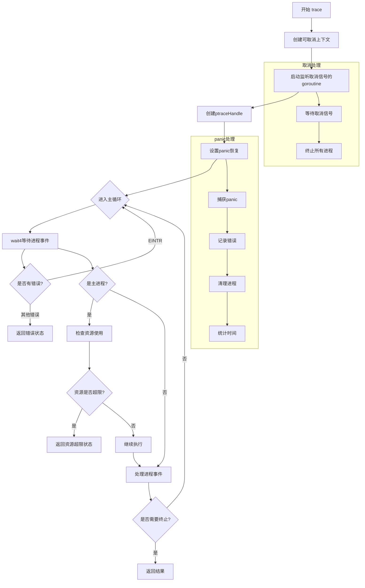

```mermaid
graph TD
    A[开始 trace] --> B[创建可取消上下文]
    B --> C[启动监听取消信号的goroutine]
    C --> D[创建ptraceHandle]
    D --> E[设置panic恢复]
    
    E --> F{进入主循环}
    F --> G[wait4等待进程事件]
    
    G --> H{是否有错误?}
    H -->|EINTR| F
    H -->|其他错误| I[返回错误状态]
    
    G --> J{是主进程?}
    J -->|是| K[检查资源使用]
    K --> L{资源是否超限?}
    L -->|是| M[返回资源超限状态]
    L -->|否| N[继续执行]
    
    J -->|否| O[处理进程事件]
    N --> O
    
    O --> P{是否需要终止?}
    P -->|是| Q[返回结果]
    P -->|否| F
    
    subgraph "panic处理"
        E --> R[捕获panic]
        R --> S[记录错误]
        S --> T[清理进程]
        T --> U[统计时间]
    end
    
    subgraph "取消处理"
        C --> V[等待取消信号]
        V --> W[终止所有进程]
    end
```